# RUV SPARC UI Dashboard - System Architecture

## Table of Contents

- [Overview](#overview)
- [Technology Stack](#technology-stack)
- [System Architecture](#system-architecture)
- [Database Schema](#database-schema)
- [API Architecture](#api-architecture)
- [Real-Time Communication](#real-time-communication)
- [Memory MCP Integration](#memory-mcp-integration)
- [Security Architecture](#security-architecture)
- [Performance Optimization](#performance-optimization)

---

## Overview

The RUV SPARC UI Dashboard is a production-ready web application for managing scheduled tasks, agent orchestration, and real-time monitoring. It implements a modern three-tier architecture with comprehensive security, performance optimization, and observability features.

### Key Features

- **Task Scheduling**: Automated skill/agent execution with cron expressions
- **Project Management**: Hierarchical organization with nested task tracking
- **Agent Registry**: Real-time activity monitoring and performance metrics
- **WebSocket Updates**: Live task status broadcasting via Redis pub/sub
- **Memory MCP Integration**: Persistent context with tagging protocol and circuit breaker
- **Multi-User Support**: JWT-based authentication with role-based access control (RBAC)

---

## Technology Stack

### Frontend
- **Framework**: React 18.3.1
- **State Management**: Zustand 5.0.8 (atomic state), Jotai 2.15.1 (derived state)
- **UI Components**: Custom components with Tailwind CSS 4.1.17
- **Form Validation**: React Hook Form 7.66.0 + Zod 4.1.12
- **Workflow Visualization**: ReactFlow 11.11.4
- **Build Tool**: Vite 5.4.10 + TypeScript 5.6.2
- **Testing**: Jest 30.2.0, Playwright 1.56.1, Testing Library 16.3.0

### Backend
- **Framework**: FastAPI 0.121.0+ (CVE-2024-47874 patched)
- **ASGI Server**: Uvicorn 0.30.0+ with Gunicorn 22.0.0
- **ORM**: SQLAlchemy 2.0.30+ with async support
- **Database**: PostgreSQL 15+ with connection pooling
- **Cache/Memory**: Redis 7+ with aioredis 2.0.1
- **Security**: Python-JOSE (JWT), Passlib (bcrypt hashing)
- **Validation**: Pydantic 2.8.0+ with comprehensive schemas
- **Rate Limiting**: SlowAPI 0.1.9

### Infrastructure
- **Containerization**: Docker Compose 3.9
- **Database Migrations**: Alembic 1.13.0
- **Message Queue**: Redis Pub/Sub for WebSocket broadcasting
- **Memory System**: Memory MCP with ChromaDB vector storage

---

## System Architecture

### High-Level Architecture

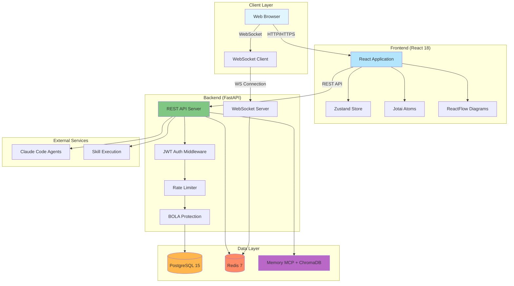

### Request Flow

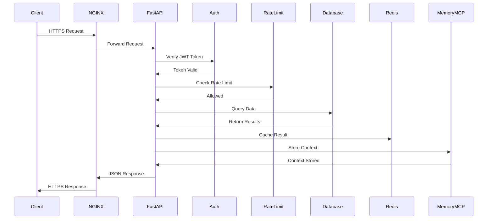

---

## Database Schema

### Entity-Relationship Diagram

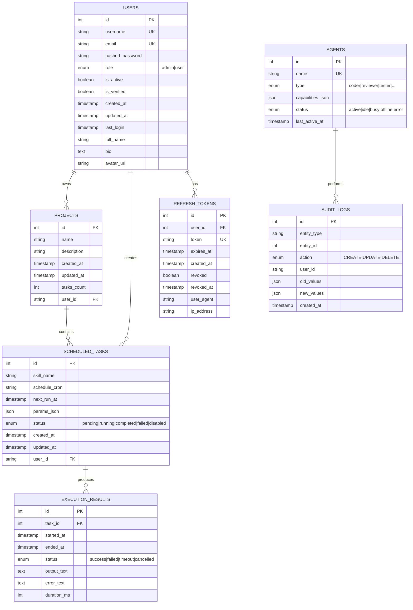

### Key Relationships

1. **Users → Projects**: One-to-many (user can own multiple projects)
2. **Projects → Scheduled Tasks**: One-to-many (project contains multiple tasks)
3. **Scheduled Tasks → Execution Results**: One-to-many (task has execution history)
4. **Users → Refresh Tokens**: One-to-many (user can have multiple active sessions)

### Indexes and Constraints

#### Projects Table
- `ix_projects_user_created`: Composite index on `(user_id, created_at)`
- `ix_projects_name_user`: Composite index on `(name, user_id)`

#### Scheduled Tasks Table
- `ix_scheduled_tasks_user_status`: Composite index on `(user_id, status)`
- `ix_scheduled_tasks_status_next_run`: Composite index on `(status, next_run_at)`
- CHECK constraint: `status IN ('pending', 'running', 'completed', 'failed', 'disabled')`

#### Agents Table
- `ix_agents_type_status`: Composite index on `(type, status)`
- `ix_agents_status_active`: Composite index on `(status, last_active_at)`
- CHECK constraint: `status IN ('active', 'idle', 'busy', 'offline', 'error')`
- CHECK constraint: `type IN ('coder', 'reviewer', 'tester', ...)`

#### Execution Results Table
- `ix_execution_results_task_started`: Composite index on `(task_id, started_at)`
- `ix_execution_results_status_started`: Composite index on `(status, started_at)`
- CHECK constraint: `status IN ('success', 'failed', 'timeout', 'cancelled')`
- CHECK constraint: `duration_ms >= 0`

---

## API Architecture

### REST Endpoints

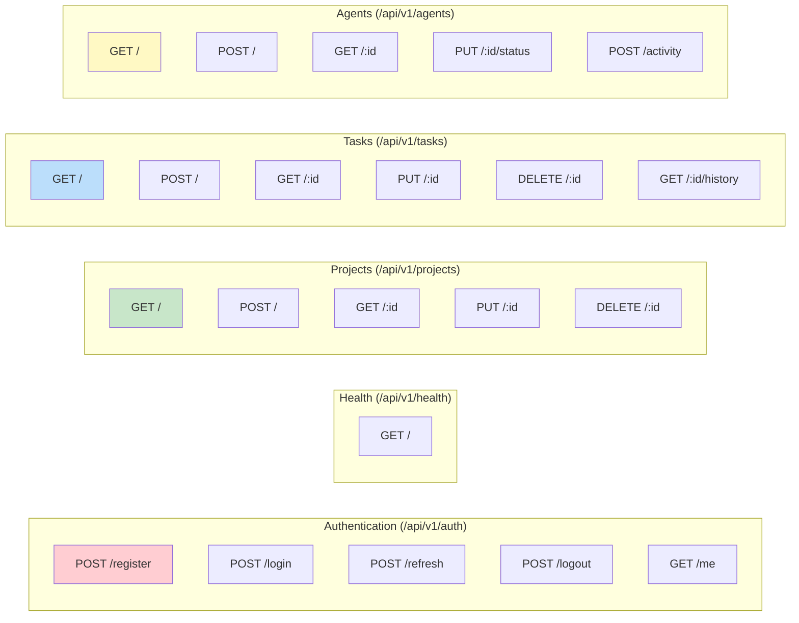

### WebSocket Events

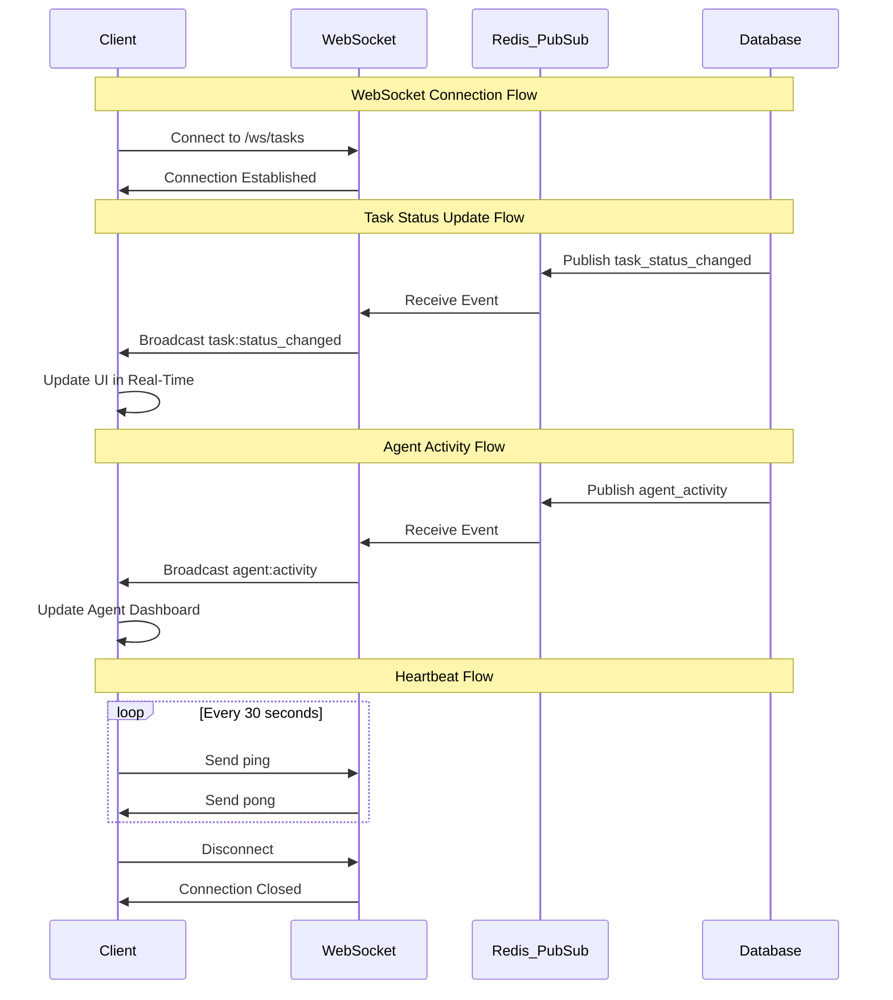

### API Rate Limits

| Endpoint Type | Limit | Period | Notes |
|--------------|-------|--------|-------|
| Standard API | 100 req | 1 min | General endpoints |
| Activity Logging | 1000 req | 1 min | High-frequency agent activity |
| Agent Creation | 60 req | 1 min | Resource-intensive operations |
| Authentication | 50 req | 1 min | Login, registration |
| WebSocket Connections | 10 connections | per IP | Concurrent limit |

---

## Real-Time Communication

### WebSocket Architecture

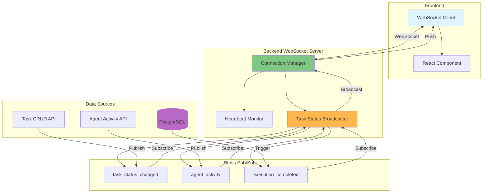

### Message Types

1. **task:status_changed**: Task execution status updates
   ```json
   {
     "type": "task:status_changed",
     "task_id": 123,
     "status": "running",
     "timestamp": "2025-11-08T20:00:00Z"
   }
   ```

2. **agent:activity**: Agent activity logging
   ```json
   {
     "type": "agent:activity",
     "agent_id": 456,
     "action": "task_started",
     "details": {...}
   }
   ```

3. **execution:completed**: Task execution results
   ```json
   {
     "type": "execution:completed",
     "task_id": 123,
     "result_id": 789,
     "status": "success",
     "duration_ms": 1500
   }
   ```

---

## Memory MCP Integration

### Tagging Protocol Architecture

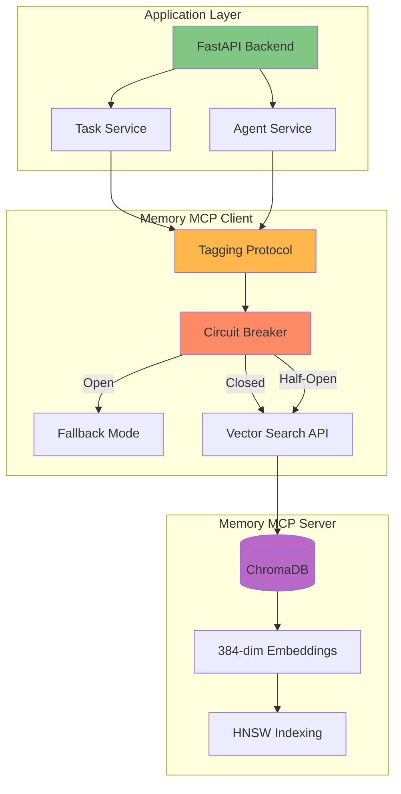

### Tagging Protocol Requirements

All Memory MCP writes **must** include metadata tags:

1. **WHO**: Agent name, category, capabilities
2. **WHEN**: ISO timestamp, Unix timestamp, readable format
3. **PROJECT**: `ruv-sparc-ui-dashboard`, `memory-mcp-triple-system`, etc.
4. **WHY**: Intent (implementation, bugfix, refactor, testing, documentation, analysis, planning, research)

Example:
```python
from app.utils.memory_mcp_client import memory_client

# Automatic tagging via protocol
await memory_client.store(
    content="Implemented task scheduling feature",
    metadata={
        "agent": "coder",
        "task_id": "TASK-123",
        "feature": "scheduling"
    }
)
# Auto-tagged with WHO/WHEN/PROJECT/WHY
```

### Circuit Breaker States

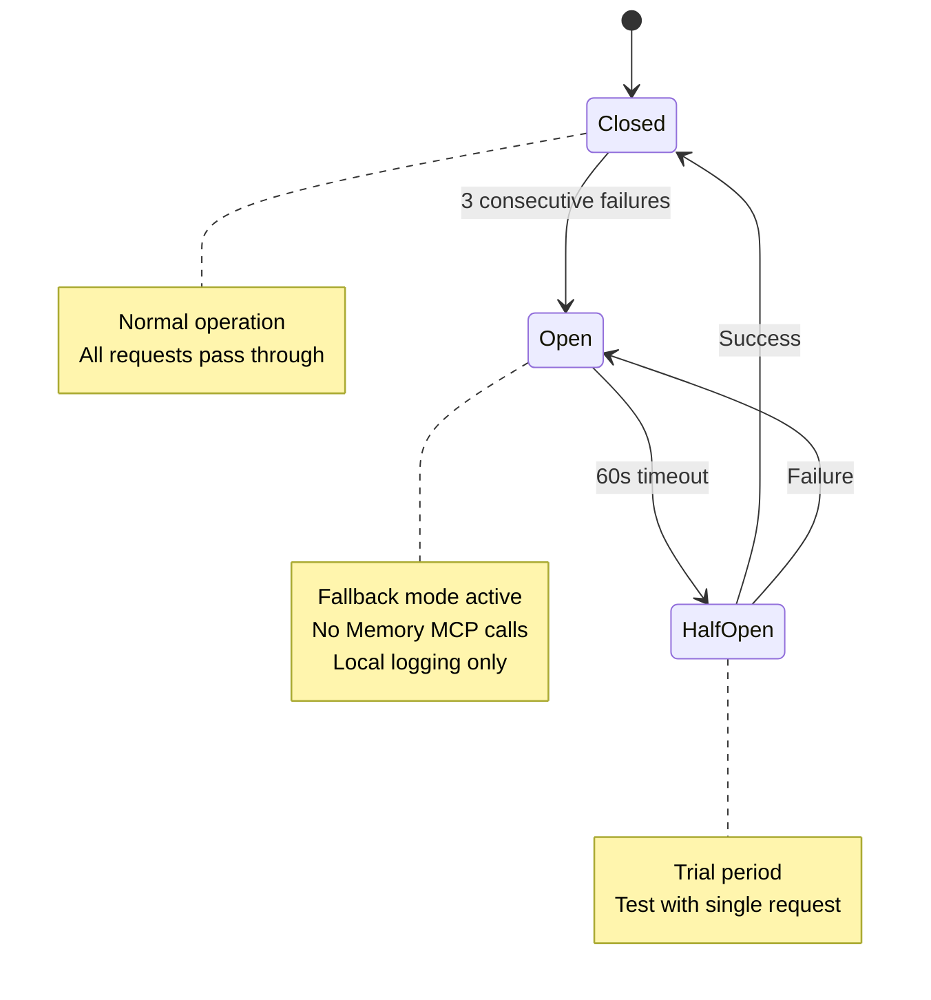

**Configuration**:
- Failure threshold: 3 consecutive failures
- Timeout: 60 seconds
- Half-open max calls: 1
- Success threshold to close: 1

---

## Security Architecture

### Authentication Flow

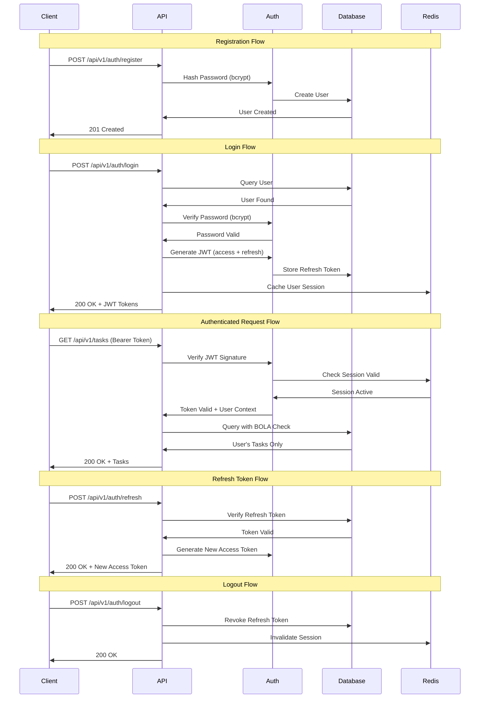

### OWASP API Security Implementation

| Risk | Mitigation | Implementation |
|------|-----------|----------------|
| **API1:2023 BOLA** | Resource ownership verification | All queries filter by `user_id` |
| **API2:2023 Broken Authentication** | JWT with bcrypt hashing | Python-JOSE + Passlib |
| **API3:2023 Broken Object Property** | Input validation | Pydantic schemas with strict typing |
| **API4:2023 Unrestricted Resource Access** | Rate limiting | SlowAPI with 100 req/min |
| **API5:2023 Broken Function Level Authorization** | RBAC with roles | Admin/User roles with middleware checks |
| **API7:2023 Server Side Request Forgery** | URL validation | Pydantic URL validators |
| **API8:2023 Security Misconfiguration** | Security headers | CSP, HSTS, X-Frame-Options |

### Security Headers

```http
X-Content-Type-Options: nosniff
X-Frame-Options: DENY
X-XSS-Protection: 1; mode=block
Strict-Transport-Security: max-age=31536000; includeSubDomains
Content-Security-Policy: default-src 'self'
```

---

## Performance Optimization

### Database Connection Pooling

```python
# SQLAlchemy async engine configuration
engine = create_async_engine(
    DATABASE_URL,
    pool_size=20,          # Max 20 connections
    max_overflow=10,       # Additional 10 overflow connections
    pool_timeout=30,       # 30s wait for connection
    pool_recycle=3600,     # Recycle connections every hour
    pool_pre_ping=True,    # Verify connection before use
    echo=False             # Disable SQL logging in production
)
```

### Redis Caching Strategy

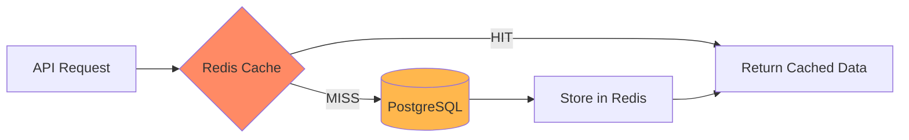

**Cache TTL**:
- User sessions: 3600 seconds (1 hour)
- Task lists: 300 seconds (5 minutes)
- Agent status: 60 seconds (1 minute)
- Project metadata: 1800 seconds (30 minutes)

### Async Parallelism

```python
# Concurrent task execution
async def get_dashboard_data(user_id: str):
    # Execute queries in parallel
    tasks, projects, agents = await asyncio.gather(
        get_user_tasks(user_id),
        get_user_projects(user_id),
        get_active_agents()
    )
    return DashboardData(tasks, projects, agents)
```

### WebSocket Optimization

- **Heartbeat interval**: 30 seconds
- **Max message size**: 1 MB
- **Compression**: Enabled for messages > 1 KB
- **Connection timeout**: 300 seconds (5 minutes)
- **Reconnection strategy**: Exponential backoff (1s, 2s, 4s, 8s, 16s)

---

## Deployment Architecture

### Docker Compose Setup

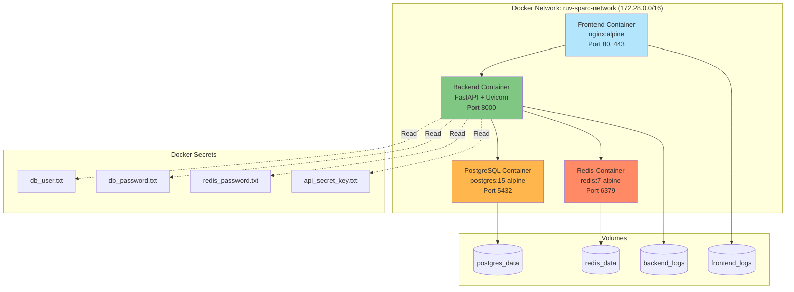

---

## Monitoring and Observability

### Logging Strategy

```python
# Structured logging with request tracing
logger.info(
    "Task created",
    extra={
        "request_id": request_id,
        "user_id": current_user.id,
        "task_id": task.id,
        "skill_name": task.skill_name,
        "timestamp": datetime.utcnow().isoformat()
    }
)
```

### Health Check Endpoint

```http
GET /api/v1/health

Response:
{
  "status": "healthy",
  "database": "connected",
  "redis": "connected",
  "memory_mcp": "operational",
  "websocket": "active",
  "version": "1.0.0"
}
```

---

## Next Steps

- Implement distributed tracing with OpenTelemetry
- Add Prometheus metrics export
- Configure Grafana dashboards for real-time monitoring
- Set up ELK stack for centralized logging
- Implement A/B testing framework
- Add feature flags for gradual rollouts

---

**Last Updated**: 2025-11-08
**Maintainer**: RUV SPARC Team
**Version**: 1.0.0
