# Example 2: Circular Dependency Detection and Resolution

## Kanitsal Cerceve (Evidential Frame Activation)
Kaynak dogrulama modu etkin.


## When to Use This Skill

- **Domain-Specific Work**: Tasks requiring specialized domain knowledge
- **Complex Problems**: Multi-faceted challenges needing systematic approach
- **Best Practice Implementation**: Following industry-standard methodologies
- **Quality-Critical Work**: Production code requiring high standards
- **Team Collaboration**: Coordinated work following shared processes

## When NOT to Use This Skill

- **Outside Domain**: Tasks outside this skill specialty area
- **Incompatible Tech Stack**: Technologies not covered by this skill
- **Simple Tasks**: Trivial work not requiring specialized knowledge
- **Exploratory Work**: Experimental code without production requirements

## Success Criteria

- [ ] Implementation complete and functional
- [ ] Tests passing with adequate coverage
- [ ] Code reviewed and approved
- [ ] Documentation updated
- [ ] Performance benchmarks met
- [ ] Security considerations addressed
- [ ] Deployed or integrated successfully

## Edge Cases to Handle

- **Legacy Integration**: Working with older codebases or deprecated APIs
- **Missing Dependencies**: Unavailable libraries or external services
- **Version Conflicts**: Dependency version incompatibilities
- **Data Issues**: Malformed input or edge case data
- **Concurrency**: Race conditions or synchronization challenges
- **Error Handling**: Graceful degradation and recovery

## Guardrails

- **NEVER** skip testing to ship faster
- **ALWAYS** follow domain-specific best practices
- **NEVER** commit untested or broken code
- **ALWAYS** document complex logic and decisions
- **NEVER** hardcode sensitive data or credentials
- **ALWAYS** validate input and handle errors gracefully
- **NEVER** deploy without reviewing changes

## Evidence-Based Validation

- [ ] Automated tests passing
- [ ] Code linter/formatter passing
- [ ] Security scan completed
- [ ] Performance within acceptable range
- [ ] Manual testing completed
- [ ] Peer review approved
- [ ] Documentation reviewed

## Scenario

Your team is developing a microservices architecture with shared TypeScript libraries. The build process has become extremely slow (12+ minutes), and you're experiencing strange runtime errors related to module initialization order. The CI/CD pipeline frequently fails with cryptic "Cannot access X before initialization" errors.

**Project Structure:**
```
enterprise-app/
├── packages/
│   ├── auth-service/      # Authentication microservice
│   ├── user-service/      # User management
│   ├── notification/      # Email/SMS notifications
│   ├── shared-models/     # Shared TypeScript interfaces
│   ├── shared-utils/      # Common utilities
│   └── core-domain/       # Business logic
├── package.json
└── tsconfig.base.json
```

**Symptoms:**
- Build time: 12 minutes (should be ~2 minutes)
- Intermittent runtime errors: "ReferenceError: Cannot access before initialization"
- Hot reload broken in development
- TypeScript language server crashes frequently
- Webpack bundle size bloated (3.2MB when it should be ~800KB)

**Goal:** Detect and eliminate circular dependencies that are causing build and runtime issues.

---

## Walkthrough

### Step 1: Initial Circular Dependency Detection

Activate the dependencies skill with circular detection mode:

```bash
npx claude-flow@alpha hooks pre-task --description "Circular dependency analysis for enterprise app"
```

**Detection Output:**
```
🔍 Circular Dependency Analysis Started...

⚠️ CRITICAL: 14 circular dependency cycles detected

CYCLE #1 (High Impact - 8 modules):
  auth-service/auth.controller.ts
    → user-service/user.repository.ts
      → shared-models/user.model.ts
        → core-domain/permissions.ts
          → auth-service/permissions.guard.ts
            → auth-service/auth.controller.ts  ❌ CYCLE CLOSED

  Impact: Build time +3.2 minutes
  Severity: CRITICAL
  Recommendation: Extract permission model to shared-models

CYCLE #2 (Medium Impact - 5 modules):
  notification/email.service.ts
    → user-service/user.service.ts
      → notification/notification.queue.ts
        → notification/email.service.ts  ❌ CYCLE CLOSED

  Impact: Runtime initialization error
  Severity: HIGH
  Recommendation: Use event-driven pattern instead of direct imports

CYCLE #3 (Low Impact - 3 modules):
  shared-utils/logger.ts
    → shared-utils/config.ts
      → shared-utils/logger.ts  ❌ CYCLE CLOSED

  Impact: Hot reload broken
  Severity: MEDIUM
  Recommendation: Move config to separate package

... (11 more cycles)

📊 Summary:
├── Total cycles: 14
├── Critical (4+ modules): 3
├── High (3 modules): 6
├── Medium (2 modules): 5
├── Estimated build time impact: +8.7 minutes
└── Affected packages: 6/6 (100%)
```

### Step 2: Dependency Graph Visualization

The skill generates a visual representation of circular dependencies:

```mermaid
graph TD
    subgraph "CYCLE #1 - Authentication & Permissions"
        AC[auth.controller] --> UR[user.repository]
        UR --> UM[user.model]
        UM --> PD[permissions domain]
        PD --> PG[permissions.guard]
        PG --> AC

        style AC fill:#ff6b6b,stroke:#c92a2a
        style PG fill:#ff6b6b,stroke:#c92a2a
    end

    subgraph "CYCLE #2 - Notifications & Users"
        ES[email.service] --> US[user.service]
        US --> NQ[notification.queue]
        NQ --> ES

        style ES fill:#ffd43b,stroke:#fab005
        style US fill:#ffd43b,stroke:#fab005
        style NQ fill:#ffd43b,stroke:#fab005
    end

    subgraph "CYCLE #3 - Utils Internal"
        LOG[logger] --> CFG[config]
        CFG --> LOG

        style LOG fill:#74c0fc,stroke:#339af0
        style CFG fill:#74c0fc,stroke:#339af0
    end
```



### Step 3: Root Cause Analysis

The skill performs deep analysis to identify the root causes:

```
🔬 Root Cause Analysis:

PRIMARY CAUSES:

1. Tight Coupling Between Packages (56% of cycles)
   ├── auth-service ↔ user-service (bidirectional dependency)
   ├── notification ↔ user-service (bidirectional dependency)
   └── shared-models importing from domain packages

   Root Issue: Lack of clear architectural boundaries
   Solution: Implement dependency inversion principle

2. Shared State in Utility Modules (28% of cycles)
   ├── shared-utils/logger ↔ shared-utils/config
   └── shared-utils/cache ↔ shared-utils/redis-client

   Root Issue: Singleton pattern with cross-module initialization
   Solution: Use dependency injection container

3. TypeScript Barrel Exports (16% of cycles)
   ├── packages/*/index.ts importing from subdirectories
   └── Subdirectories re-exporting from index.ts

   Root Issue: Convenience exports creating hidden cycles
   Solution: Use explicit import paths, avoid barrel re-exports

IMPACT BREAKDOWN:

Build Performance:
├── TypeScript compilation: 47% slower
├── Webpack bundling: 62% slower
├── Module resolution: 38% slower
└── Total build time: 6.2x longer than baseline

Runtime Performance:
├── Module initialization: Unpredictable order
├── Memory usage: +34% (duplicate module instances)
├── Bundle size: +280% (modules included multiple times)
└── Hot reload: Broken (webpack dev server crashes)

Developer Experience:
├── IDE performance: Language server crashes
├── Type checking: Inconsistent results
├── Refactoring: High risk of breaking changes
└── Debugging: Stack traces show circular require warnings
```

### Step 4: Automated Refactoring Suggestions

The skill provides concrete refactoring paths:

```
🔧 Refactoring Strategy:

PHASE 1: Quick Wins (Estimated time: 4 hours)

1. Fix CYCLE #3 (shared-utils internal cycle)

   BEFORE:
   // shared-utils/logger.ts
   import { getConfig } from './config';

   // shared-utils/config.ts
   import { logger } from './logger';

   AFTER:
   // shared-utils/logger.ts
   // Remove config import, inject config
   export function createLogger(config: LogConfig) { ... }

   // shared-utils/config.ts
   // Remove logger import, use console or external logger

   Impact: -2.1 minutes build time

2. Remove barrel export re-imports

   BEFORE:
   // packages/auth-service/index.ts
   export * from './controllers';
   export * from './services';

   // packages/auth-service/controllers/index.ts
   export * from '../index';  // ❌ CIRCULAR

   AFTER:
   // packages/auth-service/index.ts
   export { AuthController } from './controllers/auth.controller';
   export { AuthService } from './services/auth.service';
   // No re-export from controllers/index.ts

   Impact: -1.8 minutes build time

PHASE 2: Architectural Refactoring (Estimated time: 2 days)

3. Extract Permission Model (fixes CYCLE #1)

   CREATE NEW PACKAGE: @app/permissions-contracts

   Structure:
   permissions-contracts/
   ├── interfaces/
   │   ├── permission.interface.ts
   │   └── role.interface.ts
   └── types/
       └── permission.types.ts

   BEFORE:
   auth-service → user-service → shared-models → core-domain → auth-service

   AFTER:
   auth-service → permissions-contracts ← core-domain
   user-service → permissions-contracts

   Impact: -4.2 minutes build time, eliminates critical cycle

4. Implement Event-Driven Pattern (fixes CYCLE #2)

   CREATE: @app/events package

   BEFORE:
   notification/email.service
     ↓ (direct import)
   user-service/user.service
     ↓ (direct import)
   notification/notification.queue
     ↓ (direct import)
   notification/email.service  ❌

   AFTER:
   user-service emits "user.created" event
     ↓
   @app/events/event-bus
     ↓
   notification/email.service subscribes to "user.created"

   No direct imports = No cycle!

   Impact: -3.5 minutes build time, eliminates high-severity cycle

PHASE 3: Architectural Boundaries (Estimated time: 1 week)

5. Implement Layered Architecture

   LAYER 1: Domain Contracts (no dependencies)
   ├── @app/domain-models
   ├── @app/events
   └── @app/permissions-contracts

   LAYER 2: Core Domain (depends on Layer 1 only)
   ├── @app/core-domain
   └── @app/business-rules

   LAYER 3: Application Services (depends on Layers 1-2)
   ├── @app/user-service
   ├── @app/auth-service
   └── @app/notification

   LAYER 4: Infrastructure (depends on all layers)
   ├── @app/shared-utils
   └── @app/adapters

   Rule: Lower layers CANNOT import from higher layers

   Enforcement: Use madge + ESLint plugin

   Impact: Prevents all future circular dependencies
```

---

## Code Examples

### Detection Script with madge

```javascript
// scripts/detect-circular-deps.js
const madge = require('madge');
const path = require('path');
const fs = require('fs');

class CircularDependencyDetector {
  constructor(options = {}) {
    this.rootDir = options.rootDir || process.cwd();
    this.config = {
      fileExtensions: ['ts', 'tsx', 'js', 'jsx'],
      excludeRegExp: [/node_modules/, /dist/, /\.spec\.ts$/, /\.test\.ts$/],
      tsConfig: path.join(this.rootDir, 'tsconfig.json'),
      webpack: options.webpackConfig
    };
    this.cycles = [];
    this.graph = null;
  }

  /**
   * Analyze project for circular dependencies
   */
  async analyze() {
    console.log('🔍 Analyzing project structure...\n');

    this.graph = await madge(this.rootDir, {
      fileExtensions: this.config.fileExtensions,
      excludeRegExp: this.config.excludeRegExp,
      tsConfig: this.config.tsConfig,
      webpackConfig: this.config.webpack
    });

    this.cycles = this.graph.circular();

    if (this.cycles.length === 0) {
      console.log('✅ No circular dependencies found!\n');
      return { success: true, cycles: [] };
    }

    console.log(`⚠️ Found ${this.cycles.length} circular dependency cycles\n`);

    // Analyze each cycle
    const analyzedCycles = this.cycles.map((cycle, index) =>
      this.analyzeCycle(cycle, index + 1)
    );

    // Sort by severity
    analyzedCycles.sort((a, b) => {
      const severityOrder = { CRITICAL: 0, HIGH: 1, MEDIUM: 2, LOW: 3 };
      return severityOrder[a.severity] - severityOrder[b.severity];
    });

    return {
      success: false,
      cycles: analyzedCycles,
      summary: this.generateSummary(analyzedCycles)
    };
  }

  /**
   * Analyze individual cycle for severity and impact
   */
  analyzeCycle(cycle, index) {
    const moduleCount = cycle.length;
    const severity = this.calculateSeverity(cycle);
    const impact = this.estimateImpact(cycle);
    const recommendation = this.generateRecommendation(cycle);

    return {
      id: index,
      modules: cycle,
      moduleCount,
      severity,
      impact,
      recommendation,
      visualPath: this.formatCyclePath(cycle)
    };
  }

  /**
   * Calculate severity based on cycle characteristics
   */
  calculateSeverity(cycle) {
    const length = cycle.length;
    const crossesPackageBoundaries = this.crossesPackages(cycle);
    const affectsCore = cycle.some(m => m.includes('/core-') || m.includes('/shared-'));

    if (length >= 4 || (crossesPackageBoundaries && affectsCore)) {
      return 'CRITICAL';
    } else if (length === 3 || crossesPackageBoundaries) {
      return 'HIGH';
    } else if (affectsCore) {
      return 'MEDIUM';
    }
    return 'LOW';
  }

  /**
   * Estimate build time and runtime impact
   */
  estimateImpact(cycle) {
    const moduleCount = cycle.length;
    const packagesCrossed = this.getAffectedPackages(cycle).length;

    // Empirical formula based on observations
    const buildTimeImpact = (moduleCount * 0.8 + packagesCrossed * 1.5) * 60; // seconds
    const bundleSizeImpact = moduleCount * 45; // KB (approximate)

    return {
      buildTime: `+${Math.round(buildTimeImpact / 60)} minutes ${buildTimeImpact % 60} seconds`,
      bundleSize: `+${bundleSizeImpact}KB`,
      runtimeRisk: moduleCount >= 4 ? 'High (initialization errors likely)' : 'Medium',
      hotReload: cycle.some(m => m.includes('/shared-')) ? 'Broken' : 'Degraded'
    };
  }

  /**
   * Generate actionable recommendation
   */
  generateRecommendation(cycle) {
    const packages = this.getAffectedPackages(cycle);

    // Pattern detection
    if (this.isUtilsCycle(cycle)) {
      return {
        pattern: 'Utility Module Cycle',
        solution: 'Use dependency injection or split into separate packages',
        example: 'Create factory functions that accept dependencies as parameters'
      };
    }

    if (this.isServiceCycle(cycle)) {
      return {
        pattern: 'Service-to-Service Cycle',
        solution: 'Implement event-driven architecture or extract shared interface',
        example: 'Use message queue or event bus for inter-service communication'
      };
    }

    if (this.isBarrelExportCycle(cycle)) {
      return {
        pattern: 'Barrel Export Re-import',
        solution: 'Remove re-exports from barrel files, use explicit imports',
        example: "Import directly: import { X } from './module/x' instead of from './index'"
      };
    }

    if (packages.length > 1) {
      return {
        pattern: 'Cross-Package Cycle',
        solution: 'Extract shared contracts to new package in lower layer',
        example: `Create @app/${packages[0]}-contracts for shared interfaces`
      };
    }

    return {
      pattern: 'General Circular Dependency',
      solution: 'Apply dependency inversion principle',
      example: 'Extract interface, depend on abstraction instead of concrete implementation'
    };
  }

  /**
   * Format cycle path for display
   */
  formatCyclePath(cycle) {
    const formatted = cycle.map((module, index) => {
      const indent = '  '.repeat(index);
      const arrow = index > 0 ? '→ ' : '';
      const fileName = path.basename(module);
      const packageName = this.getPackageName(module);

      return `${indent}${arrow}${packageName}/${fileName}`;
    });

    // Close the cycle
    formatted.push(
      `${'  '.repeat(cycle.length)}→ ${this.getPackageName(cycle[0])}/${path.basename(cycle[0])}  ❌ CYCLE`
    );

    return formatted.join('\n');
  }

  /**
   * Generate summary statistics
   */
  generateSummary(cycles) {
    const bySeverity = {
      CRITICAL: cycles.filter(c => c.severity === 'CRITICAL').length,
      HIGH: cycles.filter(c => c.severity === 'HIGH').length,
      MEDIUM: cycles.filter(c => c.severity === 'MEDIUM').length,
      LOW: cycles.filter(c => c.severity === 'LOW').length
    };

    const totalBuildImpact = cycles.reduce((sum, cycle) => {
      const minutes = parseInt(cycle.impact.buildTime.match(/\+(\d+) minutes/)?.[1] || 0);
      return sum + minutes;
    }, 0);

    const affectedPackages = new Set(
      cycles.flatMap(c => this.getAffectedPackages(c.modules))
    );

    return {
      totalCycles: cycles.length,
      bySeverity,
      estimatedBuildTimeImpact: `+${totalBuildImpact} minutes`,
      affectedPackages: Array.from(affectedPackages),
      affectedPackageCount: affectedPackages.size
    };
  }

  /**
   * Export report to JSON and Markdown
   */
  async exportReport(analysis, outputDir) {
    // JSON report
    const jsonPath = path.join(outputDir, 'circular-dependencies.json');
    fs.writeFileSync(jsonPath, JSON.stringify(analysis, null, 2));
    console.log(`✓ JSON report saved to ${jsonPath}`);

    // Markdown report
    const mdPath = path.join(outputDir, 'CIRCULAR-DEPENDENCIES.md');
    const markdown = this.generateMarkdownReport(analysis);
    fs.writeFileSync(mdPath, markdown);
    console.log(`✓ Markdown report saved to ${mdPath}`);

    // Graphviz DOT file for visualization
    const dotPath = path.join(outputDir, 'dependencies.dot');
    const dot = this.graph.dot();
    fs.writeFileSync(dotPath, dot);
    console.log(`✓ DOT file saved to ${dotPath}`);

    // Generate SVG from DOT (requires graphviz installed)
    try {
      const { execSync } = require('child_process');
      execSync(`dot -Tsvg ${dotPath} -o ${path.join(outputDir, 'dependencies.svg')}`);
      console.log(`✓ SVG graph saved to ${path.join(outputDir, 'dependencies.svg')}`);
    } catch (error) {
      console.log('ℹ️ Install graphviz to generate SVG: brew install graphviz');
    }
  }

  /**
   * Generate Markdown report
   */
  generateMarkdownReport(analysis) {
    const { cycles, summary } = analysis;

    let md = '# Circular Dependency Analysis Report\n\n';
    md += `**Generated:** ${new Date().toISOString()}\n\n`;

    md += '## Summary\n\n';
    md += `- **Total Cycles:** ${summary.totalCycles}\n`;
    md += `- **Critical:** ${summary.bySeverity.CRITICAL}\n`;
    md += `- **High:** ${summary.bySeverity.HIGH}\n`;
    md += `- **Medium:** ${summary.bySeverity.MEDIUM}\n`;
    md += `- **Low:** ${summary.bySeverity.LOW}\n`;
    md += `- **Estimated Build Impact:** ${summary.estimatedBuildTimeImpact}\n`;
    md += `- **Affected Packages:** ${summary.affectedPackageCount}/${summary.affectedPackages.length}\n\n`;

    md += '## Detailed Analysis\n\n';

    cycles.forEach(cycle => {
      md += `### Cycle #${cycle.id} (${cycle.severity})\n\n`;
      md += '**Path:**\n```\n';
      md += cycle.visualPath;
      md += '\n```\n\n';

      md += '**Impact:**\n';
      md += `- Build Time: ${cycle.impact.buildTime}\n`;
      md += `- Bundle Size: ${cycle.impact.bundleSize}\n`;
      md += `- Runtime Risk: ${cycle.impact.runtimeRisk}\n`;
      md += `- Hot Reload: ${cycle.impact.hotReload}\n\n`;

      md += '**Recommendation:**\n';
      md += `- **Pattern:** ${cycle.recommendation.pattern}\n`;
      md += `- **Solution:** ${cycle.recommendation.solution}\n`;
      md += `- **Example:** ${cycle.recommendation.example}\n\n`;

      md += '---\n\n';
    });

    return md;
  }

  // Helper methods
  crossesPackages(cycle) {
    const packages = this.getAffectedPackages(cycle);
    return packages.length > 1;
  }

  getAffectedPackages(cycle) {
    return [...new Set(cycle.map(m => this.getPackageName(m)))];
  }

  getPackageName(modulePath) {
    const match = modulePath.match(/packages\/([^\/]+)/);
    return match ? match[1] : 'unknown';
  }

  isUtilsCycle(cycle) {
    return cycle.every(m => m.includes('/shared-utils/') || m.includes('/utils/'));
  }

  isServiceCycle(cycle) {
    return cycle.some(m => m.includes('-service/'));
  }

  isBarrelExportCycle(cycle) {
    return cycle.some(m => m.endsWith('/index.ts') || m.endsWith('/index.js'));
  }
}

// CLI Usage
async function main() {
  const detector = new CircularDependencyDetector({
    rootDir: process.cwd()
  });

  const analysis = await detector.analyze();

  if (!analysis.success) {
    console.log('\n📊 Analysis Summary:\n');
    console.log(JSON.stringify(analysis.summary, null, 2));

    await detector.exportReport(analysis, path.join(process.cwd(), 'reports'));

    process.exit(1); // Fail CI if cycles found
  }

  process.exit(0);
}

if (require.main === module) {
  main().catch(console.error);
}

module.exports = { CircularDependencyDetector };
```

### ESLint Plugin for Preventing Cycles

```javascript
// eslint-plugin-no-circular-deps/index.js
module.exports = {
  rules: {
    'no-circular-dependency': {
      meta: {
        type: 'problem',
        docs: {
          description: 'Disallow circular dependencies',
          category: 'Possible Errors',
          recommended: true
        },
        schema: [
          {
            type: 'object',
            properties: {
              allowedCycles: {
                type: 'array',
                items: { type: 'string' }
              },
              maxDepth: {
                type: 'number',
                default: 10
              }
            }
          }
        ]
      },
      create(context) {
        const importGraph = new Map();
        const fileName = context.getFilename();

        return {
          ImportDeclaration(node) {
            const importPath = node.source.value;
            const resolvedPath = resolveImport(importPath, fileName);

            if (detectCycle(fileName, resolvedPath, importGraph)) {
              context.report({
                node,
                message: `Circular dependency detected: ${fileName} → ${resolvedPath}`
              });
            }
          }
        };
      }
    }
  }
};
```

---

## Outcomes

### Refactoring Results

**Phase 1 Completion (4 hours):**
```
✅ Fixed 5 low-severity cycles
✅ Removed barrel export re-imports
✅ Dependency injection in shared-utils

Build time: 12m 18s → 9m 42s (-21%)
Hot reload: Fixed ✓
```

**Phase 2 Completion (2 days):**
```
✅ Extracted @app/permissions-contracts
✅ Implemented event-driven notification pattern
✅ Separated logger and config packages

Build time: 9m 42s → 3m 15s (-66% from baseline)
Bundle size: 3.2MB → 1.1MB (-66%)
Runtime errors: 0 in 2 weeks
```

**Phase 3 Completion (1 week):**
```
✅ Implemented 4-layer architecture
✅ Added madge to CI/CD pipeline
✅ ESLint plugin prevents new cycles

Build time: 3m 15s → 2m 8s (-82% from baseline)
CI/CD: Passes 100% (was 73%)
Developer satisfaction: +47% (internal survey)
```

---

## Tips & Best Practices

### 1. **Prevent Cycles with Architecture Rules**

```javascript
// .eslintrc.js
module.exports = {
  plugins: ['boundaries'],
  rules: {
    'boundaries/element-types': [2, {
      default: 'disallow',
      rules: [
        { from: 'domain-contracts', allow: [] },
        { from: 'core-domain', allow: ['domain-contracts'] },
        { from: 'application', allow: ['domain-contracts', 'core-domain'] },
        { from: 'infrastructure', allow: ['*'] }
      ]
    }]
  }
};
```

### 2. **Automate Detection in CI/CD**

```yaml
# .github/workflows/circular-deps.yml
name: Circular Dependency Check

on: [push, pull_request]

jobs:
  check:
    runs-on: ubuntu-latest
    steps:
      - uses: actions/checkout@v3
      - uses: actions/setup-node@v3
      - run: npm ci
      - run: node scripts/detect-circular-deps.js
      - name: Fail if cycles found
        if: failure()
        run: |
          echo "❌ Circular dependencies detected. Review reports/"
          exit 1
```

### 3. **Use Dependency Inversion**

```typescript
// ❌ WRONG: Direct coupling
// user.service.ts
import { NotificationService } from '../notification/notification.service';

export class UserService {
  constructor(private notificationService: NotificationService) {}
}

// ✅ CORRECT: Depend on abstraction
// domain-contracts/notifications.interface.ts
export interface INotificationService {
  sendEmail(to: string, subject: string): Promise<void>;
}

// user.service.ts
import { INotificationService } from '@app/domain-contracts';

export class UserService {
  constructor(private notificationService: INotificationService) {}
}
```

### 4. **Prefer Events Over Direct Calls**

```typescript
// ❌ WRONG: Bidirectional dependency
// email.service.ts → user.service.ts → email.service.ts

// ✅ CORRECT: Event-driven
// user.service.ts
import { EventEmitter } from '@app/events';

export class UserService {
  async createUser(data: UserData) {
    const user = await this.repo.save(data);
    EventEmitter.emit('user.created', user);
    return user;
  }
}

// email.service.ts
import { EventEmitter } from '@app/events';

export class EmailService {
  constructor() {
    EventEmitter.on('user.created', this.sendWelcomeEmail);
  }
}
```

### 5. **Monitor Continuously**

```json
// package.json
{
  "scripts": {
    "check:circular": "madge --circular --extensions ts,tsx src/",
    "check:circular:ci": "madge --circular --extensions ts,tsx src/ || exit 1"
  },
  "husky": {
    "hooks": {
      "pre-push": "npm run check:circular:ci"
    }
  }
}
```

---

## Summary

This example demonstrated complete circular dependency detection and resolution for an enterprise application. Key outcomes:

✅ **Detection**: Identified 14 cycles with automated tooling
✅ **Analysis**: Classified by severity and estimated impact
✅ **Resolution**: Eliminated all cycles through architectural refactoring
✅ **Prevention**: Automated checks in CI/CD and ESLint
✅ **Results**: 82% faster builds, zero runtime errors, improved DX

**Total Investment:** 2 weeks (1 developer)
**ROI:** Build time reduced by 10 minutes per build × 50 builds/day = 500 minutes/day saved (~8.3 hours/day)


---
*Promise: `<promise>EXAMPLE_2_CIRCULAR_DETECTION_VERIX_COMPLIANT</promise>`*
