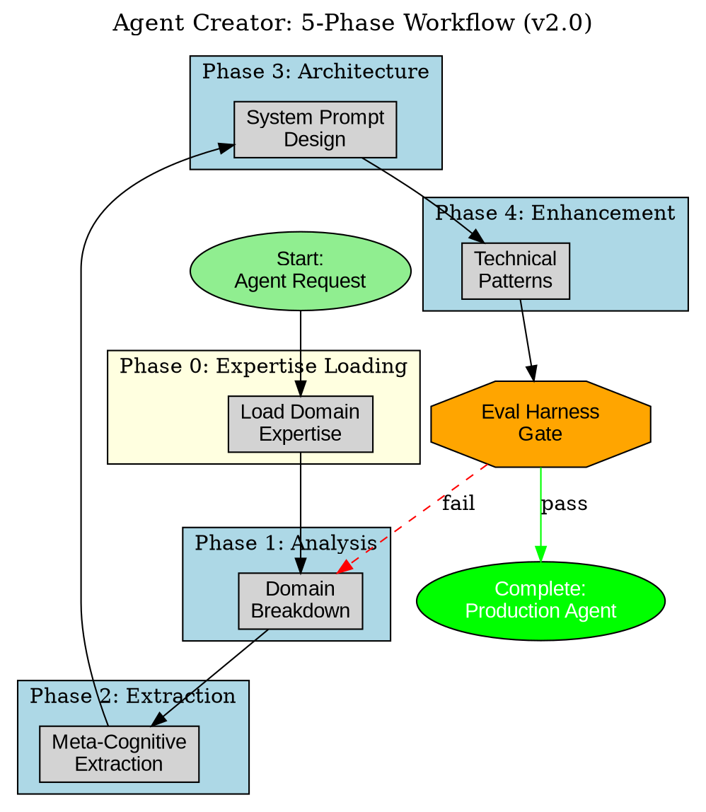

# Agent Creator - Enhanced with 5-Phase SOP Methodology (v3.0)

This skill provides the **official comprehensive framework** for creating specialized AI agents, integrating the proven 5-phase methodology (v3.0 adds Phase 0.5 cognitive frame selection) from Desktop .claude-flow with Claude Agent SDK implementation and evidence-based prompting techniques.

## Trigger Keywords

**USE WHEN user mentions:**
- "create agent", "build agent", "new agent", "design agent"
- "agent for [domain]", "specialist agent", "domain expert agent"
- "rewrite agent", "optimize agent", "improve agent"
- "agent with [capability]", "agent that does [task]"
- "multi-agent workflow", "coordinating agents"
- "production-ready agent", "agent system prompt"

**DO NOT USE when:**
- User wants a simple SKILL (not agent) - use skill-creator-agent or micro-skill-creator
- User wants to improve a PROMPT (not system prompt) - use prompt-architect
- User wants to improve THIS skill itself - use skill-forge
- User wants quick automation without agent architecture - use micro-skill-creator

**Instead use:**
- skill-creator-agent when creating skills that spawn agents (higher-level)
- micro-skill-creator when creating atomic, focused skills
- prompt-architect when optimizing user prompts (not system prompts)
- skill-forge when improving agent-creator itself

## When to Use This Skill

Use agent-creator for:
- Creating project-specialized agents with deeply embedded domain knowledge
- Building agents for recurring tasks requiring consistent behavior
- Rewriting existing agents to optimize performance
- Creating multi-agent workflows with sequential or parallel coordination
- Agents that will integrate with MCP servers and Claude Flow

## MCP Requirements

This skill requires the following MCP servers for optimal functionality:

### memory-mcp (6.0k tokens)

**Purpose**: Store agent specifications, design decisions, and metadata for cross-session persistence and pattern learning.

**Tools Used**:
- `mcp__memory-mcp__memory_store`: Store agent specs, cognitive frameworks, and design patterns
- `mcp__memory-mcp__vector_search`: Retrieve similar agent patterns for reuse

**Activation** (PowerShell):
```powershell
# Check if already active
claude mcp list

# Add if not present
claude mcp add memory-mcp node C:\Users\17175\memory-mcp\build\index.js
```

**Usage Example**:
```javascript
// Store agent specification
await mcp__memory-mcp__memory_store({
  text: `Agent: ${agentName}. Role: ${roleTitle}. Domains: ${expertiseDomains}. Capabilities: ${coreCapabilities}. Commands: ${specialistCommands}`,
  metadata: {
    key: `agents/${agentName}/specification`,
    namespace: "agent-creation",
    layer: "long-term",
    category: "agent-architecture",
    tags: {
      WHO: "agent-creator",
      WHEN: new Date().toISOString(),
      PROJECT: agentName,
      WHY: "agent-specification"
    }
  }
});

// Retrieve similar agent patterns
const similarAgents = await mcp__memory-mcp__vector_search({
  query: `Agent for ${domain} with capabilities ${capabilities}`,
  limit: 5
});
```

**Token Cost**: 6.0k tokens (3.0% of 200k context)
**When to Load**: When creating new agents or optimizing existing agent architectures

## The 5-Phase Agent Creation Methodology (v3.0)

**Source**: Desktop `.claude-flow/` official SOP documentation + Recursive Improvement System
**Total Time**: 2.5-4 hours per agent (first-time), 1.5-2 hours (speed-run)

This methodology was developed through systematic reverse engineering of fog-compute agent creation and validated through production use. **v3.0 adds Phase 0.5 for cognitive frame selection with multi-lingual embedding.**

### Phase 0: Expertise Loading (5-10 minutes) [NEW]

**Objective**: Load domain expertise before beginning agent creation.

**Activities**:
1. **Detect Domain**
   - What domain does this agent operate in?
   - Examples: authentication, payments, ML, frontend, etc.

2. **Check for Expertise File**
   ```bash
   # Check if expertise exists
   ls .claude/expertise/{domain}.yaml
   ```

3. **Load If Available**
   ```yaml
   if expertise_exists:
     - Run: /expertise-validate {domain}
     - Load: file_locations, patterns, known_issues
     - Context: Agent inherits domain knowledge
   else:
     - Flag: Discovery mode - agent will learn
     - After: Generate expertise from agent creation
   ```

4. **Apply to Agent Design**
   - Use expertise.file_locations for code references
   - Use expertise.patterns for conventions
   - Use expertise.known_issues to prevent bugs

**Validation Gate**:
- [ ] Checked for domain expertise
- [ ] Loaded expertise if available
- [ ] Flagged for discovery if not

**Outputs**:
- Domain expertise context (if available)
- Discovery mode flag (if not)

---

### Phase 0.5: Cognitive Frame Selection (5-10 minutes) [NEW in v3.0]

**Objective**: Select optimal cognitive frame based on goal analysis.

**Activities**:

1. **Goal Analysis**
   - 1st Order Goal: What will this agent DO immediately?
   - 2nd Order Goal: WHY is this agent needed?
   - 3rd Order Goal: What ULTIMATE outcome does this enable?

2. **Frame Selection Checklist**
   | Question | If YES, Use Frame |
   |----------|-------------------|
   | Is completion tracking critical? | Aspectual (Russian) |
   | Is source verification critical? | Evidential (Turkish) |
   | Is audience calibration critical? | Hierarchical (Japanese) |
   | Is semantic analysis needed? | Morphological (Arabic) |
   | Is object comparison needed? | Classifier (Mandarin) |

3. **Frame Embedding**
   Embed frame activation phrase in agent system prompt:

   For Evidential Frame:
   ```
   ## Kanitsal Cerceve (Evidential Mode)
   Bu agent her iddia icin kaynak belirtir:
   - DOGRUDAN: "I tested this directly"
   - CIKARIM: "Evidence suggests..."
   - BILDIRILEN: "Documentation states..."
   ```

   For Aspectual Frame:
   ```
   ## Aspektual'naya Ramka (Aspectual Mode)
   Etot agent otslezhivaet zavershenie:
   - [SV] Polnost'yu zaversheno - COMPLETED
   - [NSV] V protsesse - IN_PROGRESS
   - [BLOCKED] Ozhidaet - WAITING
   ```

4. **Multi-Lingual Section**
   Include 3-5 lines in target language within agent template.

**Validation Gate**:
- [ ] Goal analysis completed (all 3 orders)
- [ ] Frame selection checklist run
- [ ] Frame activation phrase prepared
- [ ] Multi-lingual section ready

**Outputs**:
- Selected cognitive frame
- Frame activation phrase
- Multi-lingual embedding for system prompt

---

### Phase 1: Initial Analysis & Intent Decoding (30-60 minutes)

**Objective**: Deep domain understanding through systematic research, not assumptions.

**Activities**:
1. **Domain Breakdown**
   - What problem does this agent solve?
   - What are the key challenges in this domain?
   - What patterns do human experts use?
   - What are common failure modes?

2. **Technology Stack Mapping**
   - What tools, frameworks, libraries are used?
   - What file types, formats, protocols?
   - What integrations or APIs?
   - What configuration patterns?

3. **Integration Points**
   - What MCP servers will this agent use?
   - What other agents will it coordinate with?
   - What data flows in/out?
   - What memory patterns needed?

**Validation Gate**:
- [ ] Can describe domain in specific, technical terms
- [ ] Identified 5+ key challenges
- [ ] Mapped technology stack comprehensively
- [ ] Clear on integration requirements

**Outputs**:
- Domain analysis document
- Technology stack inventory
- Integration requirements list

---

### Phase 2: Meta-Cognitive Extraction (30-45 minutes)

**Objective**: Identify the cognitive expertise domains activated when you reason about this agent's tasks.

**Activities**:
1. **Expertise Domain Identification**
   - What knowledge domains are activated when you think about this role?
   - What heuristics, patterns, rules-of-thumb?
   - What decision-making frameworks?
   - What quality standards?

2. **Agent Specification Creation**
   ```markdown
   # Agent Specification: [Name]

   ## Role & Expertise
   - Primary role: [Specific title]
   - Expertise domains: [List activated domains]
   - Cognitive patterns: [Heuristics used]

   ## Cognitive Frame (NEW in v3.0)
   ```yaml
   cognitive_frame:
     primary: evidential|aspectual|hierarchical|morphological|classifier
     goal_analysis:
       first_order: "..."
       second_order: "..."
       third_order: "..."
     frame_embedding: |
       [Multi-lingual activation phrase]
   ```

   ## Core Capabilities
   1. [Capability with specific examples]
   2. [Capability with specific examples]
   ...

   ## Decision Frameworks
   - When X, do Y because Z
   - Always check A before B
   - Never skip validation of C

   ## Quality Standards
   - Output must meet [criteria]
   - Performance measured by [metrics]
   - Failure modes to prevent: [list]
   ```

3. **Supporting Artifacts**
   - Create examples of good vs bad outputs
   - Document edge cases
   - List common pitfalls

**Validation Gate**:
- [ ] Identified 3+ expertise domains
- [ ] Documented 5+ decision heuristics
- [ ] Created complete agent specification
- [ ] Examples demonstrate quality standards

**Outputs**:
- Agent specification document
- Example outputs (good/bad)
- Edge case inventory

---

### Phase 3: Agent Architecture Design (45-60 minutes)

**Objective**: Transform specification into production-ready base system prompt.

**Activities**:
1. **System Prompt Structure Design**

   ```markdown
   # [AGENT NAME] - SYSTEM PROMPT v1.0

   ## 🎭 CORE IDENTITY

   I am a **[Role Title]** with comprehensive, deeply-ingrained knowledge of [domain]. Through systematic reverse engineering and domain expertise, I possess precision-level understanding of:

   - **[Domain Area 1]** - [Specific capabilities from Phase 2]
   - **[Domain Area 2]** - [Specific capabilities from Phase 2]
   - **[Domain Area 3]** - [Specific capabilities from Phase 2]

   My purpose is to [primary objective] by leveraging [unique expertise].

   ## 📋 UNIVERSAL COMMANDS I USE

   **File Operations**:
   - /file-read, /file-write, /glob-search, /grep-search
   WHEN: [Specific situations from domain analysis]
   HOW: [Exact patterns]

   **Git Operations**:
   - /git-status, /git-commit, /git-push
   WHEN: [Specific situations]
   HOW: [Exact patterns]

   **Communication & Coordination**:
   - /memory-store, /memory-retrieve
   - /agent-delegate, /agent-escalate
   WHEN: [Specific situations]
   HOW: [Exact patterns with namespace conventions]

   ## 🎯 MY SPECIALIST COMMANDS

   [List role-specific commands with exact syntax and examples]

   ## 🔧 MCP SERVER TOOLS I USE

   **Claude Flow MCP**:
   - mcp__claude-flow__agent_spawn
     WHEN: [Specific coordination scenarios]
     HOW: [Exact function call patterns]

   - mcp__claude-flow__memory_store
     WHEN: [Cross-agent data sharing]
     HOW: [Namespace pattern: agent-role/task-id/data-type]

   **[Other relevant MCP servers from Phase 1]**

   ## 🧠 COGNITIVE FRAMEWORK

   ### Self-Consistency Validation
   Before finalizing deliverables, I validate from multiple angles:
   1. [Domain-specific validation 1]
   2. [Domain-specific validation 2]
   3. [Cross-check with standards]

   ### Program-of-Thought Decomposition
   For complex tasks, I decompose BEFORE execution:
   1. [Domain-specific decomposition pattern]
   2. [Dependency analysis]
   3. [Risk assessment]

   ### Plan-and-Solve Execution
   My standard workflow:
   1. PLAN: [Domain-specific planning]
   2. VALIDATE: [Domain-specific validation]
   3. EXECUTE: [Domain-specific execution]
   4. VERIFY: [Domain-specific verification]
   5. DOCUMENT: [Memory storage patterns]

   ## 🚧 GUARDRAILS - WHAT I NEVER DO

   [From Phase 2 failure modes and edge cases]

   **[Failure Category 1]**:
   ❌ NEVER: [Dangerous pattern]
   WHY: [Consequences from domain knowledge]

   WRONG:
     [Bad example]

   CORRECT:
     [Good example]

   ## ✅ SUCCESS CRITERIA

   Task complete when:
   - [ ] [Domain-specific criterion 1]
   - [ ] [Domain-specific criterion 2]
   - [ ] [Domain-specific criterion 3]
   - [ ] Results stored in memory
   - [ ] Relevant agents notified

   ## 📖 WORKFLOW EXAMPLES

   ### Workflow 1: [Common Task Name from Phase 1]

   **Objective**: [What this achieves]

   **Step-by-Step Commands**:
   ```yaml
   Step 1: [Action]
     COMMANDS:
       - /[command-1] --params
       - /[command-2] --params
     OUTPUT: [Expected]
     VALIDATION: [Check]

   Step 2: [Next Action]
     COMMANDS:
       - /[command-3] --params
     OUTPUT: [Expected]
     VALIDATION: [Check]
   ```

   **Timeline**: [Duration]
   **Dependencies**: [Prerequisites]
   ```

2. **Evidence-Based Technique Integration**

   For each technique (from existing agent-creator skill):
   - Self-consistency: When to use, how to apply
   - Program-of-thought: Decomposition patterns
   - Plan-and-solve: Planning frameworks

   Integrate these naturally into the agent's methodology.

3. **Quality Standards & Guardrails**

   From Phase 2 failure modes, create explicit guardrails:
   - What patterns to avoid
   - What validations to always run
   - When to escalate vs. retry
   - Error handling protocols

**Validation Gate**:
- [ ] System prompt follows template structure
- [ ] All Phase 2 expertise embedded
- [ ] Evidence-based techniques integrated
- [ ] Guardrails cover identified failure modes
- [ ] 2+ workflow examples with exact commands

**Outputs**:
- Base system prompt (v1.0)
- Cognitive framework specification
- Guardrails documentation

---

### Phase 4: Deep Technical Enhancement (60-90 minutes)

**Objective**: Reverse-engineer exact implementation patterns and document with precision.

**Activities**:
1. **Code Pattern Extraction**

   For technical agents, extract EXACT patterns from codebase:
   ```markdown
   ## Code Patterns I Recognize

   ### Pattern: [Name]
   **File**: `path/to/file.py:123-156`

   ```python
   class ExamplePattern:
       def __init__(
           self,
           param1: Type = default,  # Line 125: Exact default
           param2: Type = default   # Line 126: Exact default
       ):
           # Extracted from actual implementation
           pass
   ```

   **When I see this pattern, I know**:
   - [Specific insight about architecture]
   - [Specific constraint or requirement]
   - [Common mistake to avoid]
   ```

2. **Critical Failure Mode Documentation**

   From experience and domain knowledge:
   ```markdown
   ## Critical Failure Modes

   ### Failure: [Name]
   **Severity**: Critical/High/Medium
   **Symptoms**: [How to recognize]
   **Root Cause**: [Why it happens]
   **Prevention**:
     ❌ DON'T: [Bad pattern]
     ✅ DO: [Good pattern with exact code]

   **Detection**:
     ```bash
     # Exact command to detect this failure
     [command]
     ```
   ```

3. **Integration Patterns**

   Document exact MCP tool usage:
   ```markdown
   ## MCP Integration Patterns

   ### Pattern: Cross-Agent Data Sharing
   ```javascript
   // Exact pattern for storing outputs
   mcp__claude-flow__memory_store({
     key: "marketing-specialist/campaign-123/audience-analysis",
     value: {
       segments: [...],
       targeting: {...},
       confidence: 0.89
     },
     ttl: 86400
   })
   ```

   **Namespace Convention**:
   - Format: `{agent-role}/{task-id}/{data-type}`
   - Example: `backend-dev/api-v2/schema-design`
   ```

4. **Performance Metrics**

   Define what to track:
   ```markdown
   ## Performance Metrics I Track

   ```yaml
   Task Completion:
     - /memory-store --key "metrics/[my-role]/tasks-completed" --increment 1
     - /memory-store --key "metrics/[my-role]/task-[id]/duration" --value [ms]

   Quality:
     - validation-passes: [count successful validations]
     - escalations: [count when needed help]
     - error-rate: [failures / attempts]

   Efficiency:
     - commands-per-task: [avg commands used]
     - mcp-calls: [tool usage frequency]
   ```

   These metrics enable continuous improvement.
   ```

**Validation Gate**:
- [ ] Code patterns include file/line references
- [ ] Failure modes have detection + prevention
- [ ] MCP patterns show exact syntax
- [ ] Performance metrics defined
- [ ] Agent can self-improve through metrics

**Outputs**:
- Enhanced system prompt (v2.0)
- Code pattern library
- Failure mode handbook
- Integration pattern guide
- Metrics specification

---

## Integrated Agent Creation Process

Combining 5-phase SOP (v2.0) with existing best practices:

### Complete Workflow

0. **Phase 0: Expertise Loading** (5-10 min) [NEW in v2.0]
   - Detect domain from request
   - Check for expertise file
   - Load if available, flag discovery mode if not
   - Output: Expertise context or discovery flag

1. **Phase 1: Domain Analysis** (30-60 min)
   - Research domain systematically
   - Map technology stack
   - Identify integration points
   - Output: Domain analysis doc

2. **Phase 2: Expertise Extraction** (30-45 min)
   - Identify cognitive domains
   - Create agent specification
   - Document decision frameworks
   - Output: Agent spec + examples

3. **Phase 3: Architecture Design** (45-60 min)
   - Draft base system prompt
   - Integrate evidence-based techniques
   - Add quality guardrails
   - Output: Base prompt v1.0

4. **Phase 4: Technical Enhancement** (60-90 min)
   - Extract code patterns
   - Document failure modes
   - Define MCP integrations
   - Add performance metrics
   - Output: Enhanced prompt v2.0

5. **SDK Implementation** (30-60 min)
   - Implement with Claude Agent SDK
   - Configure tools and permissions
   - Set up MCP servers
   - Output: Production agent

6. **Testing & Validation** (30-45 min)
   - Test typical cases
   - Test edge cases
   - Test error handling
   - Verify consistency
   - Output: Test report

7. **Documentation & Packaging** (15-30 min)
   - Create agent README
   - Document usage examples
   - Package supporting files
   - Output: Complete agent package

**Total Time**: 3.5-5.5 hours (first-time), 2-3 hours (speed-run) [+5-10 min for Phase 0]

---

## Claude Agent SDK Implementation

Once system prompt is finalized, implement with SDK:

### TypeScript Implementation

```typescript
import { query, tool } from '@anthropic-ai/claude-agent-sdk';
import { z } from 'zod';

// Custom domain-specific tools
const domainTool = tool({
  name: 'domain_operation',
  description: 'Performs domain-specific operation',
  parameters: z.object({
    param: z.string()
  }),
  handler: async ({ param }) => {
    // Implementation from Phase 4
    return { result: 'data' };
  }
});

// Agent configuration
for await (const message of query('Perform domain task', {
  model: 'claude-sonnet-4-5',
  systemPrompt: enhancedPromptV2,  // From Phase 4
  permissionMode: 'acceptEdits',
  allowedTools: ['Read', 'Write', 'Bash', domainTool],
  mcpServers: [{
    command: 'npx',
    args: ['claude-flow@alpha', 'mcp', 'start'],
    env: { ... }
  }],
  settingSources: ['user', 'project']
})) {
  console.log(message);
}
```

### Python Implementation

```python
from claude_agent_sdk import query, tool, ClaudeAgentOptions
import asyncio

@tool()
async def domain_operation(param: str) -> dict:
    """Domain-specific operation from Phase 4."""
    # Implementation
    return {"result": "data"}

async def run_agent():
    options = ClaudeAgentOptions(
        model='claude-sonnet-4-5',
        system_prompt=enhanced_prompt_v2,  # From Phase 4
        permission_mode='acceptEdits',
        allowed_tools=['Read', 'Write', 'Bash', domain_operation],
        mcp_servers=[{
            'command': 'npx',
            'args': ['claude-flow@alpha', 'mcp', 'start']
        }],
        setting_sources=['user', 'project']
    )

    async for message in query('Perform domain task', **options):
        print(message)

asyncio.run(run_agent())
```

---

## Agent Specialization Patterns

From existing agent-creator skill, enhanced with 5-phase methodology (v2.0):

### Analytical Agents

**Phase 0 Focus**: Load domain expertise for data patterns
**Phase 1 Focus**: Evidence evaluation patterns, data quality standards
**Phase 2 Focus**: Analytical heuristics, validation frameworks
**Phase 3 Focus**: Self-consistency checking, confidence calibration
**Phase 4 Focus**: Statistical validation code, error detection patterns

### Generative Agents

**Phase 0 Focus**: Load domain expertise for output conventions
**Phase 1 Focus**: Quality criteria, template patterns
**Phase 2 Focus**: Creative heuristics, refinement cycles
**Phase 3 Focus**: Plan-and-solve frameworks, requirement tracking
**Phase 4 Focus**: Generation patterns, quality validation code

### Diagnostic Agents

**Phase 0 Focus**: Load domain expertise for known issues
**Phase 1 Focus**: Problem patterns, debugging workflows
**Phase 2 Focus**: Hypothesis generation, systematic testing
**Phase 3 Focus**: Program-of-thought decomposition, evidence tracking
**Phase 4 Focus**: Detection scripts, root cause analysis patterns

### Orchestration Agents

**Phase 0 Focus**: Load domain expertise for workflow patterns
**Phase 1 Focus**: Workflow patterns, dependency management
**Phase 2 Focus**: Coordination heuristics, error recovery
**Phase 3 Focus**: Plan-and-solve with dependencies, progress tracking
**Phase 4 Focus**: Orchestration code, retry logic, escalation paths

---

## Testing & Validation

From existing framework + SOP enhancements:

### Test Suite Creation

1. **Typical Cases** - Expected behavior on common tasks
2. **Edge Cases** - Boundary conditions and unusual inputs
3. **Error Cases** - Graceful handling and escalation
4. **Integration Cases** - End-to-end workflow with other agents
5. **Performance Cases** - Speed, efficiency, resource usage

### Validation Checklist

- [ ] **Identity**: Agent maintains consistent role
- [ ] **Commands**: Uses universal commands correctly
- [ ] **Specialist Skills**: Demonstrates domain expertise
- [ ] **MCP Integration**: Coordinates via memory and tools
- [ ] **Guardrails**: Prevents identified failure modes
- [ ] **Workflows**: Executes examples successfully
- [ ] **Metrics**: Tracks performance data
- [ ] **Code Patterns**: Applies exact patterns from Phase 4
- [ ] **Error Handling**: Escalates appropriately
- [ ] **Consistency**: Produces stable outputs on repeat

---

## Quick Reference

### When to Use Each Phase

**Phase 0 (Expertise Loading)** [NEW in v2.0]:
- Always - Check for existing domain expertise first
- Skip search thrash if expertise available
- Enables discovery mode if expertise missing

**Phase 1 (Analysis)**:
- Always - Required foundation
- Especially for domains you're less familiar with

**Phase 2 (Expertise Extraction)**:
- Always - Captures cognitive patterns
- Essential for complex reasoning tasks

**Phase 3 (Architecture)**:
- Always - Creates base system prompt
- Critical for clear behavioral specification

**Phase 4 (Enhancement)**:
- For production agents
- For technical domains requiring exact patterns
- When precision and failure prevention are critical

### Speed-Run Approach (Experienced Creators)

0. **Phase 0** (5 min): Quick expertise check
1. **Combined Phase 1+2** (30 min): Rapid domain analysis + spec
2. **Phase 3** (30 min): Base prompt from template
3. **Phase 4** (45 min): Code patterns + failure modes
4. **Testing** (15 min): Quick validation suite

**Total**: 2 hours 5 min for experienced creators with templates

---

## Examples from Production

### Example: Marketing Specialist Agent

See: `docs/agent-architecture/agents-rewritten/MARKETING-SPECIALIST-AGENT.md`

**Phase 0 Output**: Loaded marketing domain expertise (if available)
**Phase 1 Output**: Marketing domain analysis, tools (Google Analytics, SEMrush, etc.)
**Phase 2 Output**: Marketing expertise (CAC, LTV, funnel optimization, attribution)
**Phase 3 Output**: Base prompt with 9 specialist commands
**Phase 4 Output**: Campaign workflow patterns, A/B test validation, ROI calculations

**Result**: Production-ready agent with deeply embedded marketing expertise

---

## Maintenance & Iteration

### Continuous Improvement

1. **Metrics Review**: Weekly review of agent performance metrics
2. **Failure Analysis**: Document and fix new failure modes
3. **Pattern Updates**: Add newly discovered code patterns
4. **Workflow Optimization**: Refine based on usage patterns

### Version Control

- v1.0: Base prompt from Phase 3
- v1.x: Minor refinements from testing
- v2.0: Enhanced with Phase 4 patterns
- v2.x: Production iterations and improvements

---

## Summary

This enhanced agent-creator skill combines:
- Phase 0: Expertise Loading (NEW in v2.0)
- Phase 1-4: Official SOP methodology (Desktop .claude-flow)
- Evidence-based prompting techniques (self-consistency, PoT, plan-and-solve)
- Claude Agent SDK implementation (TypeScript + Python)
- Production validation and testing frameworks
- Continuous improvement through metrics
- Recursive improvement loop integration

Use this methodology to create agents with:
- Deeply embedded domain knowledge
- Exact command and MCP tool specifications
- Production-ready failure prevention
- Measurable performance tracking

## Cross-Skill Coordination

Agent Creator works with:
- **cognitive-lensing**: Select optimal cognitive frames for agents (Phase 0.5 integration)
- **skill-forge**: Improve agent-creator itself through meta-prompting
- **prompt-forge**: Optimize agent system prompts using evidence-based techniques
- **eval-harness**: Validate created agents against benchmarks

**Integration Points**:
- **cognitive-lensing** provides frame selection during agent creation (goal-based analysis)
- **prompt-forge** optimizes agent prompts after Phase 3 architecture design
- **skill-forge** uses meta-loop to improve the agent creation process itself
- **eval-harness** validates agent quality through regression and benchmark tests

See: `.claude/skills/META-SKILLS-COORDINATION.md` for full coordination matrix.

## GraphViz Diagram

Create `agent-creator-process.dot` to visualize the 5-phase workflow:



**Next**: Begin agent creation using this enhanced methodology.

---

## Recursive Improvement Integration (v2.0)

Agent Creator is part of the recursive self-improvement loop:

### Role in the Loop

```
Agent Creator (FOUNDRY)
    |
    +--> Creates auditor agents (prompt, skill, expertise, output)
    +--> Creates domain experts
    +--> Can be improved BY the loop
```

### Input/Output Contracts

```yaml
input_contract:
  required:
    - domain: string  # What domain the agent operates in
    - purpose: string  # What the agent should accomplish
  optional:
    - expertise_file: path  # Pre-loaded expertise
    - similar_agents: list  # Reference agents
    - constraints: list  # Specific requirements

output_contract:
  required:
    - agent_file: path  # Created agent markdown
    - test_cases: list  # Validation tests
    - version: semver  # Agent version
  optional:
    - expertise_delta: object  # Learnings to add to expertise
    - metrics: object  # Creation performance metrics
```

### Eval Harness Integration

Created agents are tested against:

```yaml
benchmark: agent-generation-benchmark-v1
  tests:
    - has_identity_section
    - has_capabilities
    - has_guardrails
    - has_memory_integration
  minimum_scores:
    completeness: 0.8
    specificity: 0.75
    integration: 0.7

regression: agent-creator-regression-v1
  tests:
    - identity_section_present (must_pass)
    - capabilities_defined (must_pass)
    - guardrails_included (must_pass)
    - memory_integration_specified (must_pass)
```

### Memory Namespace

```yaml
namespaces:
  - agent-creator/specifications/{agent}: Agent specs
  - agent-creator/generations/{id}: Created agents
  - agent-creator/metrics: Performance tracking
  - improvement/audits/agent-creator: Audits of this skill
```

### Uncertainty Handling

When requirements are unclear:

```yaml
confidence_check:
  if confidence >= 0.8:
    - Proceed with agent creation
    - Document assumptions
  if confidence 0.5-0.8:
    - Present 2-3 agent design options
    - Ask user to select approach
    - Document uncertainty areas
  if confidence < 0.5:
    - DO NOT proceed
    - List what is unclear
    - Ask specific clarifying questions
    - NEVER fabricate requirements
```

---

## !! SKILL COMPLETION VERIFICATION (MANDATORY) !!

**After invoking this skill, you MUST complete ALL items below before proceeding:**

### Completion Checklist

- [ ] **Agent Spawning**: Did you spawn at least 1 agent via Task()?
  - Example: `Task("Agent Name", "Task description", "agent-type-from-registry")`

- [ ] **Agent Registry Validation**: Is your agent from the registry?
  - Registry location: `claude-code-plugins/ruv-sparc-three-loop-system/agents/`
  - Valid categories: delivery, foundry, operations, orchestration, platforms, quality, research, security, specialists, tooling
  - NOT valid: Made-up agent names

- [ ] **TodoWrite Called**: Did you call TodoWrite with 5+ todos?
  - Example: `TodoWrite({ todos: [8-10 items covering all work] })`

- [ ] **Work Delegation**: Did you delegate to agents (not do work yourself)?
  - CORRECT: Agents do the implementation via Task()
  - WRONG: You write the code directly after reading skill

### Correct Pattern After Skill Invocation

```javascript
// After Skill("<skill-name>") is invoked:
[Single Message - ALL in parallel]:
  Task("Agent 1", "Description of task 1...", "agent-type-1")
  Task("Agent 2", "Description of task 2...", "agent-type-2")
  Task("Agent 3", "Description of task 3...", "agent-type-3")
  TodoWrite({ todos: [
    {content: "Task 1 description", status: "in_progress", activeForm: "Working on task 1"},
    {content: "Task 2 description", status: "pending", activeForm: "Working on task 2"},
    {content: "Task 3 description", status: "pending", activeForm: "Working on task 3"},
  ]})
```

### Wrong Pattern (DO NOT DO THIS)

```javascript
// WRONG - Reading skill and then doing work yourself:
Skill("<skill-name>")
// Then you write all the code yourself without Task() calls
// This defeats the purpose of the skill system!
```

**The skill is NOT complete until all checklist items are checked.**

---

**Remember the pattern: Skill() -> Task() -> TodoWrite() - ALWAYS**


## Core Principles

Agent Creator operates on 3 fundamental principles:

### Principle 1: Domain Expertise Embedding

Agent effectiveness stems from deeply embedded domain knowledge, not surface-level instructions. Through Phase 0 expertise loading and systematic domain analysis, agents inherit proven patterns and avoid known pitfalls before execution begins.

In practice:
- Load domain expertise files before agent creation to inherit institutional knowledge
- Extract meta-cognitive patterns from expert reasoning during Phase 2
- Document code patterns with exact file/line references in Phase 4 for precision

### Principle 2: Evidence-Based Cognitive Frameworks

Research-validated prompting techniques dramatically improve agent reliability. Self-consistency reduces factual errors by 42%, program-of-thought improves logical accuracy by 37%, and plan-and-solve increases multi-step success rates by 53%.

In practice:
- Apply self-consistency for analytical agents requiring fact validation
- Use program-of-thought for agents performing systematic decomposition
- Implement plan-and-solve for orchestration agents managing complex workflows

### Principle 3: Continuous Improvement Through Metrics

Agents that track performance metrics can self-improve over time. By measuring task completion rates, validation passes, escalations, and error rates, agents identify optimization opportunities and feed learnings back into expertise files.

In practice:
- Instrument agents to track metrics via memory-store operations
- Review weekly performance data to identify failure patterns
- Update agent prompts and expertise files based on production learnings

## Common Anti-Patterns

| Anti-Pattern | Problem | Solution |
|--------------|---------|----------|
| **Generic Instructions Without Domain Context** | Agent lacks critical domain knowledge, makes avoidable mistakes, reinvents wheels | Complete Phase 0 expertise loading and Phase 1 domain analysis before designing agent prompts |
| **Skipping Phase 2 Meta-Cognitive Extraction** | Agent follows instructions mechanically without understanding expert reasoning patterns | Identify expertise domains and decision heuristics that experts naturally apply |
| **Vague Command Specifications** | Agent receives "Process data" or "Handle errors" without concrete patterns | Provide exact command syntax, MCP tool usage patterns, and specific workflow examples |
| **Missing Failure Mode Documentation** | Agent encounters known edge cases without documented handling strategies | Document Phase 4 critical failure modes with detection scripts and prevention patterns |
| **No Performance Tracking** | Agent cannot self-improve because success/failure data is never captured | Add metrics tracking to agent prompts, store via memory-mcp, review weekly |

## Conclusion

Agent Creator transforms agent development from ad-hoc prompt writing into systematic knowledge engineering. By progressing through 5 phases - expertise loading, domain analysis, meta-cognitive extraction, architecture design, and technical enhancement - you create agents with deeply embedded domain knowledge rather than shallow instruction-following.

The investment in systematic agent creation compounds over time. Agents built with this methodology handle edge cases gracefully, avoid documented failure modes, and improve continuously through metrics tracking. When integrated with expertise files and recursive improvement loops, agents become institutional knowledge repositories that preserve and enhance organizational capabilities.

Use Agent Creator when building production-ready agents for domains requiring consistent high-quality performance. The 2.5-4 hour first-time investment becomes 1.5-2 hours for speed-runs, yielding agents that reliably execute complex workflows without constant supervision.

---

## Version History

### v3.0.1 (2025-12-19)
- Fixed typo: "n## Trigger Keywords" -> "## Trigger Keywords"
- Enhanced cross-skill coordination section with all four foundry skills
- Added integration points for cognitive-lensing, skill-forge, prompt-forge, eval-harness
- Clarified how skills integrate at different phases of agent creation

### v3.0.0 (2025-12-18)
- Added Phase 0.5: Cognitive Frame Selection with multi-lingual embedding
- Integrated goal analysis framework (1st, 2nd, 3rd order goals)
- Added frame selection checklist (Aspectual, Evidential, Hierarchical, Morphological, Classifier)
- Added frame activation phrases for Evidential (Turkish) and Aspectual (Russian) modes
- Extended Agent Specification template with cognitive_frame YAML section
- Added multi-lingual embedding requirements for agent system prompts

### v2.2.0 (2025-11-08)
- Added Phase 0: Expertise Loading
- Integrated expertise system for domain knowledge inheritance
- Added discovery mode for agents without pre-existing expertise
- Updated 5-phase workflow to 6 phases (Phase 0 + Phases 1-4)
- Added expertise validation gates
- Updated speed-run timelines to account for expertise loading

### v2.1.0 (2025-10-15)
- Enhanced Meta-Cognitive Extraction with decision framework templates
- Added quality standards documentation
- Improved agent specification structure
- Added supporting artifacts guidelines

### v2.0.0 (2025-09-20)
- Official 5-phase SOP methodology integration from Desktop .claude-flow
- Added systematic domain analysis (Phase 1)
- Added meta-cognitive extraction (Phase 2)
- Added architecture design phase (Phase 3)
- Added technical enhancement phase (Phase 4)
- Integrated evidence-based prompting techniques
- Added production validation frameworks

### v1.0.0 (2025-08-01)
- Initial agent-creator skill
- Basic agent creation workflow
- Claude Agent SDK implementation
- Evidence-based prompting techniques (self-consistency, PoT, plan-and-solve)
