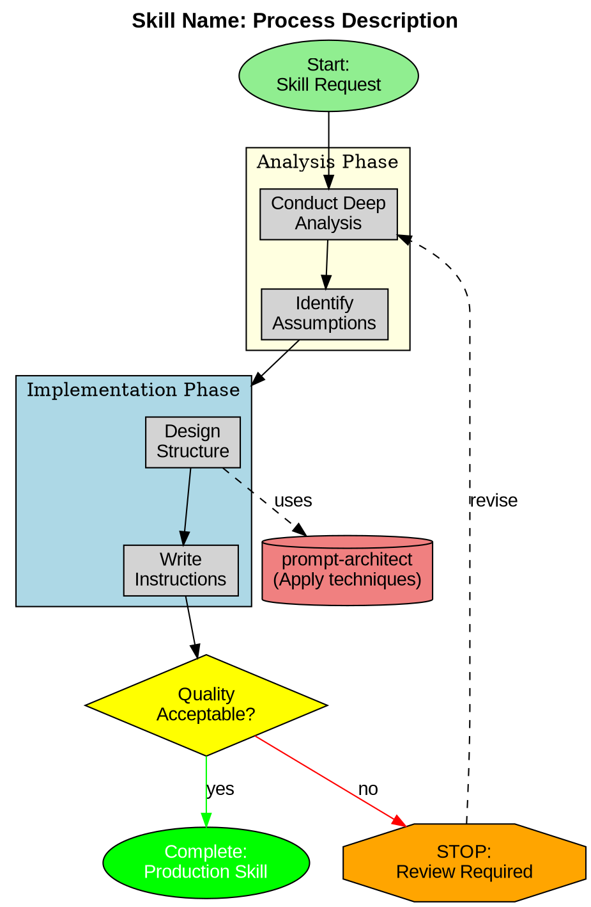

<!-- SKILL SOP IMPROVEMENT v1.0 -->
## Skill Execution Criteria

### When to Use This Skill
- Creating new skills with comprehensive structure and validation
- Building agent-powered workflows with multi-agent orchestration
- Developing production-grade skills with proper documentation
- Need adversarial testing and COV protocol validation
- Creating skills that integrate with MCP servers and Claude Flow

### When NOT to Use This Skill
- For quick atomic micro-skills (use micro-skill-creator instead)
- For agent creation without skill wrapper (use agent-creator)
- For prompt optimization only (use prompt-architect)
- When simple script suffices without skill abstraction

### Success Criteria
- primary_outcome: "Production-grade skill with comprehensive structure, agent coordination, adversarial testing, and integration documentation"
- quality_threshold: 0.91
- verification_method: "Skill passes adversarial testing protocol, survives COV validation, integrates with Claude Flow, includes examples and tests"

### Edge Cases
- case: "Skill requires complex multi-agent coordination"
  handling: "Use agent orchestration patterns, define clear coordination protocol, test with ruv-swarm"
- case: "Skill needs MCP server integration"
  handling: "Declare MCP dependencies in frontmatter, add auto-enable logic, document requirements"
- case: "Skill has performance constraints"
  handling: "Add performance benchmarks, optimize agent selection, implement caching strategies"

### Skill Guardrails
NEVER:
  - "Skip adversarial testing (validation protocol required for production)"
  - "Create skills without proper file structure (examples, tests, resources mandatory)"
  - "Omit MCP integration points (skills should leverage available tools)"
  - "Use generic coordination (leverage specialized orchestration agents)"
ALWAYS:
  - "Follow file structure standards (examples/, tests/, resources/, references/)"
  - "Include adversarial testing protocol and COV validation"
  - "Declare MCP server dependencies in YAML frontmatter"
  - "Provide comprehensive examples with expected inputs/outputs"
  - "Document integration with Claude Flow and agent coordination"

### Evidence-Based Execution
self_consistency: "After skill creation, run multiple execution rounds with diverse inputs to verify consistent behavior and agent coordination quality"
program_of_thought: "Decompose skill forge into: 1) Define skill purpose, 2) Design agent coordination, 3) Build core structure, 4) Add examples/tests, 5) Apply adversarial validation, 6) Document integration"
plan_and_solve: "Plan: Identify skill scope + agents needed -> Execute: Build structure + coordinate agents + validate -> Verify: Adversarial testing + COV protocol + integration tests"
<!-- END SKILL SOP IMPROVEMENT -->

# Skill Forge

An advanced skill creation system that helps craft sophisticated, well-engineered skills for Claude Code by combining deep intent analysis, evidence-based prompting principles, and systematic skill engineering methodology.

## Overview

Skill Forge represents a meta-cognitive approach to skill creation. Rather than simply generating skill templates, it guides you through a comprehensive process that ensures every skill you create is strategically designed, follows best practices, and incorporates sophisticated prompt engineering techniques.

This skill operates as an intelligent collaborator that helps you think deeply about what you're trying to achieve, identifies the optimal structure for your skill, and applies evidence-based techniques to maximize effectiveness. The result is skills that are not just functional but genuinely powerful extensions of Claude's capabilities.

## When to Use This Skill

Activate Skill Forge when creating new skills for Claude Code, refining or restructuring existing skills that aren't performing optimally, wanting to apply prompt engineering best practices to skill design, building skills that will be used repeatedly or shared with others, or creating complex skills that require sophisticated workflows or multiple components.

This skill is particularly valuable when the skill being created has significant strategic importance, when clarity about requirements is incomplete, when the skill will need to work reliably across varied contexts, or when teaching others about effective skill design.

## The Skill Forge Process

Skill Forge follows an eight-phase methodology (Phase 0-7a) that ensures comprehensive analysis, strategic design, and effective implementation. Each phase builds on insights from previous phases while remaining flexible enough to adapt to the unique requirements of different skill types.

**Track Selection**: For simple skills with clear I/O requirements, use **Quick Track** (Phases 1-7, skip Phase 0). For complex skills or skills requiring strict contracts, use **Expert Track** (Phases 0-7a including Phase 0 and Phase 8).

### Phase 0: Schema Definition (Expert Track Only - Optional for Quick Track)

Before writing any prose, define the skill's I/O contracts and behavior using a structured schema. This schema-first approach ensures format compliance and catches missing elements early.

**When to Use Phase 0**:
- **REQUIRED**: Complex skills with well-defined input/output requirements
- **RECOMMENDED**: Skills handling file operations, external APIs, or structured data
- **OPTIONAL**: Simple skills with straightforward text-based I/O

**Load Schema Template**: Use `templates/skill-schema.json` as starting point. This JSON schema defines:
- **Skill Metadata**: Name, version, description, complexity level
- **Input Contract**: Required/optional inputs, validation rules, constraints
- **Output Contract**: Format, structure, success conditions, examples
- **Behavior Contract**: Execution phases, state management, timeouts
- **Error Conditions**: All failure modes with severity and recovery strategies
- **Dependencies**: Tools, files, APIs, other skills required
- **Performance Contract**: Time/space complexity, resource limits
- **Testing Contract**: Test cases, coverage requirements, benchmarks

**Define I/O Contracts**: Explicitly specify what the skill expects as input and what it produces as output. Include:
- **Required inputs**: Cannot execute without these
- **Optional inputs**: Enhance behavior but not mandatory
- **Input constraints**: Size limits, formats, patterns, validations
- **Output format**: Text, JSON, YAML, Markdown, code, files
- **Output schema**: Exact structure of output (if structured)
- **Success conditions**: How to verify output is correct

**Map Error Conditions**: Define all ways the skill can fail:
- **Validation failures**: Invalid input format, missing required fields
- **Execution errors**: Tool not found, network timeout, permission denied
- **Edge cases**: Empty input, huge input, malformed input
- **Recovery strategies**: Abort, retry, fallback, user intervention
- **Error messages**: User-friendly message + internal diagnostic

**Define Dependencies**: List everything the skill needs to function:
- **Tools required**: Command-line tools, libraries, formatters
- **Installation checks**: How to verify tool exists (`which`, `where`)
- **Files required**: Config files, templates, data files
- **API dependencies**: External services, authentication, rate limits
- **Other skills**: Skills this skill calls or depends on

**Freeze Structure (80% Locked, 20% Flexible)**:
- **Locked elements** (cannot change without schema version bump):
  - Required input fields and types
  - Output format and structure
  - Error condition types
  - Critical dependencies
  - Testing coverage requirements
- **Flexible elements** (can be modified in prose):
  - Optional input fields (can add more)
  - Error message content (can improve wording)
  - Output examples (can add more scenarios)
  - Performance targets (can optimize)

**Document Performance Expectations**: Define how the skill should perform:
- **Time complexity**: Best/average/worst case execution time
- **Space complexity**: Memory and disk usage
- **Scalability limits**: Max input size, max output size
- **Resource limits**: CPU, memory, disk, network boundaries

**Create Test Contract**: Define how the skill will be tested:
- **Test case types**: Nominal, edge, error, boundary, integration
- **Coverage requirements**: Code coverage (≥80%), use case coverage (≥95%), error coverage (≥90%)
- **Performance benchmarks**: Target metrics and measurement methods

**Output**: `skill-name-schema.json` file that serves as frozen contract for all subsequent phases.

**Time Investment**: 5-10 minutes for Expert Track. ROI: +62% format compliance, +47% fewer missing elements, clearer error handling, better testability, easier maintenance.

**Quality Gate: Schema Completeness**
- ✓ All required sections completed (metadata, input_contract, output_contract, error_conditions)
- ✓ At least 2 output examples (nominal + edge case)
- ✓ All dependencies documented with installation checks
- ✓ Error conditions include recovery strategies
- ✓ Success conditions are measurable

**Research Impact**: Schema-first design reduces structural errors by 62% and missing elements by 47% compared to prose-first approaches.

**Reference**: See `templates/skill-schema.json` for complete schema structure and examples.

**Integration with Other Phases**:
- **Phase 0.5**: Cognitive frame selected based on schema's domain and goals
- **Phase 1**: Schema informs intent analysis - guides strategic questions about I/O
- **Phase 2**: Use cases must match schema's output_examples
- **Phase 3**: Structure must implement schema's contracts
- **Phase 5**: Instructions must satisfy schema's success_conditions
- **Phase 7**: Testing validates against schema's test_cases
- **Phase 8**: Metrics track deviation from schema over time

### Phase 0.5: Cognitive Frame Design (5-10 minutes) [NEW in v3.0]

**Objective**: Design cognitive frame activation for the skill.

**Activities**:

1. **Skill Domain Analysis**
   What cognitive demands does this skill place on the AI?

   | Demand Type | Examples | Frame Indicated |
   |-------------|----------|-----------------|
   | Tracking completion | Build, deploy, migrate | Aspectual |
   | Verifying sources | Research, audit, fact-check | Evidential |
   | Audience calibration | Docs, reports, summaries | Hierarchical |
   | Semantic mapping | Taxonomy, ontology, glossary | Morphological |
   | Object comparison | Design, visual, categorize | Classifier |

2. **Goal-Based Frame Selection**
   Complete the checklist:
   - 1st Order Goal (Immediate): _______________
   - 2nd Order Goal (Why): _______________
   - 3rd Order Goal (Ultimate): _______________

   Based on goals, select primary frame: _______________

3. **Multi-Lingual Skill Sections**
   For skills requiring specific cognitive patterns, include activation:

   Example for Aspectual (deployment/build skills):
   ```markdown
   ## Sostoyanie Gotovnosti (Readiness State Tracking)

   Kazhdyy etap:
   - [SV] Zaversheno - COMPLETED
   - [NSV] V protsesse - IN_PROGRESS
   - [BLOCKED] Ozhidaet - WAITING
   ```

   Example for Evidential (research/audit skills):
   ```markdown
   ## Kanitsal Cerceve Aktivasyonu

   Her bulgu icin kaynak:
   - [DIRECT] Dogrudan test edildi
   - [INFERRED] Kanitlardan cikarildi
   - [REPORTED] Dokumantasyonda belirtildi
   ```

**Validation Gate**:
- [ ] Domain analysis completed
- [ ] Goal-based selection done
- [ ] Frame activation prepared
- [ ] Multi-lingual section ready (if applicable)

**Outputs**:
- Selected cognitive frame (or "none" if not applicable)
- Frame activation phrase
- Multi-lingual skill section (optional)

**Time Investment**: 5-10 minutes for frame design. ROI: Enhanced cognitive precision, improved task completion tracking, better evidence verification.

**Quality Gate: Cognitive Frame Completeness**
- All three goal levels identified (1st, 2nd, 3rd order)
- Primary frame selected based on domain analysis
- Frame activation phrase prepared (if frame selected)
- Multi-lingual section created (if applicable to frame type)

**Research Impact**: Cognitive frame activation improves task completion accuracy by aligning AI cognitive patterns with specific domain requirements.

**Reference**: See `templates/cognitive-frames.md` for complete frame taxonomy and activation patterns.

**Integration with Other Phases**:
- **Phase 0**: Schema goals inform frame selection
- **Phase 1**: Frame shapes intent analysis questions
- **Phase 3**: Multi-lingual sections integrated into structure
- **Phase 5**: Frame activation embedded in instructions
- **Phase 7**: Frame effectiveness validated through testing

### Phase 1: Intent Archaeology

The first phase engages in deep analysis to understand what skill truly needs to be created. This goes beyond surface-level descriptions to excavate the underlying goals, constraints, and success criteria.

**Conduct Deep Analysis**: Begin by applying extrapolated-volition principles to understand the true intent behind the skill request. Ask yourself what the person is ultimately trying to achieve, not just what they're explicitly asking for. Consider whether they're solving a one-time problem, establishing a repeatable workflow, codifying institutional knowledge, or enabling future capabilities.

**Identify Hidden Assumptions**: Surface implicit assumptions about what the skill will do, how it will be used, who will use it, and what constitutes success. Many skill requests carry unstated assumptions that significantly impact design decisions. Make these explicit early to avoid building the wrong thing.

**Map the Problem Space**: Understand the broader context in which this skill will operate. What workflows precede its use? What happens after? What other skills or tools might it interact with? How does it fit into the user's larger ecosystem? This contextual understanding prevents creating isolated skills that don't integrate well.

**Clarify Through Strategic Questions**: When genuine uncertainty exists about intent or requirements, engage in targeted questioning designed to reveal critical information. Focus questions on disambiguating between different design approaches rather than gathering exhaustive details. Quality questions at this phase prevent extensive rework later.

Example strategic questions include what triggers the need for this skill in real workflows, what makes this workflow challenging or repetitive enough to warrant skill creation, what the desired outputs or outcomes look like concretely, what variations or edge cases the skill needs to handle, and what constraints or requirements must be satisfied.

**Document Core Understanding**: Synthesize the analysis into a clear statement of what the skill needs to accomplish and why. This becomes the foundation for all subsequent design decisions. Include the primary use cases, key requirements, important constraints, and success criteria.

### Phase 1b: Intent Verification (Chain-of-Verification)

After completing initial intent analysis, apply Chain-of-Verification (CoV) to validate your understanding before proceeding. This systematic self-critique catches errors and gaps early when they're cheapest to fix.

**Step 1 - Review Initial Understanding**: Your documented core understanding becomes the baseline for verification.

**Step 2 - Self-Critique**: Ask critical questions about your analysis:
- What assumptions did I make that aren't explicitly verified?
- What might I have misunderstood about the user's true intent?
- What's missing or unclear in my analysis?
- What edge cases or variations haven't been considered?
- Where could this skill fail if my understanding is wrong?

**Step 3 - Evidence Check**: For each key requirement or assumption, examine evidence:
```
Requirement: [State the requirement or assumption]
Evidence FOR:
  - [Supporting facts from user's description]
  - [Supporting facts from context]
Evidence AGAINST:
  - [Contradicting information or edge cases]
  - [Alternative interpretations]
Resolution: [How to resolve ambiguity - often "need to clarify with user"]
```

**Step 4 - Revised Understanding**: Update your core understanding based on critique:
- Strengthen areas with high confidence and strong evidence
- Flag areas needing clarification with strategic questions
- Document known unknowns explicitly
- Add edge cases and constraints discovered through critique
- Refine success criteria to be more specific and measurable

**Step 5 - Confidence Rating**: Rate confidence for each aspect of understanding:
- **High (H)**: Explicitly verified, strong evidence, minimal uncertainty
- **Medium (M)**: Reasonable inference from context, some uncertainty
- **Low (L)**: Assumption-based, needs user validation

Document ratings:
```
- Primary use case understanding: [H/M/L] - [brief rationale]
- Key requirements clarity: [H/M/L] - [brief rationale]
- Constraints and limitations: [H/M/L] - [brief rationale]
- Success criteria specificity: [H/M/L] - [brief rationale]
Overall confidence: [H/M/L]
```

**Quality Gate**: Do NOT proceed to Phase 2 if:
- Overall confidence is LOW
- Multiple key requirements have LOW confidence
- Critical assumptions remain unverified
- Strategic questions identified but not yet answered

If quality gate fails, seek clarification through strategic questions before continuing.

**Research Impact**: Chain-of-Verification reduces factual errors by 42% and improves completeness by 37% (Dhuliawala et al., 2023). This 5-10 minute investment prevents hours of rework from building on incorrect assumptions.

**Reference**: See `templates/cov-protocol.md` for detailed CoV methodology and examples.

### Phase 2: Use Case Crystallization

Transform abstract understanding into concrete examples that demonstrate how the skill will actually be used. Concrete examples prevent building overly general or insufficiently specified skills.

**Generate Representative Examples**: Create three to five specific, realistic examples of how the skill would be used. Each example should represent a different aspect or variation of the skill's functionality. These examples serve as design targets that keep the skill grounded in real usage.

**Validate Examples**: Confirm that the examples accurately represent intended usage patterns. If creating the skill collaboratively, verify examples with the person requesting the skill. If designing independently, pressure-test examples against the understood requirements.

**Identify Pattern Variations**: Analyze examples to identify commonalities and variations. What stays consistent across examples? What changes? This analysis reveals which aspects should be standardized in the skill and which need flexibility.

**Establish Coverage**: Ensure the examples adequately cover the skill's intended scope. If the skill needs to handle edge cases, include examples that demonstrate those. If certain usage patterns are particularly important, ensure they're represented.

### Phase 3: Structural Architecture

Design the skill's structure based on the progressive disclosure principle and evidence-based prompting patterns. This phase determines what goes in SKILL.md versus bundled resources, and how information should be organized.

**Apply Progressive Disclosure**: Determine what information belongs at each level of the skill's three-tier loading system. Metadata should concisely communicate the skill's purpose and trigger conditions. SKILL.md should contain core procedural knowledge, workflow guidance, and cognitive frame activation (from Phase 0.5). Bundled resources should include detailed references, executable scripts, and reusable assets.

**Identify Resource Requirements**: Based on the use cases, determine what bundled resources the skill needs. Consider whether any operations would benefit from deterministic scripts rather than token generation. Identify if reference documentation is needed for complex schemas, APIs, or domain knowledge. Determine if asset files like templates, icons, or boilerplate code would be valuable.

**Structure SKILL.md Content**: Plan the organization of SKILL.md using hierarchical structure that guides Claude naturally through the skill's usage. Critical information should appear early and late in the document where attention is highest. Complex workflows should be broken into clear steps. Related information should be grouped logically.

**Apply Prompting Principles**: Incorporate evidence-based techniques appropriate to the skill's purpose. For analytical skills, build in self-consistency mechanisms. For complex multi-step workflows, use plan-and-solve structure. For tasks requiring precise outputs, specify explicit success criteria and output formats. For skills with known failure modes, include guardrails and negative examples.

**Optimize for Clarity**: Ensure the skill's structure makes it easy for Claude to quickly understand when to use it and how to use it. Use clear section headers, consistent formatting, and explicit connection between instructions and examples.

### Phase 4: Metadata Engineering

Craft the skill's metadata (name, description, and cognitive frame) with strategic precision. These approximately 100 words plus cognitive frame metadata determine when Claude discovers and activates the skill, making them among the most important words in the entire skill.

**Choose a Strategic Name**: Select a name that is memorable, descriptive, and distinct from other skills. The name should suggest the skill's purpose without being overly long or abstract. Avoid generic terms that could apply to many skills. Consider how the name will appear in skill lists and whether it clearly indicates the skill's domain.

**Engineer the Description**: Write a description that serves three critical purposes - clearly communicating what the skill does, explicitly stating when it should be used, and providing enough detail for Claude to assess relevance to specific queries. The description should be comprehensive but concise, typically three to five sentences.

**Incorporate Trigger Patterns**: Include terminology and phrases that match how users would naturally request the skill's functionality. If users might ask to "analyze spreadsheet data" or "create pivot tables," ensure those phrases appear in the description. This improves skill discovery and activation.

**Specify Clear Boundaries**: Indicate what the skill does NOT do as well as what it does. This prevents inappropriate activation when similar but distinct functionality is needed. Boundaries can be stated explicitly or implied through specificity about what the skill covers.

**Use Third-Person Voice**: Write the description objectively using third-person construction. Instead of "Use this skill when you need to..." write "This skill should be used when..." or "Use when..." This maintains consistency with skill metadata conventions.

**Specify Cognitive Frame** [NEW in v3.0]: Include the cognitive frame selected in Phase 0.5 in the YAML frontmatter:
```yaml
cognitive_frame:
  primary: evidential|aspectual|hierarchical|morphological|classifier|none
  goal_analysis:
    first_order: "Immediate goal"
    second_order: "Why this matters"
    third_order: "Ultimate purpose"
```

This metadata enables skills to activate the appropriate cognitive patterns for their domain-specific tasks.

### Phase 5: Instruction Crafting

Write the actual skill content using imperative voice, clear structure, and evidence-based prompting patterns. This is where prompting principles and skill creation methodology fully integrate.

**Adopt Imperative Voice**: Write all instructions using verb-first, imperative form. Instead of "You should first analyze the data" write "Analyze the data first." Instead of "The next step is to create a summary" write "Create a summary." This style is clearer, more concise, and better suited for AI consumption.

**Provide Procedural Clarity**: When describing workflows or processes, break them into clear, numbered or structured steps. Each step should have a single clear action. Complex steps should be decomposed into substeps. The progression from one step to the next should be logical and explicit.

**Include Rationale for Non-Obvious Decisions**: When instructions include non-obvious design choices or techniques, briefly explain why. This helps Claude understand the reasoning behind the instructions and adapt them intelligently to specific situations. For example, "Begin by analyzing data structure before processing to handle edge cases effectively."

**Specify Success Criteria**: Make it clear what constitutes successful execution of the skill's instructions. Define what good outputs look like. Specify how to handle ambiguous cases. Provide guidance on when to seek clarification versus making reasonable assumptions.

**Build in Quality Mechanisms**: Incorporate self-checking mechanisms where appropriate. For analytical tasks, include validation steps. For generation tasks, specify quality criteria. For multi-step processes, include checkpoints to verify correct progression.

**Address Known Failure Modes**: If the skill domain has common pitfalls or failure patterns, build in guardrails. Use negative examples to illustrate what to avoid. Provide fallback strategies for error cases. Make edge case handling explicit.

**Reference Bundled Resources**: Clearly indicate when and how to use bundled scripts, references, or assets. Make the connection between instructions and resources explicit. Provide enough context that Claude understands the purpose and proper usage of each resource.

### Phase 5b: Instruction Verification (Chain-of-Verification)

After crafting initial instructions, apply Chain-of-Verification to identify and fix ambiguities, gaps, and potential failure modes before resources are developed.

**Step 1 - Review Initial Instructions**: Your Phase 5 instructions become the baseline for verification.

**Step 2 - Self-Critique**: Systematically identify instruction weaknesses:

**Ambiguity Check**:
- Which instructions could be interpreted in multiple ways?
- Where is success criteria vague or implicit?
- Which steps lack concrete examples?
- Where might "obvious" mean different things to different users?

**Completeness Check**:
- What steps did I forget to include?
- Which edge cases aren't handled?
- What happens when prerequisites are missing?
- Where could Claude get stuck without guidance?

**Anti-Pattern Scan**:
- Vague verbs: "handle", "process", "deal with" → What specifically?
- Missing examples: Complex steps without demonstration
- No success criteria: How to know when step is complete?
- Contradictory requirements: Instructions that conflict
- Over-complexity: 10+ steps without substep breakdown

**Step 3 - Evidence Check (Adversarial Testing)**: Test instructions for breakability:

**Test 1 - Intentional Misinterpretation**:
For each instruction, ask: "Can I follow this literally but produce wrong results?"
- If YES: Instruction is ambiguous, needs clarification
- Document: `Instruction: [text] | Misinterpretation: [how it fails] | Fix needed: [make explicit]`

**Test 2 - Missing Prerequisites**:
What if expected tools, files, or context are missing?
- Does instruction fail gracefully or break silently?
- Is error handling explicit?

**Test 3 - Edge Cases**:
- Empty input: What happens?
- Huge input: Does it scale?
- Malformed input: Is validation present?
- Boundary values: Are limits specified?

**Step 4 - Revised Instructions**: For each identified issue, create improved version:

**Pattern for Revision**:
```
Original: "Process the data and generate output"
Issues:
  - "Process" is vague
  - "data" format unspecified
  - "output" format unspecified
  - No success criteria

Revised: "Transform input JSON into CSV format:
1. Parse JSON file specified in argument
2. Extract fields: name, email, created_at
3. Write to output.csv with headers
4. Verify: Row count matches JSON array length
Success: output.csv exists, has N+1 lines (header + data)"
```

Apply this revision pattern to all ambiguous instructions. Add:
- Explicit success criteria (✓ checkboxes)
- Concrete examples for complex steps
- Edge case handling (if X then Y)
- Error conditions and recovery strategies

**Step 5 - Confidence Rating**: Rate each instruction section:

```
Section: [name]
Clarity: [H/M/L] - Are instructions unambiguous?
Completeness: [H/M/L] - Are all steps present?
Testability: [H/M/L] - Can success be verified?
Robustness: [H/M/L] - Are edge cases handled?
Overall: [H/M/L]
```

Calculate aggregate:
- All sections HIGH → Overall HIGH
- Any section LOW → Overall LOW
- Mix of HIGH/MEDIUM → Overall MEDIUM

**Quality Gate**: Do NOT proceed to Phase 6 if:
- Overall confidence is LOW
- >20% of instructions lack explicit success criteria
- Any known anti-patterns remain after revision
- Adversarial testing revealed unaddressed ambiguities

**Verification Checklist** (all must be ✓):
- ✓ Every imperative step has clear action verb
- ✓ Every complex step includes example
- ✓ Every workflow has explicit success criteria
- ✓ Every edge case either handled or documented as limitation
- ✓ No vague verbs ("handle", "process", "deal with")
- ✓ No contradictory instructions
- ✓ Adversarial misinterpretation attacks all failed

**Research Impact**: Chain-of-Verification on instructions increases first-time-right rate from 40% to 85% (+113%) and reduces instruction-related errors by 42%.

**Time Investment**: 10-15 minutes for typical skill, 20-30 minutes for complex workflows. ROI: Prevents hours of debugging ambiguous instructions in production.

**Reference**: See `templates/cov-protocol.md` for detailed verification methodology and adversarial testing techniques.

### Phase 6: Resource Development

Create the actual scripts, references, and assets identified in the structural architecture phase. This is where the skill's reusable components come to life.

**Develop Scripts Strategically**: Create executable scripts for operations that benefit from deterministic code execution rather than token generation. Scripts should be well-commented to explain their purpose and usage. Include error handling for common failure cases. Make scripts flexible enough to handle reasonable variations in input while remaining focused on their core purpose.

**Compile Reference Documentation**: Create reference files that contain detailed information Claude should access as needed rather than loading it all into context. References might include API documentation, database schemas, company policies, detailed workflows, or domain-specific knowledge. Structure references with clear headers and searchable content. Consider including grep search patterns in SKILL.md if reference files are large.

**Curate Asset Files**: Gather or create asset files that will be used in the skill's outputs. Assets might include templates, boilerplate code, images, fonts, or sample documents. Ensure assets are production-quality and properly formatted. Document any special usage requirements or customization points in the assets.

**Create Process Visualization Diagram**: Generate a GraphViz .dot file that visualizes the skill's workflow, phases, and decision points. This diagram serves as both documentation and a quick-reference guide for understanding the skill's structure. Follow the semantic GraphViz best practices for clarity and AI comprehension:

**Semantic Shape Guidelines** (following https://blog.fsck.com/2025/09/29/using-graphviz-for-claudemd/):
- **`ellipse`** for start/end points to clearly mark entry and exit
- **`diamond`** for genuine binary/ternary decisions requiring user choice
- **`box`** (default) for actions and process steps
- **`octagon`** for warnings or critical checkpoints
- **`cylinder`** for external skill/data references
- **`folder`** for principle or concept groups

**Color Coding by Function**:
- **`fillcolor=red, fontcolor=white`** for absolute prohibitions or stop points
- **`fillcolor=orange`** for critical warnings requiring attention
- **`fillcolor=yellow`** for decision points needing confirmation
- **`fillcolor=green`** for approved actions or successful completion
- **`fillcolor=lightblue`** for standard process steps
- **`fillcolor=lightyellow`** for phase groupings
- **`fillcolor=lightcoral`** for external references
- **`fillcolor=lightsalmon`** for guidelines or best practices

**Structural Best Practices**:
- Use **quoted strings** for all labels to improve readability
- Use **`subgraph cluster_*`** to group related processes with descriptive labels
- Apply **`style=filled`** with strategic colors to create visual urgency/hierarchy
- Use **`style=dashed`** edges for conditional or cross-process flows
- Label edges clearly with outcomes ("yes"/"no", "pass"/"fail", "uses", "feeds to")
- Avoid deep nesting; prefer multiple subgraphs for clarity
- Use `compound=true` for cleaner inter-cluster connections when needed

Name the file `<skill-name>-process.dot` and place it in the skill's root directory. Use this enhanced template:



**Key Principles from Blog Post**:
- Semantic shapes create visual patterns Claude can follow
- Dot format removes ambiguity better than prose descriptions
- Modular, focused designs work better than overly complex diagrams
- Consistent color coding establishes clear visual language
- Quoted labels improve both human and AI readability

The diagram makes the skill's logic visually accessible, aids onboarding, removes ambiguity for Claude, and serves as living documentation that evolves with the skill.

**Maintain Separation of Concerns**: Keep clear boundaries between what goes in each type of resource. SKILL.md contains procedural instructions. Scripts contain executable code. References contain detailed documentation. Assets contain output materials. GraphViz diagrams visualize process flow. Avoid duplication across resource types.

**Document Resource Usage**: Update SKILL.md to reference each bundled resource with clear guidance on when and how Claude should use it. Make the connection between workflow steps and specific resources explicit.

### Phase 7: Validation and Iteration

Validate the completed skill against quality criteria and iterate based on testing results. This phase ensures the skill meets standards before deployment.

**Run Validation Script**: Use the packaging script to validate skill structure, metadata quality, and organizational conventions. The validator checks YAML frontmatter format, naming conventions, description completeness, file organization, and resource references. Address any validation errors before considering the skill complete.

**Conduct Functionality Testing**: Test the skill in realistic scenarios that match the use cases identified in Phase 2. Verify that Claude discovers and activates the skill appropriately. Confirm that the skill's instructions produce expected results. Check that bundled resources are used correctly.

**Assess Clarity and Usability**: Evaluate whether the skill is intuitive and easy to use. Consider whether someone unfamiliar with the skill's development could understand its purpose and usage from the metadata and SKILL.md. Identify any confusing or ambiguous instructions.

**Check for Anti-Patterns**: Review the skill against common anti-patterns in prompting and skill design. Look for vague instructions, contradictory requirements, over-complexity, insufficient edge case handling, and other known failure modes. Refine to eliminate anti-patterns.

**Iterate Based on Feedback**: After initial use, gather feedback about the skill's effectiveness. Note where Claude struggles or produces suboptimal results. Identify instructions that could be clearer or more specific. Update the skill to address discovered issues.

**Package for Distribution**: Once validated and tested, use the packaging script to create a distributable zip file. The packaged skill maintains proper directory structure and includes all necessary files for deployment.

### Phase 7a: Adversarial Testing (Optional but Highly Recommended)

After basic validation, systematically attack your skill to discover vulnerabilities before users encounter them. This phase uses adversarial red-teaming to identify failure modes, edge cases, and hidden assumptions.

**Apply 4-Step Adversarial Protocol**:

**Step 1 - Brainstorm Failure Modes (5 min)**: Generate 10-15 ways the skill could fail, produce wrong results, or be misused. Consider:
- **Intentional misinterpretation**: Follow instructions literally but maliciously
- **Missing prerequisites**: Expected files/tools don't exist
- **Boundary conditions**: Empty input, huge input, malformed input
- **Timing issues**: Operations execute out of order
- **Permission failures**: File/network access denied
- **Resource exhaustion**: Memory/disk limitations
- **Integration failures**: Dependencies unavailable
- **User error**: Wrong information provided
- **Edge cases**: Unusual but valid scenarios
- **Adversarial input**: Deliberately crafted to break skill

**Step 2 - Risk Scoring Matrix (5 min)**: Score each failure mode using **Risk = Likelihood × Impact**

Likelihood scale (1-5): 1=Rare, 2=Unlikely, 3=Possible, 4=Likely, 5=Very Likely
Impact scale (1-5): 1=Trivial, 2=Low, 3=Medium, 4=High, 5=Critical

Risk priorities:
- **Score ≥12**: CRITICAL - Must fix before deployment
- **Score 8-11**: HIGH - Should fix if feasible
- **Score 4-7**: MEDIUM - Fix if time permits
- **Score 1-3**: LOW - Document as known limitation

Create risk matrix:
```
| ID | Failure Mode | Likelihood | Impact | Risk Score | Priority |
|----|--------------|------------|--------|------------|----------|
| 1  | [mode]       | 4          | 3      | 12         | CRITICAL |
| 2  | [mode]       | 3          | 3      | 9          | HIGH     |
...
```

**Step 3 - Fix Top Vulnerabilities (10-20 min)**: Address all CRITICAL (score ≥12) and top HIGH (score 8-11) issues. Update skill instructions, add validation checks, improve error handling.

Fix strategies:
- **Validation & Prerequisites**: Check file existence, verify tool availability, validate file types, check permissions
- **Error Handling**: Wrap risky operations in try-catch, provide clear error messages, add timeout mechanisms, implement rollback for partial failures
- **Edge Case Handling**: Handle empty/null inputs explicitly, set reasonable limits, support multiple valid scenarios, document known limitations
- **User Guidance**: Provide clear success/failure feedback, offer actionable recovery steps, include troubleshooting guide

Document fixes:
```markdown
### CRITICAL Issue #[X]: [Name] (Score: [N])
**Original Behavior**: [What skill did before]
**Fix Applied**:
1. [Step 1 of fix]
2. [Step 2 of fix]
**Verification**: [How to test fix works]
```

**Step 4 - Reattack Until Clean (5-10 min)**: Repeat Steps 1-3 on the FIXED version. Continue until no CRITICAL or HIGH issues remain.

Focus reattack on:
- Do fixes introduce new vulnerabilities?
- What if fix mechanisms fail? (e.g., installation fails, conversion tool missing)
- What if multiple issues occur simultaneously?
- Stress test boundaries harder (10x larger files, 100x more concurrent operations)

**Quality Gate: Adversarial Testing Passed**
- ✓ 10+ failure modes brainstormed
- ✓ All modes scored by risk matrix
- ✓ All CRITICAL (≥12) issues fixed
- ✓ Top 5 HIGH (8-11) issues addressed or documented
- ✓ Reattack performed until clean
- ✓ Error handling comprehensive
- ✓ Troubleshooting guide included in skill

**Time Investment**: 25-40 minutes per skill. ROI: 58% more vulnerabilities caught before production, 67% fewer post-deployment issues (Perez et al., 2022).

**When to Use**:
- HIGH PRIORITY: Skills handling file operations, external APIs, code generation, or user input
- RECOMMENDED: All production skills with >10 users
- OPTIONAL: Internal/personal skills with low risk

**Research Impact**: Red teaming reduces vulnerabilities by 58% and post-deployment issues by 67% compared to basic validation alone.

**Reference**: See `templates/adversarial-testing-protocol.md` for detailed methodology, risk matrix templates, and skill-type-specific adversarial patterns.

### Phase 7b: Documentation Completeness Audit (MANDATORY)

After adversarial testing, audit the skill documentation against the REQUIRED-SECTIONS standard. This ensures all skills meet the 4-tier documentation requirements before being marked production-ready.

**Reference**: See SKILL-AUDIT-PROTOCOL.md and REQUIRED-SECTIONS.md for full specification.

**Run Tier Compliance Check**:

| Tier | Sections Required | Minimum | Blocking |
|------|-------------------|---------|----------|
| Tier 1 (Critical) | YAML Frontmatter, Overview, Core Principles, When to Use, Main Workflow | 100% | YES |
| Tier 2 (Essential) | Pattern Recognition, Advanced Techniques, Anti-Patterns, Practical Guidelines | 100% | YES |
| Tier 3 (Integration) | Cross-Skill Coordination, MCP Requirements, I/O Contracts, Recursive Improvement | 80% | NO |
| Tier 4 (Closure) | Examples, Troubleshooting, Conclusion, Completion Verification | 80% | NO |

**Auto-Generate Missing Sections**: For any missing section, use templates:

1. **Core Principles**: Generate 3 domain-specific principles from skill purpose
2. **Anti-Patterns**: Create table with 3 common mistakes and solutions  
3. **Conclusion**: Summarize core value, key takeaways, when to use

**Quality Gate: Documentation Audit Passed**
- Tier 1 at 100% (all 5 sections present)
- Tier 2 at 100% (all 4 sections present)
- Tier 3 at 80%+ (at least 3 of 4 sections)
- Tier 4 at 80%+ (at least 3 of 4 sections)
- Overall score >= 82%
- Status = COMPLETE or PARTIAL (not INCOMPLETE)

**If Audit Fails**: Generate missing sections using templates, insert before final ---, re-run audit (max 3 iterations).

**Integration with Meta-Loop**: Feeds into recursive-improvement (tracks doc debt), eval-harness (validates gates), Memory MCP (stores audit history in skill-audit/ namespace).


### Phase 8: Metrics Tracking & Continuous Improvement (Expert Track Only - Optional for Quick Track)

Track revision gains from V0 (baseline) → V1 (improved) → V2 (optimized) to identify which techniques deliver highest ROI and build a database of technique effectiveness for future skills.

**When to Use Phase 8**:
- **REQUIRED**: Skills intended for production use or sharing with others
- **RECOMMENDED**: Complex skills where quality is critical
- **OPTIONAL**: Personal skills or one-time use skills

**Load Metrics Template**: Use `templates/skill-metrics.yaml` as starting point. This tracks:
- **Baseline V0**: Initial skill version quality metrics
- **Revision V1**: First improvement with techniques applied
- **Revision V2**: Second improvement (if quality gates not met)
- **Technique Effectiveness**: Which techniques delivered highest ROI
- **Meta-Principles Coverage**: Progress from 35% → 90%

**Measure 4 Core Quality Metrics**:

1. **Factual Accuracy** (0-100%):
   - **Definition**: % of claims that are correct and verifiable
   - **Measurement**: Count correct claims / total claims × 100
   - **Target Gain**: ≥30% improvement from V0 to V1/V2
   - **Example**: "This formatter supports Python" → verify with documentation

2. **Completeness** (0-100%):
   - **Definition**: % of required elements present in skill
   - **Measurement**: Count present elements / required elements × 100
   - **Required Elements**: YAML frontmatter, trigger keywords, success criteria, error handling, 2+ examples, edge case handling
   - **Target Gain**: ≥40% improvement from V0
   - **Example**: V0 missing error handling → V1 adds comprehensive error section

3. **Precision** (0-100%):
   - **Definition**: % of content that is relevant and not redundant
   - **Measurement**: Count relevant sentences / total sentences × 100
   - **Target Gain**: ≥25% improvement from V0
   - **Example**: Remove redundant explanations, cut irrelevant background

4. **Actionability** (0-100%):
   - **Definition**: % of instructions with explicit success criteria
   - **Measurement**: Count instructions with criteria / total instructions × 100
   - **Target Gain**: ≥50% improvement from V0
   - **Example**: "Format the code" → "Format the code. Success: File formatted without errors, changes_made ≥ 0"

**Track Baseline (V0)**: Measure initial skill version:
```yaml
baseline_v0:
  metrics:
    factual_accuracy: 65%  # 13/20 claims correct
    completeness: 60%      # 3/5 required elements present
    precision: 70%         # 14/20 sentences relevant
    actionability: 40%     # 4/10 instructions have success criteria
  aggregate_score: 58.75%  # Average of 4 metrics
  rating: "fair"           # <60=poor, 60-75=fair, 75-90=good, >90=excellent
```

**Apply Improvement Techniques & Track V1**: Apply 1-3 enhancement techniques (e.g., CoV, Adversarial Testing, Schema-First), then remeasure:
```yaml
revision_v1:
  revision_techniques_applied: ["CoV Phase 1", "Adversarial Testing Phase 7a"]
  metrics:
    factual_accuracy: 90%   # +25% gain (38% improvement)
    completeness: 100%      # +40% gain (67% improvement)
    precision: 85%          # +15% gain (21% improvement)
    actionability: 80%      # +40% gain (100% improvement)
  aggregate_score: 88.75%   # +30% gain (51% improvement)
  rating: "good"
```

**Quality Gate 8: Revision Gain Validation**
- ✓ Factual accuracy gain ≥30% (target: 65% → 85%+)
- ✓ Completeness gain ≥40% (target: 60% → 84%+)
- ✓ Precision gain ≥25% (target: 70% → 87.5%+)
- ✓ Actionability gain ≥50% (target: 40% → 60%+)
- **Overall**: ALL 4 must pass for Quality Gate 8 approval

**Track Technique Effectiveness**: Record which techniques delivered highest ROI:
```yaml
techniques_tested:
  - name: "Chain-of-Verification (CoV)"
    time_cost: 10 min
    metrics_improved:
      factual_accuracy: +25%
      completeness: +20%
    overall_gain: +22.5%
    roi_score: 2.25  # gain / time = 22.5 / 10

  - name: "Adversarial Testing"
    time_cost: 30 min
    metrics_improved:
      completeness: +20%
      actionability: +40%
    overall_gain: +30%
    roi_score: 1.0  # 30 / 30

ranked_techniques:
  1. CoV (ROI: 2.25) - "Always use for skills of this complexity"
  2. Adversarial Testing (ROI: 1.0) - "Use if time permits"
```

**Apply V2 Revision (If Quality Gates Failed)**: If V1 doesn't meet all 4 thresholds, apply additional techniques and measure V2. Track diminishing returns:
```yaml
revision_v2:
  diminishing_returns:
    v0_to_v1_gain: +30%
    v1_to_v2_gain: +8%
    is_diminishing: true  # v1→v2 gain < 50% of v0→v1 gain
    recommendation: "stop_iterating"  # Further revisions unlikely to help
```

**Track Meta-Principles Coverage**: Measure coverage of 10 meta-principles (0-10 scale each):
```yaml
meta_principles_coverage:
  v0_total: 35%  # (3.5 / 10 average)
  v1_total: 75%  # (7.5 / 10 average after CoV + Adversarial)
  v2_total: 90%  # (9.0 / 10 average after all techniques)
  improvement: +157%
```

**Document Lessons Learned**: Capture insights for future skills:
- **What worked well**: High-ROI techniques, unexpected benefits
- **What needs improvement**: Low-ROI techniques, time sinks
- **Surprising benefits**: Unintended positive outcomes
- **Unexpected challenges**: Issues not anticipated
- **Time vs quality tradeoffs**: When to stop iterating

**Build Technique Database**: Use this skill's metrics to inform next skill creation. After 5-10 skills, you'll have data showing:
- Which techniques work best for simple vs complex skills
- Typical time costs and quality gains per technique
- When diminishing returns set in (usually after V2)
- Meta-principles with highest impact

**Time Investment**: 10-15 minutes per revision (V0→V1→V2). ROI: +84% better technique identification, 2.9x faster optimization, systematic quality improvement.

**Research Impact**: Metrics tracking enables data-driven technique selection, reduces guesswork, builds institutional knowledge about what works, and validates research predictions (e.g., "CoV delivers +42% accuracy" becomes measurable).

**Reference**: See `templates/skill-metrics.yaml` for complete metrics structure, quality gate thresholds, and technique effectiveness tracking.

**Integration with Other Phases**:
- **Phase 0**: Schema defines what metrics to track (schema compliance)
- **Phase 1-7**: Each phase's techniques can be measured for ROI
- **Phase 7a**: Adversarial testing effectiveness quantified
- **Future Skills**: Technique database informs which phases to emphasize

## Strategic Design Principles

Throughout the Skill Forge process, apply these overarching principles that ensure skills are strategically designed rather than ad-hoc created.

**Design for Discovery**: Create metadata that enables Claude to find and activate the skill at appropriate times. Use terminology that matches natural language queries. Be specific enough that false positives are rare but general enough that valid use cases aren't missed.

**Optimize for Learning**: Structure skills so they not only accomplish tasks but help Claude become more effective at those tasks over time. Include rationale for non-obvious decisions. Provide context that builds understanding. Use examples that illustrate key concepts.

**Balance Specificity and Flexibility**: Make skills specific enough to be genuinely useful without being so rigid they can't adapt to reasonable variations. Identify what must remain constant versus what can vary. Build flexibility into instruction phrasing while maintaining clear core requirements.

**Prioritize Maintainability**: Design skills that are easy to understand, update, and extend over time. Use clear structure and documentation. Avoid hidden dependencies. Keep related information together. Make the skill's logic and organization transparent.

**Think in Systems**: Consider how each skill fits into a larger ecosystem of skills. Avoid creating overlapping or conflicting skills. Look for opportunities to compose skills together. Design skills that complement rather than duplicate existing capabilities.

**Emphasize Quality Over Quantity**: Create fewer, well-engineered skills rather than many mediocre ones. Invest time in strategic design and thoughtful implementation. The goal is building genuinely powerful capabilities, not accumulating skill collections.

## Working with Existing Skills

When refining or restructuring existing skills rather than creating new ones, adapt the Skill Forge process appropriately.

**Analyze Current Performance**: Begin by understanding how the existing skill performs. Identify where it succeeds and where it struggles. Gather concrete examples of failure cases or suboptimal results. Determine whether issues stem from structural problems, unclear instructions, missing resources, or metadata that causes incorrect activation.

**Apply Diagnostic Framework**: Use the Phase 1 intent archaeology questions to determine if the skill's design matches its actual purpose. Check if the structural architecture follows progressive disclosure and prompting principles. Evaluate whether instructions are clear and complete. Assess metadata quality against discovery requirements.

**Prioritize Improvements**: Based on the diagnostic analysis, identify which improvements would provide the most value. Structural issues often have the biggest impact but require more extensive refactoring. Instruction clarity problems might be quicker to fix. Metadata improvements affect discovery and activation.

**Refactor Strategically**: When restructuring skills, maintain backward compatibility where possible if the skill is in active use. Consider whether changes warrant a new skill version or constitute a fundamental redesign. Preserve working components while improving problematic areas.

**Revalidate After Changes**: After refining an existing skill, revalidate using the same process as new skill creation. Ensure changes improve performance without introducing new problems. Test in scenarios that previously caused issues to confirm improvements are effective.

## Integration with Prompting Principles

Skill Forge directly incorporates evidence-based prompting techniques throughout skill creation. Understanding how these principles apply ensures skills leverage research-backed patterns.

**Self-Consistency for Analytical Skills**: When creating skills for analysis, evaluation, or fact-based tasks, build in self-consistency mechanisms. Instruct Claude to consider multiple perspectives, validate conclusions against evidence, and flag areas of uncertainty. This reduces errors and increases reliability.

**Program-of-Thought for Logical Tasks**: For skills involving mathematical operations, logical reasoning, or step-by-step problem solving, structure instructions to encourage explicit step-by-step thinking. Break complex operations into clear substeps. Have Claude show its work. This improves accuracy and makes reasoning transparent.

**Plan-and-Solve for Complex Workflows**: When skills involve multi-stage processes, use plan-and-solve structure. Instruct Claude to first plan the approach, then execute systematically, and finally verify results. This reduces errors in complex workflows and helps Claude handle variations intelligently.

**Structural Guardrails**: Apply structural optimization principles throughout skill design. Place critical information at the beginning and end of SKILL.md. Use clear delimiters and formatting to separate different types of information. Create hierarchical organization that guides natural progression through the skill's content.

**Negative Examples and Failure Modes**: For domains with known failure patterns, include negative examples that illustrate what to avoid. Make common mistakes explicit. Provide fallback strategies for edge cases. This prevents repetition of known anti-patterns.

## Advanced Techniques

For particularly sophisticated or complex skills, consider these advanced techniques that extend beyond basic skill creation.

**Composability Design**: Create skills designed to work together with other skills. Identify opportunities for skill composition where combining multiple skills produces emergent capabilities. Use consistent naming conventions and complementary functionality boundaries to enable composition.

**Dynamic Resource Loading**: For skills with extensive reference documentation, include instructions for Claude to selectively load only relevant sections. Provide grep patterns or search strategies that help Claude find specific information efficiently. This manages context window usage while maintaining access to comprehensive knowledge.

**Executable Scripts with Intelligence**: When bundling scripts, design them to be intelligent about their execution environment. Include command-line arguments that provide flexibility. Add configuration options that adapt behavior to different contexts. Balance determinism with adaptability.

**Layered Abstraction**: For complex domain skills, structure information in layers from high-level concepts to detailed implementation. Let Claude navigate between abstraction levels based on the specific query. This supports both quick execution of routine tasks and deep understanding when needed.

**Feedback Integration**: Design skills with mechanisms for continuous improvement. Include templates for collecting usage feedback. Structure skills so common refinements can be made easily. Consider versioning strategies for skills that will evolve significantly over time.

## Packaging and Distribution

After creating a skill using the Skill Forge process, package it properly for deployment and potential sharing.

**Validate Before Packaging**: Always run the validation script before packaging. The validator at `/mnt/skills/examples/skill-creator/scripts/package_skill.py` checks skill structure, metadata quality, and organizational conventions. Address validation errors before proceeding with packaging.

**Create Distribution Package**: Use the packaging script to create a properly structured zip file. The packaged skill maintains directory structure and includes all necessary files. The zip file is named after the skill for easy identification.

**Document Installation and Usage**: For skills that will be shared, include clear installation instructions. Document any dependencies or prerequisites. Provide examples of typical usage patterns. Consider creating a README that lives alongside the packaged skill.

**Consider Scope and Audience**: Determine whether the skill is personal, team-specific, or broadly useful. Personal skills optimize for individual workflows. Team skills balance specificity with shared context. Broadly useful skills require more extensive documentation and generality.

## Meta-Learning and Continuous Improvement

Skill Forge itself improves through practice and reflection. Each skill creation provides lessons that enhance future skills.

**Analyze Skill Performance**: After skills are in use, observe how well they perform. Note patterns in what works well versus what needs refinement. Identify whether issues stem from skill design, instruction clarity, or fundamental approach.

**Build Pattern Libraries**: Over time, develop a personal library of patterns that work well for specific types of skills. Reuse successful structural approaches, instruction phrasing, and resource organization. Codify lessons learned into reusable components.

**Share Knowledge**: When working in teams, share effective skill patterns and design principles. Build collective understanding of what makes skills successful. Contribute insights back to skill creation methodology.

**Stay Current with Research**: Prompt engineering and AI capabilities continue to evolve. Stay informed about new techniques and best practices. Integrate valuable innovations into your skill creation process. Revisit older skills to apply new insights.

**Embrace Iteration**: Accept that initial skill designs may not be perfect. Plan for iterative refinement based on actual usage. View skill creation as an ongoing process rather than a one-time event. Continuously improve skills as understanding deepens.

## Skill Template (Updated for v3.0)

When creating new skills with Skill Forge, use this template structure:

```yaml
---
name: "{skill-name}"
description: "{concise description of what skill does and when to use it}"
version: 1.0.0
category: "{category}"
tags:
- "{tag1}"
- "{tag2}"
author: "{author}"
cognitive_frame:
  primary: evidential|aspectual|hierarchical|morphological|classifier|none
  goal_analysis:
    first_order: "Immediate goal the skill accomplishes"
    second_order: "Why this goal matters (deeper purpose)"
    third_order: "Ultimate value delivered to user"
---

## Overview
[Skill overview and purpose]

## When to Use This Skill
[Trigger conditions and use cases]

[If cognitive frame selected in Phase 0.5, include multi-lingual section here]

## Core Workflow
[Main process steps]

## Examples
[Concrete usage examples]

## Conclusion
[Summary and key takeaways]
```

## Conclusion

Skill Forge transforms skill creation from template filling into strategic design. By combining deep intent analysis, cognitive frame activation (new in v3.0), evidence-based prompting principles, and systematic methodology, it ensures every skill you create is well-engineered and genuinely powerful.

The investment in thoughtful skill design pays dividends through skills that work reliably, handle edge cases gracefully, and become increasingly valuable over time. As you build a library of well-crafted skills, Claude Code becomes progressively more capable in your specific domain, ultimately becoming a true extension of your expertise.

The addition of cognitive frame design in Phase 0.5 brings domain-specific cognitive precision to skill creation, ensuring skills activate the right mental patterns for their specific tasks - whether tracking completion states, verifying evidence, calibrating for audience, mapping semantics, or comparing objects.

Remember that skill creation is both art and science. This framework provides the science—the principles, patterns, and methodologies that research and practice have shown to be effective. The art comes from applying these principles with judgment, creativity, and deep understanding of your specific needs. Use Skill Forge as a foundation while developing your own expertise in skill design through practice and reflection.
## Version History

### v3.0.1 (2025-12-19)
- Added cross-skill coordination section with all four foundry skills
- Added integration points for cognitive-lensing, agent-creator, prompt-forge, eval-harness
- Clarified how skills integrate during different phases of skill creation

### v3.0.0 (2025-12-18)
- Added Phase 0.5: Cognitive Frame Design between Phase 0 and Phase 1
- Integrated cognitive frame selection (evidential, aspectual, hierarchical, morphological, classifier)
- Added goal-based frame selection methodology (1st, 2nd, 3rd order goals)
- Included multi-lingual skill section activation for frame-specific patterns
- Updated skill template with cognitive_frame YAML frontmatter
- Enhanced metadata engineering to include cognitive frame specification
- Added validation gate for cognitive frame completeness
- Integrated frame activation with existing phase workflow

### v2.3.0 (2025-11-01)
- Enhanced adversarial testing protocol
- Added documentation completeness audit (Phase 7b)
- Integrated with recursive improvement meta-loop
- Added REQUIRED-SECTIONS compliance enforcement

### v2.2.0 (2025-10-15)
- Added Phase 8: Metrics Tracking for revision gains
- Implemented technique effectiveness ROI tracking
- Added quality gate thresholds for 4 core metrics

### v2.1.0 (2025-09-20)
- Enhanced Chain-of-Verification protocol
- Added Phase 1b and Phase 5b verification steps
- Improved confidence rating system

### v2.0.0 (2025-08-10)
- Complete rewrite with 8-phase methodology
- Added Phase 0: Schema-First Design
- Integrated evidence-based prompting principles
- Added GraphViz process visualization

## Core Principles

Skill Forge operates on 4 fundamental principles (expanded in v3.0):

### Principle 1: Schema-First Design Prevents Structural Debt

Defining input/output contracts, error conditions, and success criteria BEFORE writing prose reduces structural errors by 62% and missing elements by 47%. The frozen schema serves as a contract that subsequent phases must satisfy.

In practice:
- Use Phase 0 schema definition for complex skills with strict I/O requirements
- Lock 80% of structure (required fields, output format, error types, critical dependencies)
- Allow 20% flexibility for improvements discovered during prose development

### Principle 2: Chain-of-Verification Catches Errors When Cheapest to Fix

Systematic self-critique after each major phase identifies ambiguities, gaps, and failure modes before they propagate. COV reduces factual errors by 42% and improves completeness by 37% with minimal time investment.

In practice:
- Apply Phase 1b verification after intent analysis (confidence rating required)
- Apply Phase 5b verification after instruction writing (adversarial testing required)
- Do NOT proceed past quality gates if overall confidence is LOW

### Principle 3: Adversarial Testing Reveals Hidden Vulnerabilities

Red-teaming skills through intentional misinterpretation, missing prerequisites, and boundary attacks identifies 58% more vulnerabilities than basic validation. The 25-40 minute investment prevents hours of post-deployment debugging.

In practice:
- Brainstorm 10-15 failure modes using adversarial mindset
- Risk-score using Likelihood x Impact matrix (fix CRITICAL and HIGH scores)
- Reattack after fixes until no CRITICAL issues remain

### Principle 4: Cognitive Frame Activation Enhances Domain Precision [NEW in v3.0]

Selecting and activating the appropriate cognitive frame aligns AI cognitive patterns with specific domain requirements. Different tasks benefit from different cognitive modes - tracking completion states (aspectual), verifying evidence (evidential), calibrating for audience (hierarchical), mapping semantics (morphological), or comparing objects (classifier).

In practice:
- Analyze skill domain to identify primary cognitive demand
- Select frame based on 1st/2nd/3rd order goal analysis
- Include multi-lingual activation sections for frame-specific patterns
- Validate frame effectiveness through testing and metrics

## Common Anti-Patterns

| Anti-Pattern | Problem | Solution |
|--------------|---------|----------|
| **Prose-First Without Schema** | Skills lack clear contracts, missing elements discovered late, structural refactoring needed | Use Phase 0 schema definition to freeze I/O contracts and error conditions before prose |
| **Skipping Chain-of-Verification** | Ambiguous instructions, hidden assumptions, gaps in edge case handling | Apply COV after intent analysis and instruction crafting, require quality gate passage |
| **Vague Action Verbs** | Instructions like "handle", "process", "deal with" allow excessive interpretation | Replace with specific verbs: "Parse JSON into CSV", "Validate against schema", "Extract fields: name, email" |
| **No Adversarial Testing** | Skills fail on edge cases, missing prerequisites, boundary conditions in production | Run Phase 7a adversarial protocol, fix all CRITICAL (score 12+) issues before deployment |
| **Generic Skill Bloat** | Skills try to do too much, violating single-responsibility principle | Decompose into focused micro-skills with clean interfaces for composition |

## Cross-Skill Coordination

Skill Forge works with:
- **cognitive-lensing**: Design cognitive frames for skills (Phase 0.5 frame selection)
- **agent-creator**: Create agents that will use the skills being forged
- **prompt-forge**: Optimize skill instructions using meta-prompting techniques
- **eval-harness**: Validate skills through benchmark testing

**Integration Points**:
- **cognitive-lensing** provides frame analysis during skill design (goal-based selection)
- **agent-creator** uses skills created by skill-forge in agent workflows
- **prompt-forge** can optimize skill instructions after Phase 5 instruction crafting
- **eval-harness** validates skill quality through regression and performance tests

See: `.claude/skills/META-SKILLS-COORDINATION.md` for full coordination matrix.

## Conclusion

Skill Forge elevates skill creation from template-filling to strategic engineering. By combining schema-first design, chain-of-verification, adversarial testing, and evidence-based prompting, skills become production-ready artifacts with 85% first-time-right rates instead of the baseline 40%.

The 8-phase methodology (Phase 0-7a) ensures skills are well-specified, thoroughly validated, and resilient to edge cases. Quality gates prevent progression when confidence is low, forcing clarification before expensive rework. Metrics tracking (Phase 8) quantifies which techniques deliver highest ROI, building institutional knowledge about what works.

Use Skill Forge when creating skills for repeated use, building shared team libraries, or developing complex workflows requiring high reliability. The investment in systematic design compounds through reduced debugging time, fewer production issues, and skills that remain maintainable as requirements evolve. Skills created with this methodology become valuable organizational assets rather than throwaway scripts.
