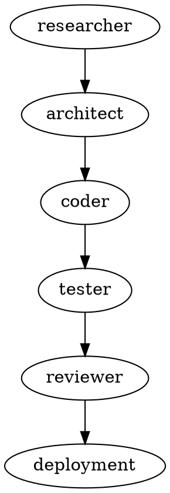

# Example 3: Creating Multi-Agent Orchestration Skill

## Kanitsal Cerceve (Evidential Frame Activation)
Kaynak dogrulama modu etkin.


## Scenario
You need a complex skill that coordinates multiple agents for full-stack feature development.

## Step-by-Step Process

### Phase 1: Intent Analysis
**Request**: "Create a skill for building complete API endpoints from spec to tests"

**Deep Analysis**:
- Surface Intent: API endpoint creation
- Root Cause: Manual end-to-end development is error-prone
- Context: Microservices development, REST APIs
- Agents Required: researcher, architect, coder, tester, reviewer
- Coordination: Hierarchical with coordinator
- Success: Production-ready endpoint with full test coverage

### Phase 2: Use Cases
```yaml
Example 1:
  Input: "Create GET /users endpoint"
  Output: OpenAPI spec, Express code, Jest tests, documentation

Example 2:
  Input: "Build POST /orders with validation"
  Output: Complete implementation with auth, validation, tests
```

### Phase 3: Structure Decision
- Type: Hierarchical orchestration
- Coordinator: hierarchical-coordinator
- Specialists: researcher, architect, coder, tester, reviewer
- Resources: OpenAPI templates, test templates, deployment guides
- Coordination: Sequential phases with parallel within phases

### Phase 4: skill.md Content
```markdown
---
name: build-api-endpoint-complete
description: Complete API endpoint development from specification to deployment using multi-agent orchestration. Coordinates researcher, architect, coder, tester, and reviewer for production-ready endpoints.
orchestration:
  coordinator: hierarchical-coordinator
  specialists: [researcher, architect, coder, tester, reviewer]
  coordination: hierarchical
sop_phases: [research, architecture, implementation, testing, review, deployment]
---

# API Endpoint Builder - Complete Orchestration

Build production-ready API endpoints with full orchestration.

## Orchestration Flow

### Phase 1: Research (researcher agent)
```javascript
Task("researcher", `
  Research best practices for {endpoint_type} endpoints:
  1. Industry standards (REST, OpenAPI 3.0)
  2. Security patterns (auth, validation)
  3. Performance optimization (caching, pagination)
  4. Error handling standards

  Store findings in memory: api-dev/{endpoint}/research
`, "researcher")
```

### Phase 2: Architecture (architect agent)
```javascript
Task("architect", `
  Design endpoint architecture:
  1. OpenAPI 3.0 specification
  2. Data models and schemas
  3. Request/response formats
  4. Error response structure
  5. Authentication requirements

  Store design in memory: api-dev/{endpoint}/architecture
`, "architect")
```

### Phase 3: Implementation (coder agent)
```javascript
Task("coder", `
  Implement endpoint:
  1. Express route handler
  2. Input validation (Joi/Zod)
  3. Business logic
  4. Error handling
  5. Response formatting

  Use architecture from memory: api-dev/{endpoint}/architecture
  Store code in memory: api-dev/{endpoint}/implementation
`, "coder")
```

### Phase 4: Testing (tester agent)
```javascript
Task("tester", `
  Create comprehensive tests:
  1. Unit tests (Jest)
  2. Integration tests
  3. Edge cases
  4. Error scenarios
  5. Performance tests

  Target: 90%+ coverage
  Store tests in memory: api-dev/{endpoint}/tests
`, "tester")
```

### Phase 5: Review (reviewer agent)
```javascript
Task("reviewer", `
  Review implementation:
  1. Security audit
  2. Code quality check
  3. Test coverage validation
  4. Documentation completeness
  5. Performance verification

  Store review in memory: api-dev/{endpoint}/review
`, "reviewer")
```

### Phase 6: Integration
Aggregate all outputs:
- OpenAPI spec
- Implementation code
- Test suite
- Documentation
- Deployment guide

## Memory Namespace
```
api-dev/{endpoint}/
  ├── research/          # Industry best practices
  ├── architecture/      # Design decisions
  ├── implementation/    # Source code
  ├── tests/             # Test suite
  └── review/            # Quality review
```

## Success Criteria
- [assert|neutral] OpenAPI 3.0 spec complete [ground:acceptance-criteria] [conf:0.90] [state:provisional]
- [assert|neutral] Implementation follows best practices [ground:acceptance-criteria] [conf:0.90] [state:provisional]
- [assert|neutral] Test coverage ≥90% [ground:acceptance-criteria] [conf:0.90] [state:provisional]
- [assert|neutral] Security review passed [ground:acceptance-criteria] [conf:0.90] [state:provisional]
- [assert|neutral] Documentation complete [ground:acceptance-criteria] [conf:0.90] [state:provisional]
- [assert|neutral] ``` [ground:acceptance-criteria] [conf:0.90] [state:provisional]

### Phase 5: Create Templates
```yaml
# resources/templates/openapi-endpoint.yaml
openapi: 3.0.0
paths:
  /{endpoint}:
    get:
      summary: {description}
      parameters: []
      responses:
        '200':
          description: Success
          content:
            application/json:
              schema:
                type: object
```

```javascript
// resources/templates/express-handler.js
const express = require('express');
const router = express.Router();

router.get('/{endpoint}', async (req, res, next) => {
  try {
    // Implementation
    res.json({ success: true });
  } catch (error) {
    next(error);
  }
});

module.exports = router;
```

### Phase 6: Create Process Diagram


### Phase 7: Complete Documentation
```markdown
# references/deployment-guide.md

## Deployment Checklist
1. Run tests: `npm test`
2. Security audit: `npm audit`
3. Build: `npm run build`
4. Deploy to staging
5. Integration tests on staging
6. Deploy to production
```

### Phase 8: Directory Structure
```
build-api-endpoint-complete/
├── skill.md
├── README.md
├── examples/
│   ├── example-get-endpoint.md
│   ├── example-post-endpoint.md
│   └── example-complex-endpoint.md
├── references/
│   ├── openapi-guide.md
│   ├── deployment-guide.md
│   ├── best-practices.md
│   └── troubleshooting.md
├── resources/
│   ├── scripts/
│   │   ├── generate-openapi.py
│   │   └── validate-tests.sh
│   ├── templates/
│   │   ├── openapi-endpoint.yaml
│   │   ├── express-handler.js
│   │   ├── jest-test.js
│   │   └── integration-test.js
│   └── assets/
│       └── api-architecture.png
├── graphviz/
│   ├── orchestration-flow.dot
│   └── agent-coordination.dot
└── tests/
    ├── test-basic-endpoint.md
    └── test-complex-endpoint.md
```

**Result**: Enterprise-grade orchestration skill with complete resources, templates, and documentation.

## Time Investment
- Phase 1-2 (Analysis): 20 minutes
- Phase 3-4 (Structure & Content): 40 minutes
- Phase 5 (Templates): 30 minutes
- Phase 6 (Diagrams): 15 minutes
- Phase 7 (Documentation): 30 minutes
- Phase 8 (Testing): 25 minutes

**Total**: ~2.5 hours for production-ready orchestration skill


---
*Promise: `<promise>EXAMPLE_3_MULTI_AGENT_ORCHESTRATION_VERIX_COMPLIANT</promise>`*
