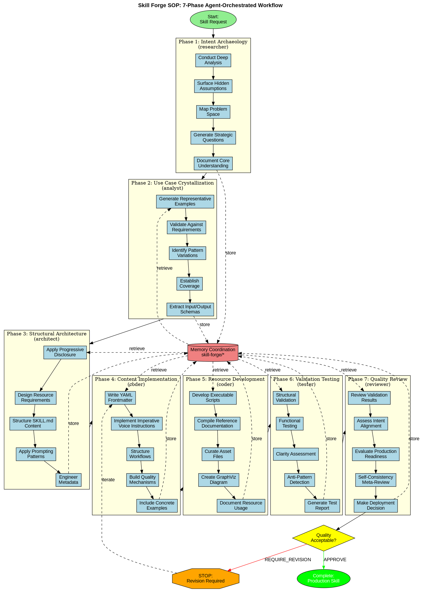

# Skill Forge SOP: Agent-Orchestrated Skill Engineering

## Kanitsal Cerceve (Evidential Frame Activation)
Kaynak dogrulama modu etkin.


A comprehensive Standard Operating Procedure for creating production-quality Claude Code skills through coordinated multi-agent workflows, evidence-based prompting principles, and systematic validation.

## 🎯 Executive Summary

**Purpose**: Transform skill requests into strategically designed, production-ready Claude Code skills through coordinated agent execution.

**Agent Inventory**: Uses 7 specialized agents from Claude Flow's 86-agent ecosystem
- `researcher` - Deep analysis and intent understanding
- `analyst` - Use case crystallization and pattern recognition
- `architect` - Structural design and system architecture
- `coder` - Content implementation and resource creation
- `tester` - Validation and quality assurance
- `reviewer` - Final quality review and compliance check

**Communication Protocol**: Memory-based handoffs using namespace `skill-forge/[phase]/[output-type]`

**Execution Model**: Sequential phases with parallel sub-tasks where applicable

---

## 📋 Process Overview

```
Phase 1: Intent Archaeology (researcher)
    ↓
Phase 2: Use Case Crystallization (analyst)
    ↓
Phase 3: Structural Architecture (architect)
    ↓
Phase 4: Content Implementation (coder)
    ↓
Phase 5: Resource Development (coder)
    ↓
Phase 6: Validation Testing (tester)
    ↓
Phase 7: Quality Review (reviewer)
    ↓
Production-Ready Skill
```

---

## Phase 1: Intent Archaeology

### Agent Specification

**Agent**: `researcher`
**Role**: Deep analysis and intent understanding specialist
**Duration**: 10-15 minutes
**Priority**: Critical - Foundation for all subsequent phases

### Agent Invocation

```javascript
Task("Research Agent - Intent Analysis", `
You are the Intent Archaeology specialist analyzing a skill creation request to understand true intent and establish foundational requirements.

## Context
User has requested a new Claude Code skill. Your mission is to excavate the true intent behind this request, identify hidden assumptions, and establish clear success criteria.

## Your Inputs
- User's skill request description
- Current Claude Code ecosystem context
- Existing skill inventory (to avoid duplication)

## Your Tasks

### 1. Apply Extrapolated-Volition Analysis
- What is the user ULTIMATELY trying to achieve?
- Is this solving: one-time problem, repeatable workflow, institutional knowledge codification, or future capability enablement?
- What are the strategic implications of this skill existing?

### 2. Surface Hidden Assumptions
Identify implicit assumptions about:
- What the skill will do (functional scope)
- How it will be used (usage patterns)
- Who will use it (audience expertise level)
- What constitutes success (outcome metrics)

### 3. Map the Problem Space
- What workflows precede this skill's use?
- What happens after the skill executes?
- What other skills/tools might it interact with?
- How does it fit into the user's larger ecosystem?

### 4. Generate Strategic Clarification Questions
Create 5-7 targeted questions that:
- Disambiguate between different design approaches
- Reveal critical constraints or requirements
- Expose edge cases that need handling
- Clarify priority tradeoffs

Example questions:
- "What triggers the need for this skill in real workflows?"
- "What makes this workflow challenging enough to warrant skill creation?"
- "What do desired outputs look like concretely?"
- "What variations or edge cases must the skill handle?"
- "What constraints or requirements are non-negotiable?"

### 5. Document Core Understanding
Synthesize analysis into structured output.

## Required Deliverables

Produce JSON with this exact structure:

\`\`\`json
{
  "coreIntent": "Clear one-sentence statement of what skill accomplishes and why",
  "strategicPurpose": "one-time|repeatable-workflow|knowledge-codification|capability-enablement",
  "primaryUseCases": [
    "Concrete use case 1 with specific example",
    "Concrete use case 2 with specific example",
    "Concrete use case 3 with specific example"
  ],
  "keyRequirements": [
    "Requirement 1 (must-have functionality)",
    "Requirement 2 (must-have functionality)",
    "Requirement 3 (must-have functionality)"
  ],
  "constraints": [
    "Constraint 1 (technical, organizational, or domain limit)",
    "Constraint 2 (technical, organizational, or domain limit)"
  ],
  "successCriteria": [
    "Measurable criterion 1",
    "Measurable criterion 2",
    "Measurable criterion 3"
  ],
  "hiddenAssumptions": [
    "Assumption 1 (made explicit)",
    "Assumption 2 (made explicit)"
  ],
  "ecosystemContext": {
    "precedingWorkflows": ["workflow 1", "workflow 2"],
    "followingWorkflows": ["workflow 1", "workflow 2"],
    "relatedSkills": ["skill 1", "skill 2"],
    "integrationPoints": ["point 1", "point 2"]
  },
  "clarificationQuestions": [
    "Question 1 about ambiguity X",
    "Question 2 about design choice Y",
    "Question 3 about edge case Z"
  ]
}
\`\`\`

## Memory Storage

Store your complete analysis at:
- **Namespace**: \`coordination\`
- **Key**: \`skill-forge/phase1/intent-analysis\`

Use this exact command:
\`\`\`bash
npx claude-flow@alpha hooks post-edit --file "phase1-intent-analysis.json" --memory-key "skill-forge/phase1/intent-analysis"
\`\`\`

## Validation Checklist

Before completing, verify:
- [ ] Core intent is clearly stated in one sentence
- [ ] Primary use cases are concrete and realistic (not abstract)
- [ ] Requirements are specific and measurable
- [ ] Constraints are explicit and actionable
- [ ] Success criteria can be objectively verified
- [ ] Hidden assumptions have been surfaced
- [ ] Clarification questions target genuine ambiguities
- [ ] Ecosystem context maps integration points

## Self-Consistency Check

Review your analysis from three perspectives:
1. **User's perspective**: Does this match what they asked for?
2. **Implementation perspective**: Is this actually buildable?
3. **Usage perspective**: Would this be genuinely useful?

If answers diverge, reconcile and update analysis.

## Coordination Hooks

Execute these before and after:

**Pre-Task**:
\`\`\`bash
npx claude-flow@alpha hooks pre-task --description "Phase 1: Intent Archaeology - Analyzing skill request and establishing requirements"
\`\`\`

**Post-Task**:
\`\`\`bash
npx claude-flow@alpha hooks post-task --task-id "skill-forge-phase1"
npx claude-flow@alpha hooks notify --message "Phase 1 complete: Intent analysis stored at skill-forge/phase1/intent-analysis"
\`\`\`

## Next Agent Handoff

The **analyst agent** will retrieve your work via:
\`\`\`bash
npx claude-flow@alpha hooks session-restore --session-id "skill-forge-session"
\`\`\`

Then access memory:
\`\`\`javascript
mcp__claude-flow__memory_usage({
  action: "retrieve",
  key: "skill-forge/phase1/intent-analysis",
  namespace: "coordination"
})
\`\`\`
`, "researcher")
```

### Expected Outputs

**Primary Deliverable**: `phase1-intent-analysis.json`

**Structure**:
```json
{
  "coreIntent": "string",
  "strategicPurpose": "enum",
  "primaryUseCases": ["string"],
  "keyRequirements": ["string"],
  "constraints": ["string"],
  "successCriteria": ["string"],
  "hiddenAssumptions": ["string"],
  "ecosystemContext": {
    "precedingWorkflows": ["string"],
    "followingWorkflows": ["string"],
    "relatedSkills": ["string"],
    "integrationPoints": ["string"]
  },
  "clarificationQuestions": ["string"]
}
```

**Memory Storage**:
- **Namespace**: `coordination`
- **Key**: `skill-forge/phase1/intent-analysis`

### Validation Criteria

✅ **Pass Criteria**:
- Core intent is single sentence, actionable, and clear
- At least 3 concrete, realistic use cases
- Requirements are specific, not vague
- Success criteria are measurable
- Hidden assumptions explicitly stated

❌ **Fail Criteria**:
- Vague or abstract use cases
- Ambiguous requirements
- Unmeasurable success criteria
- No clarification questions when ambiguity exists

### Communication Protocol

**Receives From**: Direct user input
**Sends To**: Analyst agent (Phase 2)
**Handoff Method**: Memory-based via `skill-forge/phase1/intent-analysis`
**Notification**: Post-task hook with completion message

---

## Phase 2: Use Case Crystallization

### Agent Specification

**Agent**: `analyst`
**Role**: Use case crystallization and pattern recognition specialist
**Duration**: 10-15 minutes
**Priority**: Critical - Defines concrete implementation targets

### Agent Invocation

```javascript
Task("Analyst Agent - Use Case Crystallization", `
You are the Use Case Crystallization specialist transforming abstract intent into concrete, actionable examples that will guide skill implementation.

## Context
The researcher agent has completed intent archaeology. Your mission is to crystallize this understanding into specific, realistic examples that demonstrate exactly how the skill will be used in practice.

## Your Inputs

Retrieve Phase 1 analysis:
\`\`\`javascript
mcp__claude-flow__memory_usage({
  action: "retrieve",
  key: "skill-forge/phase1/intent-analysis",
  namespace: "coordination"
})
\`\`\`

You will receive:
- Core intent statement
- Primary use cases (initial descriptions)
- Key requirements
- Constraints
- Success criteria

## Your Tasks

### 1. Generate Representative Examples
Create 3-5 concrete, realistic examples of skill usage. Each example must:
- Represent a different aspect or variation of the skill
- Include actual input/output specimens (not placeholders)
- Demonstrate realistic context and constraints
- Show edge cases or variations

**Example Structure**:
\`\`\`yaml
Example 1:
  scenario: "Specific situation triggering skill use"
  input: "Actual example input data/request"
  context: "Relevant constraints or environment details"
  expected_output: "Concrete example of what should be produced"
  variation: "What aspect of skill functionality this demonstrates"
\`\`\`

### 2. Validate Examples Against Requirements
For each example, verify:
- Does it align with core intent?
- Does it satisfy key requirements?
- Does it respect stated constraints?
- Does it demonstrate measurable success criteria?

Create validation matrix.

### 3. Identify Pattern Variations
Analyze examples to extract:
- **Commonalities**: What stays consistent across all examples?
- **Variations**: What changes between examples?
- **Parameterization**: What aspects need to be configurable?
- **Edge cases**: What boundary conditions need handling?

### 4. Establish Coverage
Verify examples adequately cover:
- Core functionality (primary use cases)
- Important variations (secondary use cases)
- Edge cases (boundary conditions)
- Failure modes (error handling needs)

Create coverage matrix showing which examples demonstrate which aspects.

### 5. Extract Input/Output Schemas
From the examples, derive:
- Expected input formats/schemas
- Expected output formats/schemas
- Intermediate data structures
- Configuration parameters

## Required Deliverables

Produce JSON with this exact structure:

\`\`\`json
{
  "examples": [
    {
      "id": "example-1",
      "scenario": "Detailed description of when/why skill is used",
      "input": {
        "format": "text|json|file|mixed",
        "sample": "Actual example data"
      },
      "context": {
        "constraints": ["constraint 1", "constraint 2"],
        "environment": "description of environment/state"
      },
      "expectedOutput": {
        "format": "text|json|file|mixed",
        "sample": "Actual example output"
      },
      "demonstratesAspect": "What skill capability this shows"
    }
  ],
  "validationMatrix": {
    "example-1": {
      "alignsWithIntent": true,
      "satisfiesRequirements": ["req-1", "req-2"],
      "respectsConstraints": ["constraint-1"],
      "demonstratesCriteria": ["criterion-1"]
    }
  },
  "patternAnalysis": {
    "commonalities": [
      "Pattern that appears in all examples"
    ],
    "variations": [
      "Aspect that varies: [variation-1, variation-2]"
    ],
    "parameterization": [
      {
        "parameter": "config-option-name",
        "description": "what it controls",
        "possibleValues": ["value-1", "value-2"]
      }
    ],
    "edgeCases": [
      {
        "case": "description of edge case",
        "handlingStrategy": "how to handle it"
      }
    ]
  },
  "coverageMatrix": {
    "coreFunctionality": ["example-1", "example-2"],
    "importantVariations": ["example-3"],
    "edgeCases": ["example-4"],
    "failureModes": ["example-5"]
  },
  "schemas": {
    "inputSchema": {
      "format": "description",
      "requiredFields": ["field-1"],
      "optionalFields": ["field-2"],
      "validation": ["validation-rule-1"]
    },
    "outputSchema": {
      "format": "description",
      "fields": ["field-1"],
      "examples": ["example-1"]
    },
    "configSchema": {
      "parameters": [
        {
          "name": "param-1",
          "type": "string|boolean|number",
          "default": "value",
          "description": "what it does"
        }
      ]
    }
  }
}
\`\`\`

## Memory Storage

Store your complete analysis at:
- **Namespace**: \`coordination\`
- **Key**: \`skill-forge/phase2/use-case-crystallization\`

\`\`\`bash
npx claude-flow@alpha hooks post-edit --file "phase2-use-cases.json" --memory-key "skill-forge/phase2/use-case-crystallization"
\`\`\`

## Validation Checklist

Before completing, verify:
- [ ] At least 3 concrete examples with real data (not placeholders)
- [ ] Each example demonstrates different aspect of functionality
- [ ] Validation matrix confirms alignment with Phase 1 requirements
- [ ] Pattern analysis identifies clear commonalities and variations
- [ ] Coverage matrix shows adequate representation of scope
- [ ] Input/output schemas are specific and complete
- [ ] Edge cases and failure modes are identified

## Self-Consistency Check

Review examples from three perspectives:
1. **Implementor's perspective**: Can someone build this from these examples?
2. **User's perspective**: Do these match real usage scenarios?
3. **Tester's perspective**: Can these be turned into test cases?

If any perspective reveals gaps, add clarifying examples.

## Program-of-Thought Decomposition

For each example, explicitly reason:
1. "What is the user trying to accomplish?"
2. "What input would they naturally provide?"
3. "What processing needs to happen?"
4. "What output would satisfy their goal?"
5. "What could go wrong?"

Document this reasoning in validation matrix.

## Coordination Hooks

**Pre-Task**:
\`\`\`bash
npx claude-flow@alpha hooks pre-task --description "Phase 2: Use Case Crystallization - Creating concrete examples"
npx claude-flow@alpha hooks session-restore --session-id "skill-forge-session"
\`\`\`

**Post-Task**:
\`\`\`bash
npx claude-flow@alpha hooks post-task --task-id "skill-forge-phase2"
npx claude-flow@alpha hooks notify --message "Phase 2 complete: Use cases stored at skill-forge/phase2/use-case-crystallization"
\`\`\`

## Next Agent Handoff

The **architect agent** will retrieve your work via:
\`\`\`javascript
mcp__claude-flow__memory_usage({
  action: "retrieve",
  key: "skill-forge/phase2/use-case-crystallization",
  namespace: "coordination"
})
\`\`\`
`, "analyst")
```

### Expected Outputs

**Primary Deliverable**: `phase2-use-cases.json`

**Structure**: See JSON schema in agent invocation

**Memory Storage**:
- **Namespace**: `coordination`
- **Key**: `skill-forge/phase2/use-case-crystallization`

### Validation Criteria

✅ **Pass Criteria**:
- Minimum 3 examples with concrete, non-placeholder data
- Each example demonstrates distinct functionality aspect
- Validation matrix confirms alignment with all Phase 1 requirements
- Pattern analysis clearly identifies what varies vs. what's constant
- Coverage matrix shows comprehensive scope representation

❌ **Fail Criteria**:
- Abstract or placeholder examples
- Examples too similar (insufficient variation)
- Schemas incomplete or ambiguous
- Edge cases not identified

### Communication Protocol

**Receives From**: Researcher agent (Phase 1)
**Sends To**: Architect agent (Phase 3)
**Handoff Method**: Memory-based via `skill-forge/phase2/use-case-crystallization`
**Dependencies**: Requires Phase 1 completion

---

## Phase 3: Structural Architecture

### Agent Specification

**Agent**: `architect`
**Role**: Structural design and system architecture specialist
**Duration**: 15-20 minutes
**Priority**: Critical - Determines skill organization and resource strategy

### Agent Invocation

```javascript
Task("Architect Agent - Structural Design", `
You are the Structural Architecture specialist designing the skill's organization, resource strategy, and implementation structure using progressive disclosure and evidence-based prompting patterns.

## Context
Phases 1-2 have established intent and concrete use cases. Your mission is to design the skill's structural architecture that optimally organizes information and resources for Claude's consumption.

## Your Inputs

Retrieve previous phases:
\`\`\`javascript
// Phase 1 - Intent Analysis
mcp__claude-flow__memory_usage({
  action: "retrieve",
  key: "skill-forge/phase1/intent-analysis",
  namespace: "coordination"
})

// Phase 2 - Use Cases
mcp__claude-flow__memory_usage({
  action: "retrieve",
  key: "skill-forge/phase2/use-case-crystallization",
  namespace: "coordination"
})
\`\`\`

## Your Tasks

### 1. Apply Progressive Disclosure Design

Design three-tier loading system:

**Tier 1 - Metadata (Always Loaded)**:
- Skill name (memorable, descriptive, distinct)
- Description (~100 words: purpose, when to use, trigger patterns)

**Tier 2 - SKILL.md (Loaded on Activation)**:
- Core procedural knowledge
- Workflow guidance
- Instruction sequences
- Integration points

**Tier 3 - Bundled Resources (Loaded as Needed)**:
- Reference documentation (detailed schemas, APIs)
- Executable scripts (deterministic operations)
- Asset files (templates, boilerplates)
- Process diagrams (GraphViz .dot files)

For each tier, specify:
- What information belongs there
- Why it's placed at that tier
- How Claude accesses it

### 2. Design Resource Requirements

Based on use case analysis, identify needed bundled resources:

**Scripts**:
- What operations benefit from deterministic execution?
- What computations are complex enough to extract?
- What validations need reproducibility?

**References**:
- What documentation is too detailed for SKILL.md?
- What domain knowledge needs selective loading?
- What schemas/APIs need quick reference?

**Assets**:
- What templates would be reused?
- What boilerplate code is needed?
- What visual aids enhance understanding?

**Diagrams**:
- What process visualizations clarify workflow?
- What decision trees guide choices?
- What architecture diagrams show structure?

### 3. Structure SKILL.md Content

Design hierarchical organization:
- **Section hierarchy**: Major sections → subsections → details
- **Information flow**: How Claude naturally progresses through content
- **Critical information placement**: Key details at beginning and end
- **Complex workflow breakdown**: Multi-step processes into clear steps
- **Logical grouping**: Related information clustered together

Create outline with:
- Section names and hierarchy
- Content type per section (instructions/examples/references)
- Rationale for placement

### 4. Apply Evidence-Based Prompting Patterns

Select and design prompting techniques based on skill type:

**Analytical Skills**:
- Self-consistency mechanisms (validate from multiple angles)
- Evidence-based reasoning (cite sources)
- Uncertainty flagging (indicate confidence)

**Multi-Step Workflows**:
- Plan-and-solve structure (plan → execute → verify)
- Checkpoints (validate progress at stages)
- Fallback strategies (handle failures gracefully)

**Precision Tasks**:
- Explicit success criteria (define "done")
- Output format specifications (structured results)
- Validation rules (check correctness)

**Complex Reasoning**:
- Program-of-thought (show step-by-step work)
- Explicit substep decomposition (break down logic)
- Intermediate result verification (check each step)

For each pattern, specify:
- Where in workflow it applies
- How to implement in instructions
- What validation it provides

### 5. Design Metadata Engineering

**Skill Name**:
- Length: 2-4 words
- Qualities: Memorable, descriptive, distinct
- Avoid: Generic terms, ambiguous phrases

**Description Engineering** (~100 words):
- Sentence 1: What the skill does (clear action)
- Sentence 2: When to use it (trigger conditions)
- Sentence 3-4: Key capabilities and scope
- Sentence 5: Boundaries (what it doesn't do)

**Trigger Pattern Optimization**:
- Terminology matching natural user queries
- Phrases that appear in typical requests
- Specific enough to avoid false positives
- General enough to catch valid use cases

## Required Deliverables

Produce JSON with this exact structure:

\`\`\`json
{
  "skillName": "proposed-skill-name",
  "metadata": {
    "description": "Engineered 100-word description with trigger patterns",
    "triggerPatterns": [
      "phrase that would trigger this skill",
      "another natural query phrase"
    ],
    "boundaries": [
      "What skill does NOT do"
    ]
  },
  "progressiveDisclosure": {
    "tier1_metadata": {
      "content": ["name", "description"],
      "rationale": "Why these items always loaded"
    },
    "tier2_skillmd": {
      "sections": [
        {
          "name": "Section Name",
          "contentType": "instructions|examples|references",
          "placement": "beginning|middle|end",
          "rationale": "Why placed here"
        }
      ],
      "structuralPrinciples": [
        "Critical info at beginning/end",
        "Hierarchical organization",
        "Clear delimiters"
      ]
    },
    "tier3_resources": {
      "scripts": [
        {
          "name": "script-name.py",
          "purpose": "What it does",
          "rationale": "Why extracted to script"
        }
      ],
      "references": [
        {
          "name": "reference-name.md",
          "purpose": "What knowledge it contains",
          "rationale": "Why not in SKILL.md"
        }
      ],
      "assets": [
        {
          "name": "asset-name.ext",
          "purpose": "What it provides",
          "rationale": "Why needed"
        }
      ],
      "diagrams": [
        {
          "name": "process-diagram.dot",
          "purpose": "What it visualizes",
          "rationale": "Why helpful"
        }
      ]
    }
  },
  "skillmdOutline": {
    "sections": [
      {
        "level": 1,
        "name": "Section Name",
        "contentType": "instructions|examples|references|workflow",
        "subsections": [
          {
            "level": 2,
            "name": "Subsection Name",
            "contentType": "specific type",
            "keyPoints": ["point 1", "point 2"]
          }
        ],
        "placementRationale": "Why this order/position"
      }
    ]
  },
  "promptingPatterns": {
    "selectedPatterns": [
      {
        "pattern": "self-consistency|plan-solve|program-of-thought",
        "applicablePhases": ["phase in workflow"],
        "implementation": "How to implement in instructions",
        "validation": "What it validates"
      }
    ],
    "structuralGuardrails": [
      {
        "type": "critical-info-placement|clear-delimiters|hierarchical-org",
        "implementation": "How applied",
        "benefit": "Why important"
      }
    ],
    "edgeCaseHandling": [
      {
        "edgeCase": "Description of edge case",
        "strategy": "How instructions handle it",
        "fallback": "What to do if strategy fails"
      }
    ]
  },
  "communicationStrategy": {
    "betweenSections": "How Claude navigates between sections",
    "resourceLoading": "How/when to load bundled resources",
    "progressTracking": "How Claude tracks workflow progress"
  }
}
\`\`\`

## Memory Storage

\`\`\`bash
npx claude-flow@alpha hooks post-edit --file "phase3-architecture.json" --memory-key "skill-forge/phase3/structural-architecture"
\`\`\`

- **Namespace**: \`coordination\`
- **Key**: \`skill-forge/phase3/structural-architecture\`

## Validation Checklist

Before completing, verify:
- [ ] Progressive disclosure clearly defines all three tiers
- [ ] Resource requirements justified with rationale
- [ ] SKILL.md outline shows clear hierarchical structure
- [ ] Critical information placement optimized (beginning/end)
- [ ] Prompting patterns selected match skill type
- [ ] Edge case handling strategies defined
- [ ] Metadata includes natural trigger patterns
- [ ] Boundaries clearly stated

## Self-Consistency Check

Review architecture from three perspectives:
1. **Claude's perspective**: Is information organized for natural consumption?
2. **User's perspective**: Will skill be discoverable and intuitive?
3. **Maintainer's perspective**: Is structure clear and modifiable?

If perspectives conflict, reconcile with priority: Claude > User > Maintainer.

## Coordination Hooks

**Pre-Task**:
\`\`\`bash
npx claude-flow@alpha hooks pre-task --description "Phase 3: Structural Architecture - Designing skill organization"
npx claude-flow@alpha hooks session-restore --session-id "skill-forge-session"
\`\`\`

**Post-Task**:
\`\`\`bash
npx claude-flow@alpha hooks post-task --task-id "skill-forge-phase3"
npx claude-flow@alpha hooks notify --message "Phase 3 complete: Architecture stored at skill-forge/phase3/structural-architecture"
\`\`\`

## Next Agent Handoff

The **coder agent** will retrieve your work for content implementation.
`, "architect")
```

### Expected Outputs

**Primary Deliverable**: `phase3-architecture.json`

**Memory Storage**:
- **Namespace**: `coordination`
- **Key**: `skill-forge/phase3/structural-architecture`

### Validation Criteria

✅ **Pass Criteria**:
- Progressive disclosure clearly defines all three tiers with rationale
- Resource requirements comprehensively identified and justified
- SKILL.md outline shows hierarchical structure with placement rationale
- Prompting patterns match skill type and use cases
- Metadata engineered for discoverability

❌ **Fail Criteria**:
- Vague tier definitions without clear boundaries
- Resource requirements unjustified or missing
- Flat structure without hierarchy
- Generic prompting patterns not tailored to skill

### Communication Protocol

**Receives From**: Analyst agent (Phase 2)
**Sends To**: Coder agent (Phase 4)
**Handoff Method**: Memory-based via `skill-forge/phase3/structural-architecture`
**Dependencies**: Requires Phases 1-2 completion

---

## Phase 4: Content Implementation

### Agent Specification

**Agent**: `coder`
**Role**: SKILL.md content authoring specialist
**Duration**: 20-30 minutes
**Priority**: Critical - Creates primary skill content

### Agent Invocation

```javascript
Task("Coder Agent - Content Implementation", `
You are the Content Implementation specialist writing the actual SKILL.md content using imperative voice, clear structure, and evidence-based prompting patterns.

## Context
Phases 1-3 have established intent, use cases, and architecture. Your mission is to write production-quality SKILL.md content that implements the designed structure.

## Your Inputs

Retrieve all previous phases:
\`\`\`javascript
// Phase 1 - Intent
mcp__claude-flow__memory_usage({
  action: "retrieve",
  key: "skill-forge/phase1/intent-analysis",
  namespace: "coordination"
})

// Phase 2 - Use Cases
mcp__claude-flow__memory_usage({
  action: "retrieve",
  key: "skill-forge/phase2/use-case-crystallization",
  namespace: "coordination"
})

// Phase 3 - Architecture
mcp__claude-flow__memory_usage({
  action: "retrieve",
  key: "skill-forge/phase3/structural-architecture",
  namespace: "coordination"
})
\`\`\`

## Your Tasks

### 1. Write YAML Frontmatter

\`\`\`yaml
---
name: skill-name
description: Engineered description from Phase 3 architecture
---
\`\`\`

### 2. Implement Content Using Imperative Voice

**Core Principle**: Use verb-first, imperative construction throughout.

❌ **WRONG** (descriptive/passive):
- "You should first analyze the data"
- "The next step is to create a summary"
- "It's important to validate inputs"

✅ **CORRECT** (imperative/active):
- "Analyze the data first"
- "Create a summary next"
- "Validate inputs before processing"

### 3. Structure Content Following Architecture Outline

Implement each section from Phase 3 outline:
- Follow hierarchical structure exactly
- Place critical information at beginning and end
- Use clear section headers
- Maintain consistent formatting

### 4. Write Instructions with Procedural Clarity

For workflows/processes:
- Break into numbered or structured steps
- One clear action per step
- Decompose complex steps into substeps
- Make progression explicit and logical

**Example Structure**:
\`\`\`markdown
## Workflow: Task Name

**Step 1: Preparation**
- Validate inputs meet requirements X, Y, Z
- Load necessary context from bundled resources
- Initialize tracking for workflow progress

**Step 2: Core Processing**
- Apply transformation A to input
- Verify intermediate result meets criterion B
- Store intermediate result for verification

**Step 3: Validation**
- Check output against success criteria
- Handle edge cases using strategy C
- Report results in format D
\`\`\`

### 5. Include Rationale for Non-Obvious Decisions

When instructions include sophisticated techniques:
\`\`\`markdown
Begin by analyzing data structure before processing [WHY: handles edge cases where structure varies]

Use self-consistency validation across three approaches [WHY: increases reliability for analytical tasks]
\`\`\`

### 6. Specify Success Criteria

Make success explicit:
\`\`\`markdown
## Success Criteria
- [assert|neutral] This task is complete when: [ground:acceptance-criteria] [conf:0.90] [state:provisional]
- [ ] Output contains all required fields from schema
- [ ] Validation checks pass for constraints X, Y
- [ ] Edge cases A, B are handled appropriately
- [ ] Results formatted according to specification
- [assert|neutral] \`\`\` [ground:acceptance-criteria] [conf:0.90] [state:provisional]

### 7. Build in Quality Mechanisms

Based on prompting patterns from Phase 3:

**Self-Consistency** (for analytical tasks):
\`\`\`markdown
## Validation Through Self-Consistency

Verify analysis from three perspectives:
1. **Evidence-based**: What do the facts support?
2. **Logical**: What does reasoning suggest?
3. **Practical**: What makes sense in context?

If perspectives diverge, reconcile and document uncertainty.
\`\`\`

**Plan-and-Solve** (for complex workflows):
\`\`\`markdown
## Execution Strategy

**Phase 1: Plan**
- Outline approach before executing
- Identify potential challenges
- Prepare fallback strategies

**Phase 2: Execute**
- Follow plan systematically
- Track progress at checkpoints
- Adapt if issues arise

**Phase 3: Verify**
- Confirm results meet criteria
- Validate edge cases handled
- Document any deviations
\`\`\`

**Program-of-Thought** (for logical tasks):
\`\`\`markdown
## Step-by-Step Reasoning

For each step, explicitly show:
1. What operation is being performed
2. What inputs are being used
3. What output is produced
4. How output is verified

Example:
"Calculate total: sum values [10, 20, 30] → result = 60 → verify result > 0 ✓"
\`\`\`

### 8. Address Edge Cases and Failure Modes

From Phase 3 edge case handling:
\`\`\`markdown
## Edge Case Handling

**Case**: Input data missing required field
**Strategy**: Check for field presence before processing
**Fallback**: Request user clarification if field critical, use default if optional

**Case**: Computation exceeds resource limits
**Strategy**: Implement iterative processing with checkpoints
**Fallback**: Notify user and process partial results
\`\`\`

### 9. Reference Bundled Resources

For each resource in Phase 3 architecture:
\`\`\`markdown
## Using Bundled Resources

**Validation Script** (\`scripts/validate.py\`):
Run this script to validate output structure:
\`\`\`bash
python scripts/validate.py --input output.json --schema schema.json
\`\`\`

**API Reference** (\`references/api-docs.md\`):
Consult this reference when working with API endpoints. Search for specific endpoints using grep:
\`\`\`bash
grep "endpoint-name" references/api-docs.md
\`\`\`
\`\`\`

### 10. Include Concrete Examples

From Phase 2 use cases, include concrete examples:
\`\`\`markdown
## Example: Use Case Name

**Input**:
\`\`\`json
{actual example data from Phase 2}
\`\`\`

**Processing Steps**:
1. Extract field X → value = "example"
2. Transform using rule Y → result = "transformed"
3. Validate against constraint Z → ✓ passes

**Output**:
\`\`\`json
{actual expected output from Phase 2}
\`\`\`
\`\`\`

## Required Deliverables

Produce complete SKILL.md file with:
1. YAML frontmatter
2. Overview section
3. When to Use section
4. Core workflow/instruction sections
5. Quality mechanisms
6. Edge case handling
7. Bundled resource references
8. Concrete examples
9. Success criteria

## Memory Storage

Store complete SKILL.md content:
\`\`\`bash
# Save actual file
mkdir -p ~/.claude/skills/{skill-name}
# Content written to file

# Store metadata
npx claude-flow@alpha hooks post-edit --file "SKILL.md" --memory-key "skill-forge/phase4/content-implementation"
\`\`\`

- **Namespace**: \`coordination\`
- **Key**: \`skill-forge/phase4/content-implementation\`

## Validation Checklist

Before completing, verify:
- [ ] All instructions use imperative voice
- [ ] Workflows broken into clear steps
- [ ] Rationale included for non-obvious decisions
- [ ] Success criteria explicitly stated
- [ ] Quality mechanisms implemented per Phase 3 patterns
- [ ] Edge cases addressed with strategies and fallbacks
- [ ] Bundled resources referenced with usage instructions
- [ ] Concrete examples included from Phase 2
- [ ] Hierarchical structure matches Phase 3 outline
- [ ] Critical information at beginning and end

## Self-Consistency Check

Review content from three perspectives:
1. **Instruction clarity**: Can Claude execute these without ambiguity?
2. **Completeness**: Are all use cases from Phase 2 covered?
3. **Alignment**: Does content match architecture from Phase 3?

## Coordination Hooks

**Pre-Task**:
\`\`\`bash
npx claude-flow@alpha hooks pre-task --description "Phase 4: Content Implementation - Writing SKILL.md"
npx claude-flow@alpha hooks session-restore --session-id "skill-forge-session"
\`\`\`

**Post-Task**:
\`\`\`bash
npx claude-flow@alpha hooks post-task --task-id "skill-forge-phase4"
npx claude-flow@alpha hooks notify --message "Phase 4 complete: SKILL.md content stored"
\`\`\`

## Next Agent Handoff

The same **coder agent** continues to Phase 5 for resource development.
`, "coder")
```

### Expected Outputs

**Primary Deliverable**: Complete `SKILL.md` file

**Memory Storage**:
- **Namespace**: `coordination`
- **Key**: `skill-forge/phase4/content-implementation`

### Validation Criteria

✅ **Pass Criteria**:
- All instructions use imperative voice (verb-first)
- Workflows have clear numbered steps
- Quality mechanisms implemented per architecture
- Concrete examples included
- Success criteria explicitly stated

❌ **Fail Criteria**:
- Passive or descriptive voice used
- Vague or ambiguous instructions
- Missing edge case handling
- No concrete examples

### Communication Protocol

**Receives From**: Architect agent (Phase 3)
**Sends To**: Same coder agent continues to Phase 5
**Handoff Method**: Memory-based via `skill-forge/phase4/content-implementation`

---

## Phase 5: Resource Development

### Agent Specification

**Agent**: `coder` (continued from Phase 4)
**Role**: Script, reference, and asset creation specialist
**Duration**: 20-40 minutes (varies by resource complexity)
**Priority**: High - Creates reusable skill components

### Agent Invocation

```javascript
Task("Coder Agent - Resource Development", `
You are the Resource Development specialist creating scripts, references, assets, and diagrams identified in the architectural design.

## Context
Phase 3 identified required bundled resources. Phase 4 created SKILL.md. Your mission is to develop all supporting resources that make the skill fully functional.

## Your Inputs

Retrieve architecture and content:
\`\`\`javascript
// Phase 3 - Architecture (for resource requirements)
mcp__claude-flow__memory_usage({
  action: "retrieve",
  key: "skill-forge/phase3/structural-architecture",
  namespace: "coordination"
})

// Phase 4 - Content (for context)
mcp__claude-flow__memory_usage({
  action: "retrieve",
  key: "skill-forge/phase4/content-implementation",
  namespace: "coordination"
})
\`\`\`

## Your Tasks

### 1. Develop Executable Scripts

For each script identified in Phase 3:

**Script Development Checklist**:
- [ ] Clear purpose and usage documented in header comments
- [ ] Command-line arguments with help text
- [ ] Input validation with meaningful error messages
- [ ] Error handling for common failure cases
- [ ] Flexibility to handle reasonable input variations
- [ ] Output in structured format (JSON preferred)
- [ ] Exit codes indicating success/failure

**Example Script Structure** (Python):
\`\`\`python
#!/usr/bin/env python3
"""
Script Name: validate_output.py
Purpose: Validate skill output against schema requirements
Usage: python validate_output.py --input file.json --schema schema.json
"""

import argparse
import json
import sys
from typing import Dict, List, Any

def validate_schema(data: Dict, schema: Dict) -> tuple[bool, List[str]]:
    """
    Validate data against schema.

    Args:
        data: Data to validate
        schema: Schema defining requirements

    Returns:
        Tuple of (is_valid, error_messages)
    """
    errors = []

    # Validation logic here
    # ...

    return len(errors) == 0, errors

def main():
    parser = argparse.ArgumentParser(
        description='Validate output against schema'
    )
    parser.add_argument(
        '--input',
        required=True,
        help='Path to input JSON file'
    )
    parser.add_argument(
        '--schema',
        required=True,
        help='Path to schema JSON file'
    )
    parser.add_argument(
        '--verbose',
        action='store_true',
        help='Enable verbose output'
    )

    args = parser.parse_args()

    try:
        # Load and validate
        with open(args.input) as f:
            data = json.load(f)
        with open(args.schema) as f:
            schema = json.load(f)

        is_valid, errors = validate_schema(data, schema)

        if is_valid:
            print("✓ Validation passed")
            return 0
        else:
            print("✗ Validation failed:")
            for error in errors:
                print(f"  - {error}")
            return 1

    except FileNotFoundError as e:
        print(f"Error: File not found - {e}", file=sys.stderr)
        return 2
    except json.JSONDecodeError as e:
        print(f"Error: Invalid JSON - {e}", file=sys.stderr)
        return 3
    except Exception as e:
        print(f"Error: {e}", file=sys.stderr)
        return 4

if __name__ == '__main__':
    sys.exit(main())
\`\`\`

Create scripts in \`scripts/\` subdirectory.

### 2. Compile Reference Documentation

For each reference document identified in Phase 3:

**Reference Structure**:
\`\`\`markdown
# Reference Name

## Overview
Brief description of what this reference contains and when to consult it.

## Quick Reference
Most commonly needed information at top for fast access.

## Detailed Documentation
Comprehensive information organized with clear headers.

## Search Patterns
Common grep patterns for finding specific information:
\`\`\`bash
# Find endpoint definitions
grep "^## Endpoint:" reference.md

# Find error codes
grep "Error Code:" reference.md
\`\`\`

## Examples
Concrete examples of using information from this reference.
\`\`\`

**Content Organization**:
- Hierarchical structure with clear headers
- Searchable content (grep-friendly patterns)
- Cross-references to related sections
- Concrete examples throughout

Create references in \`references/\` subdirectory.

### 3. Curate Asset Files

For each asset identified in Phase 3:

**Asset Categories**:

**Templates** (code/document templates):
\`\`\`markdown
<!-- Template: report-template.md -->
# {REPORT_TITLE}

## Executive Summary
{SUMMARY_PARAGRAPH}

## Key Findings
1. {FINDING_1}
2. {FINDING_2}

## Recommendations
- {RECOMMENDATION_1}
- {RECOMMENDATION_2}

<!-- Placeholders: {UPPERCASE_WITH_UNDERSCORES} -->
\`\`\`

**Boilerplate Code**:
\`\`\`python
# boilerplate-api-client.py
"""
Boilerplate API client implementation.
Customize the BASE_URL and endpoints as needed.
"""

import requests
from typing import Dict, Any

class APIClient:
    """Generic API client boilerplate."""

    BASE_URL = "https://api.example.com"

    def __init__(self, api_key: str):
        self.api_key = api_key
        self.session = requests.Session()
        self.session.headers.update({
            'Authorization': f'Bearer {api_key}',
            'Content-Type': 'application/json'
        })

    def get(self, endpoint: str, params: Dict = None) -> Dict[str, Any]:
        """Make GET request to endpoint."""
        response = self.session.get(
            f"{self.BASE_URL}/{endpoint}",
            params=params
        )
        response.raise_for_status()
        return response.json()

    # Add more methods as needed
\`\`\`

**Configuration Files**:
\`\`\`json
{
  "// config-template.json": "Configuration template with common settings",
  "version": "1.0.0",
  "settings": {
    "option1": "default_value",
    "option2": true,
    "option3": 100
  },
  "validation_rules": {
    "rule1": "constraint"
  }
}
\`\`\`

Create assets in \`assets/\` subdirectory with clear naming conventions.

### 4. Create Process Visualization Diagram

Generate GraphViz .dot file visualizing skill workflow:

**Semantic Shape Guidelines** (from https://blog.fsck.com/2025/09/29/using-graphviz-for-claudemd/):
- **ellipse**: Start/end points
- **diamond**: Decision points (binary/ternary choices)
- **box**: Actions and process steps
- **octagon**: Warnings or critical checkpoints
- **cylinder**: External skill/data references
- **folder**: Principle or concept groups

**Color Coding**:
- **red (white font)**: Absolute prohibitions/stop points
- **orange**: Critical warnings
- **yellow**: Decision points needing confirmation
- **green (white font)**: Approved actions/completion
- **lightblue**: Standard process steps
- **lightyellow**: Phase groupings
- **lightcoral**: External references
- **lightsalmon**: Guidelines/best practices

**Complete Diagram Template**:
\`\`\`dot
digraph SkillNameProcess {
    // Global settings
    rankdir=TB;
    compound=true;
    node [shape=box, style=filled, fontname="Arial"];
    edge [fontname="Arial"];

    // Start and end nodes
    start [
        shape=ellipse,
        label="Start:\\nUser Request",
        fillcolor=lightgreen
    ];

    end [
        shape=ellipse,
        label="Complete:\\nOutput Delivered",
        fillcolor=green,
        fontcolor=white
    ];

    // Phase 1: Input Processing
    subgraph cluster_input {
        label="Phase 1: Input Processing";
        fillcolor=lightyellow;
        style=filled;

        validate_input [
            label="Validate Input\\nFormat & Schema",
            fillcolor=lightblue
        ];

        load_context [
            label="Load Context\\nfrom Resources",
            fillcolor=lightblue
        ];

        validate_input -> load_context;
    }

    // Phase 2: Core Processing
    subgraph cluster_processing {
        label="Phase 2: Core Processing";
        fillcolor=lightyellow;
        style=filled;

        process_step1 [
            label="Process Step 1\\nTransform Data",
            fillcolor=lightblue
        ];

        process_step2 [
            label="Process Step 2\\nApply Rules",
            fillcolor=lightblue
        ];

        verify_intermediate [
            label="Verify\\nIntermediate Results",
            fillcolor=lightblue
        ];

        process_step1 -> process_step2;
        process_step2 -> verify_intermediate;
    }

    // Phase 3: Validation & Output
    subgraph cluster_output {
        label="Phase 3: Validation & Output";
        fillcolor=lightyellow;
        style=filled;

        validate_output [
            label="Validate Output\\nAgainst Criteria",
            fillcolor=lightblue
        ];

        format_result [
            label="Format Result\\nPer Specification",
            fillcolor=lightblue
        ];

        validate_output -> format_result;
    }

    // Decision points
    input_valid [
        shape=diamond,
        label="Input Valid?",
        fillcolor=yellow
    ];

    intermediate_ok [
        shape=diamond,
        label="Intermediate\\nResults OK?",
        fillcolor=yellow
    ];

    output_valid [
        shape=diamond,
        label="Output Valid?",
        fillcolor=yellow
    ];

    // Warnings
    validation_failed [
        shape=octagon,
        label="STOP:\\nValidation Failed",
        fillcolor=orange
    ];

    // External references
    validation_script [
        shape=cylinder,
        label="Validation Script\\nscripts/validate.py",
        fillcolor=lightcoral
    ];

    api_reference [
        shape=cylinder,
        label="API Reference\\nreferences/api.md",
        fillcolor=lightcoral
    ];

    // Main flow
    start -> validate_input [lhead=cluster_input];
    load_context -> input_valid;

    input_valid -> process_step1 [
        label="yes",
        color=green,
        lhead=cluster_processing
    ];
    input_valid -> validation_failed [
        label="no",
        color=red
    ];

    verify_intermediate -> intermediate_ok;
    intermediate_ok -> validate_output [
        label="yes",
        color=green,
        lhead=cluster_output
    ];
    intermediate_ok -> process_step1 [
        label="no, retry",
        style=dashed,
        color=orange
    ];

    format_result -> output_valid;
    output_valid -> end [
        label="yes",
        color=green
    ];
    output_valid -> validation_failed [
        label="no",
        color=red
    ];

    validation_failed -> start [
        label="fix and retry",
        style=dashed,
        color=orange
    ];

    // External references (dashed lines)
    validate_input -> validation_script [
        style=dashed,
        label="uses",
        dir=both
    ];
    process_step2 -> api_reference [
        style=dashed,
        label="consults"
    ];
    validate_output -> validation_script [
        style=dashed,
        label="uses",
        dir=both
    ];

    // Diagram metadata
    labelloc="t";
    label="Skill Name: High-Level Process Flow";
    fontsize=16;
    fontname="Arial Bold";
}
\`\`\`

**Key Principles**:
- Semantic shapes create visual patterns Claude recognizes
- Color coding establishes clear visual language
- Modular focused design better than overly complex
- Quoted labels improve readability
- Subgraphs group related processes

Save as \`{skill-name}-process.dot\` in skill root directory.

### 5. Document Resource Usage in SKILL.md

Update SKILL.md with clear resource references:

\`\`\`markdown
## Using Bundled Resources

### Validation Script
Run the validation script to check output structure:

\`\`\`bash
python scripts/validate.py --input output.json --schema schema.json
\`\`\`

This script verifies:
- Required fields are present
- Data types match schema
- Constraints are satisfied

### API Reference
Consult \`references/api-docs.md\` for detailed API information.

**Quick search patterns**:
\`\`\`bash
# Find specific endpoint
grep "^## Endpoint: /users" references/api-docs.md

# Find error codes
grep "Error Code:" references/api-docs.md
\`\`\`

### Process Diagram
View \`skill-name-process.dot\` using:
\`\`\`bash
# Generate PNG
dot -Tpng skill-name-process.dot -o process.png

# Generate SVG
dot -Tsvg skill-name-process.dot -o process.svg

# View interactively
xdot skill-name-process.dot
\`\`\`
\`\`\`

## Required Deliverables

Create directory structure:
\`\`\`
~/.claude/skills/{skill-name}/
├── SKILL.md
├── {skill-name}-process.dot
├── scripts/
│   ├── script1.py
│   └── script2.py
├── references/
│   ├── reference1.md
│   └── reference2.md
└── assets/
    ├── template1.md
    └── boilerplate1.py
\`\`\`

## Memory Storage

Store resource inventory:
\`\`\`bash
npx claude-flow@alpha hooks post-edit --file "resources-created.json" --memory-key "skill-forge/phase5/resource-development"
\`\`\`

JSON structure:
\`\`\`json
{
  "scripts": [
    {
      "path": "scripts/script1.py",
      "purpose": "What it does",
      "usage": "How to invoke"
    }
  ],
  "references": [
    {
      "path": "references/reference1.md",
      "purpose": "What knowledge it contains"
    }
  ],
  "assets": [
    {
      "path": "assets/template1.md",
      "purpose": "What it provides"
    }
  ],
  "diagrams": [
    {
      "path": "skill-name-process.dot",
      "purpose": "Workflow visualization"
    }
  ]
}
\`\`\`

- **Namespace**: \`coordination\`
- **Key**: \`skill-forge/phase5/resource-development\`

## Validation Checklist

Before completing, verify:
- [ ] All scripts have clear purpose, error handling, and help text
- [ ] Scripts tested manually with realistic inputs
- [ ] References organized with clear hierarchical structure
- [ ] Assets are production-quality and properly documented
- [ ] GraphViz diagram uses semantic shapes and colors correctly
- [ ] Diagram compiles without errors (\`dot -Tpng {file}.dot\`)
- [ ] SKILL.md updated with resource usage instructions
- [ ] Directory structure follows conventions
- [ ] All resources referenced in SKILL.md actually exist

## Coordination Hooks

**Pre-Task**:
\`\`\`bash
npx claude-flow@alpha hooks pre-task --description "Phase 5: Resource Development - Creating bundled resources"
npx claude-flow@alpha hooks session-restore --session-id "skill-forge-session"
\`\`\`

**Post-Task**:
\`\`\`bash
npx claude-flow@alpha hooks post-task --task-id "skill-forge-phase5"
npx claude-flow@alpha hooks notify --message "Phase 5 complete: Resources created and documented"
\`\`\`

## Next Agent Handoff

The **tester agent** will validate the complete skill package.
`, "coder")
```

### Expected Outputs

**Primary Deliverables**:
- All scripts in `scripts/` directory
- All references in `references/` directory
- All assets in `assets/` directory
- GraphViz diagram: `{skill-name}-process.dot`
- Updated `SKILL.md` with resource references

**Memory Storage**:
- **Namespace**: `coordination`
- **Key**: `skill-forge/phase5/resource-development`

### Validation Criteria

✅ **Pass Criteria**:
- All scripts have error handling and documentation
- References organized with clear structure
- GraphViz diagram compiles without errors
- All resources referenced in SKILL.md exist
- Directory structure follows conventions

❌ **Fail Criteria**:
- Scripts without error handling or help text
- Diagram has syntax errors or unclear structure
- Resources referenced but not created
- Poor code quality or missing documentation

### Communication Protocol

**Receives From**: Coder agent (Phase 4)
**Sends To**: Tester agent (Phase 6)
**Handoff Method**: Memory-based via `skill-forge/phase5/resource-development`

---

## Phase 6: Validation Testing

### Agent Specification

**Agent**: `tester`
**Role**: Quality assurance and validation specialist
**Duration**: 15-25 minutes
**Priority**: Critical - Ensures skill quality before deployment

### Agent Invocation

```javascript
Task("Tester Agent - Validation Testing", `
You are the Validation Testing specialist verifying the skill meets quality standards, functions correctly, and is ready for deployment.

## Context
Phases 1-5 have created a complete skill with content and resources. Your mission is to validate structure, functionality, clarity, and compliance with best practices.

## Your Inputs

Retrieve all previous phases:
\`\`\`javascript
// All phases
["phase1/intent-analysis", "phase2/use-case-crystallization",
 "phase3/structural-architecture", "phase4/content-implementation",
 "phase5/resource-development"].forEach(phase => {
  mcp__claude-flow__memory_usage({
    action: "retrieve",
    key: \`skill-forge/\${phase}\`,
    namespace: "coordination"
  })
})
\`\`\`

## Your Tasks

### 1. Structural Validation

**YAML Frontmatter Check**:
- [ ] Valid YAML syntax (parse without errors)
- [ ] \`name\` field present and follows kebab-case convention
- [ ] \`description\` field present, 80-150 words
- [ ] No extra/invalid fields in frontmatter

**File Organization Check**:
- [ ] SKILL.md in skill root directory
- [ ] scripts/ subdirectory (if scripts exist)
- [ ] references/ subdirectory (if references exist)
- [ ] assets/ subdirectory (if assets exist)
- [ ] GraphViz .dot file in skill root
- [ ] No unexpected files or directories

**Resource Reference Check**:
- [ ] All resources referenced in SKILL.md actually exist
- [ ] All created resources are referenced in SKILL.md
- [ ] File paths in SKILL.md are correct
- [ ] No broken links or missing files

### 2. Functional Testing

**Test Against Phase 2 Use Cases**:

For each use case from Phase 2:
1. **Simulate skill activation**: Would Claude discover this skill for the use case?
2. **Follow instructions**: Are instructions clear and executable?
3. **Check outputs**: Do results match expected outputs?
4. **Verify resource usage**: Are bundled resources used correctly?

**Test Execution Template**:
\`\`\`markdown
### Test: Use Case {N}

**Use Case**: {description from Phase 2}

**Input**: {actual input from Phase 2 example}

**Execution**:
1. Skill activation: {Would skill be discovered? Why/why not?}
2. Instruction clarity: {Are steps clear and unambiguous?}
3. Resource usage: {Are resources accessed correctly?}
4. Output generation: {Does output match expected?}

**Result**: ✓ PASS / ✗ FAIL

**Issues Found**:
- {Issue 1 if any}
- {Issue 2 if any}

**Recommendations**:
- {Fix 1 if needed}
- {Fix 2 if needed}
\`\`\`

Run all Phase 2 use cases through this template.

### 3. Clarity and Usability Assessment

**Metadata Evaluation**:
- [ ] Skill name is memorable and descriptive
- [ ] Description clearly states what skill does
- [ ] Description includes trigger patterns
- [ ] Boundaries (what skill doesn't do) are clear
- [ ] Would appear for appropriate queries

**Instruction Evaluation**:
- [ ] All instructions use imperative voice
- [ ] Workflows broken into clear steps
- [ ] No ambiguous or vague language
- [ ] Examples are concrete (not placeholders)
- [ ] Success criteria are explicit
- [ ] Edge cases addressed

**Learnability Check**:
Test with "fresh eyes" perspective:
- Can someone unfamiliar understand purpose from metadata?
- Are instructions intuitive without prior knowledge?
- Is workflow logical and easy to follow?
- Are error messages/fallbacks helpful?

### 4. Anti-Pattern Detection

Check against common anti-patterns:

**Instruction Anti-Patterns**:
- [ ] Vague instructions ("handle appropriately", "do as needed")
- [ ] Contradictory requirements
- [ ] Over-complexity (could be simpler)
- [ ] Under-specification (insufficient detail)
- [ ] Passive voice usage
- [ ] Missing error handling

**Structure Anti-Patterns**:
- [ ] Flat structure (no hierarchy)
- [ ] Critical info buried in middle
- [ ] Inconsistent formatting
- [ ] Poor section organization
- [ ] Missing delimiters between sections

**Resource Anti-Patterns**:
- [ ] Duplication between SKILL.md and resources
- [ ] Scripts without error handling
- [ ] References without clear structure
- [ ] Assets without documentation
- [ ] Unclear resource usage instructions

### 5. Prompting Pattern Validation

Verify implementation of patterns from Phase 3:

**Self-Consistency** (if applicable):
- [ ] Multiple perspectives defined
- [ ] Reconciliation process specified
- [ ] Uncertainty handling included

**Plan-and-Solve** (if applicable):
- [ ] Planning phase distinct from execution
- [ ] Verification step included
- [ ] Checkpoints defined

**Program-of-Thought** (if applicable):
- [ ] Step-by-step decomposition required
- [ ] Intermediate results tracked
- [ ] Reasoning shown explicitly

**Edge Case Handling**:
- [ ] Common edge cases identified
- [ ] Handling strategies specified
- [ ] Fallback mechanisms defined

### 6. Script Testing

For each script in scripts/:
\`\`\`bash
# Test with valid inputs
python scripts/{script-name} {valid-args}
# Expected: Success (exit code 0)

# Test with invalid inputs
python scripts/{script-name} {invalid-args}
# Expected: Graceful error (exit code != 0)

# Test help
python scripts/{script-name} --help
# Expected: Clear usage information
\`\`\`

Document results for each script.

### 7. Diagram Validation

Test GraphViz diagram:
\`\`\`bash
# Compile to PNG
dot -Tpng {skill-name}-process.dot -o test-process.png
# Expected: No errors, valid PNG produced

# Compile to SVG
dot -Tsvg {skill-name}-process.dot -o test-process.svg
# Expected: No errors, valid SVG produced
\`\`\`

**Visual Inspection**:
- [ ] Semantic shapes used correctly
- [ ] Color coding follows conventions
- [ ] Labels are clear and readable
- [ ] Flow is logical and easy to follow
- [ ] No overlapping nodes/edges
- [ ] Subgraphs properly grouped

## Required Deliverables

Produce comprehensive test report:

\`\`\`json
{
  "validationResults": {
    "structural": {
      "yamlFrontmatter": "pass|fail",
      "fileOrganization": "pass|fail",
      "resourceReferences": "pass|fail",
      "issues": ["issue 1", "issue 2"]
    },
    "functional": {
      "useCaseTests": [
        {
          "useCaseId": "example-1",
          "skillActivation": "pass|fail",
          "instructionClarity": "pass|fail",
          "resourceUsage": "pass|fail",
          "outputMatching": "pass|fail",
          "issues": ["issue if any"],
          "recommendations": ["fix if needed"]
        }
      ],
      "overallPass": true
    },
    "clarity": {
      "metadataQuality": "pass|fail",
      "instructionQuality": "pass|fail",
      "learnability": "pass|fail",
      "issues": ["issue 1"]
    },
    "antiPatterns": {
      "instructionAntiPatterns": ["detected pattern"],
      "structureAntiPatterns": ["detected pattern"],
      "resourceAntiPatterns": ["detected pattern"],
      "severity": "low|medium|high"
    },
    "promptingPatterns": {
      "selfConsistency": "implemented|not-applicable|missing",
      "planAndSolve": "implemented|not-applicable|missing",
      "programOfThought": "implemented|not-applicable|missing",
      "edgeCaseHandling": "implemented|insufficient|missing"
    },
    "scripts": [
      {
        "name": "script-name.py",
        "validInputTest": "pass|fail",
        "invalidInputTest": "pass|fail",
        "helpTextTest": "pass|fail",
        "issues": ["issue if any"]
      }
    ],
    "diagram": {
      "compilation": "pass|fail",
      "semanticShapes": "correct|issues",
      "colorCoding": "correct|issues",
      "visualClarity": "pass|fail",
      "issues": ["issue if any"]
    }
  },
  "overallAssessment": {
    "readyForDeployment": true,
    "criticalIssues": ["issue requiring fix before deployment"],
    "recommendations": ["nice-to-have improvement"],
    "strengths": ["what works well"]
  },
  "nextSteps": {
    "requiredFixes": [
      {
        "issue": "description",
        "severity": "critical|high|medium|low",
        "suggestedFix": "how to fix"
      }
    ],
    "optionalImprovements": [
      {
        "area": "what could be better",
        "suggestion": "how to improve"
      }
    ]
  }
}
\`\`\`

## Memory Storage

Store test results:
\`\`\`bash
npx claude-flow@alpha hooks post-edit --file "validation-report.json" --memory-key "skill-forge/phase6/validation-testing"
\`\`\`

- **Namespace**: \`coordination\`
- **Key**: \`skill-forge/phase6/validation-testing\`

## Validation Checklist

Before completing, verify:
- [ ] All structural checks completed
- [ ] All use cases tested with documented results
- [ ] Anti-patterns checked and documented
- [ ] Scripts tested with valid and invalid inputs
- [ ] Diagram compiled and visually inspected
- [ ] Overall assessment provided
- [ ] Next steps clearly defined

## Decision Criteria

**Ready for Deployment** if:
- ✅ No critical issues
- ✅ All use cases pass functional tests
- ✅ No severe anti-patterns detected
- ✅ Scripts work correctly
- ✅ Diagram compiles without errors

**Requires Fixes** if:
- ❌ Critical issues found
- ❌ Use case tests fail
- ❌ Severe anti-patterns detected
- ❌ Scripts fail or lack error handling
- ❌ Diagram has errors or unclear structure

## Coordination Hooks

**Pre-Task**:
\`\`\`bash
npx claude-flow@alpha hooks pre-task --description "Phase 6: Validation Testing - Comprehensive quality assurance"
npx claude-flow@alpha hooks session-restore --session-id "skill-forge-session"
\`\`\`

**Post-Task**:
\`\`\`bash
npx claude-flow@alpha hooks post-task --task-id "skill-forge-phase6"
npx claude-flow@alpha hooks notify --message "Phase 6 complete: Validation report ready for review"
\`\`\`

## Next Agent Handoff

The **reviewer agent** will perform final quality review based on your test results.
`, "tester")
```

### Expected Outputs

**Primary Deliverable**: `validation-report.json` (comprehensive test results)

**Memory Storage**:
- **Namespace**: `coordination`
- **Key**: `skill-forge/phase6/validation-testing`

### Validation Criteria

✅ **Pass Criteria**:
- All structural checks completed
- All use cases tested with documented results
- Anti-patterns identified and documented
- Scripts tested thoroughly
- Clear deployment decision provided

❌ **Fail Criteria**:
- Incomplete testing
- Use cases not validated
- Critical issues not identified
- Unclear next steps

### Communication Protocol

**Receives From**: Coder agent (Phase 5)
**Sends To**: Reviewer agent (Phase 7)
**Handoff Method**: Memory-based via `skill-forge/phase6/validation-testing`

---

## Phase 7: Quality Review

### Agent Specification

**Agent**: `reviewer`
**Role**: Final quality review and compliance specialist
**Duration**: 10-15 minutes
**Priority**: Critical - Final approval gate

### Agent Invocation

```javascript
Task("Reviewer Agent - Final Quality Review", `
You are the Quality Review specialist performing the final assessment before skill deployment. Your mission is to ensure production-readiness, compliance with best practices, and overall excellence.

## Context
Phases 1-6 have created and validated the skill. Your mission is final quality review, approval decision, and preparation for deployment or iteration.

## Your Inputs

Retrieve all phases, especially validation results:
\`\`\`javascript
// Priority: Phase 6 validation results
mcp__claude-flow__memory_usage({
  action: "retrieve",
  key: "skill-forge/phase6/validation-testing",
  namespace: "coordination"
})

// Context: All previous phases
["phase1/intent-analysis", "phase2/use-case-crystallization",
 "phase3/structural-architecture", "phase4/content-implementation",
 "phase5/resource-development"].forEach(phase => {
  mcp__claude-flow__memory_usage({
    action: "retrieve",
    key: \`skill-forge/\${phase}\`,
    namespace: "coordination"
  })
})
\`\`\`

## Your Tasks

### 1. Review Validation Results

Analyze Phase 6 test report:
- What issues were identified?
- What is the severity of each issue?
- Are there patterns in the issues?
- What fixes are required vs. optional?

### 2. Assess Alignment with Original Intent

Compare final skill to Phase 1 intent:
- **Core Intent**: Does skill accomplish stated purpose?
- **Use Cases**: Are all primary use cases supported?
- **Requirements**: Are all key requirements satisfied?
- **Constraints**: Are all constraints respected?
- **Success Criteria**: Can success be measured per criteria?

Create alignment matrix.

### 3. Evaluate Production-Readiness

**Quality Dimensions**:

**Functionality**:
- [ ] Skill performs intended operations correctly
- [ ] Edge cases handled appropriately
- [ ] Error handling is robust
- [ ] Resources work as expected

**Usability**:
- [ ] Metadata enables discovery
- [ ] Instructions are clear and actionable
- [ ] Examples are concrete and helpful
- [ ] Workflow is intuitive

**Maintainability**:
- [ ] Structure is clear and organized
- [ ] Code is well-documented
- [ ] Resources follow conventions
- [ ] Future modifications would be straightforward

**Reliability**:
- [ ] Prompting patterns appropriate for skill type
- [ ] Validation mechanisms in place
- [ ] Anti-patterns avoided
- [ ] Quality checks implemented

**Completeness**:
- [ ] All promised functionality delivered
- [ ] Documentation complete
- [ ] Resources created and tested
- [ ] No gaps or missing pieces

### 4. Apply Best Practice Checklist

**Claude Code Skill Best Practices**:
- [ ] Name follows kebab-case convention
- [ ] Description 80-150 words with trigger patterns
- [ ] SKILL.md uses imperative voice throughout
- [ ] Progressive disclosure properly applied
- [ ] Bundled resources separated by concern
- [ ] GraphViz diagram included and correct
- [ ] Examples use real data (not placeholders)
- [ ] Success criteria explicitly stated
- [ ] Edge cases identified and handled
- [ ] Self-consistency mechanisms where appropriate

### 5. Conduct Self-Consistency Meta-Review

Review the entire skill from multiple perspectives:

**Perspective 1: Claude's View**:
- Is information structured for AI consumption?
- Are instructions unambiguous?
- Is context sufficient for execution?

**Perspective 2: User's View**:
- Would this skill be discoverable?
- Is it clear when/how to use it?
- Does it deliver value?

**Perspective 3: Maintainer's View**:
- Is structure logical and clear?
- Would updates be straightforward?
- Is documentation sufficient?

If perspectives reveal conflicts, document them.

### 6. Make Deployment Decision

Based on all evidence, make one of three decisions:

**✅ APPROVE FOR DEPLOYMENT**:
- All critical requirements met
- No blocking issues
- Quality standards satisfied
- Ready for production use

**⚠️ APPROVE WITH RECOMMENDATIONS**:
- Core functionality solid
- Minor issues or improvements identified
- Deployable but could be enhanced
- Document recommendations for future iteration

**❌ REQUIRE REVISION**:
- Critical issues found
- Quality standards not met
- Blocking problems exist
- Must iterate before deployment

### 7. Document Review Decision

Create comprehensive review summary.

## Required Deliverables

Produce final review report:

\`\`\`json
{
  "reviewSummary": {
    "decision": "APPROVE|APPROVE_WITH_RECOMMENDATIONS|REQUIRE_REVISION",
    "confidence": "high|medium|low",
    "timestamp": "ISO-8601 timestamp",
    "reviewer": "reviewer-agent"
  },
  "alignmentAssessment": {
    "coreIntentAlignment": {
      "aligned": true,
      "evidence": "How skill matches original intent",
      "gaps": ["gap if any"]
    },
    "useCaseCoverage": {
      "coveragePercent": 100,
      "supportedCases": ["case-1", "case-2"],
      "unsupportedCases": []
    },
    "requirementSatisfaction": {
      "totalRequirements": 5,
      "satisfiedRequirements": 5,
      "unsatisfiedRequirements": []
    },
    "constraintCompliance": {
      "allConstraintsRespected": true,
      "violations": []
    },
    "successCriteriaMeasurability": {
      "measurable": true,
      "criteria": ["criterion with measurement approach"]
    }
  },
  "productionReadiness": {
    "functionality": {
      "score": "excellent|good|acceptable|insufficient",
      "evidence": ["what works well"],
      "issues": ["what needs work"]
    },
    "usability": {
      "score": "excellent|good|acceptable|insufficient",
      "evidence": ["what works well"],
      "issues": ["what needs work"]
    },
    "maintainability": {
      "score": "excellent|good|acceptable|insufficient",
      "evidence": ["what works well"],
      "issues": ["what needs work"]
    },
    "reliability": {
      "score": "excellent|good|acceptable|insufficient",
      "evidence": ["what works well"],
      "issues": ["what needs work"]
    },
    "completeness": {
      "score": "excellent|good|acceptable|insufficient",
      "evidence": ["what's complete"],
      "gaps": ["what's missing"]
    }
  },
  "bestPracticeCompliance": {
    "totalChecks": 15,
    "passed": 14,
    "failed": 1,
    "failedChecks": [
      {
        "check": "what failed",
        "severity": "critical|high|medium|low",
        "impact": "how it affects quality"
      }
    ]
  },
  "multiPerspectiveReview": {
    "claudePerspective": {
      "assessment": "positive|neutral|negative",
      "strengths": ["what works for AI"],
      "concerns": ["what's problematic for AI"]
    },
    "userPerspective": {
      "assessment": "positive|neutral|negative",
      "strengths": ["what works for users"],
      "concerns": ["what's problematic for users"]
    },
    "maintainerPerspective": {
      "assessment": "positive|neutral|negative",
      "strengths": ["what's maintainable"],
      "concerns": ["what's hard to maintain"]
    },
    "conflicts": ["any conflicting perspectives"]
  },
  "decisionRationale": {
    "primaryFactors": [
      "Key factor 1 in decision",
      "Key factor 2 in decision"
    ],
    "strengthsIdentified": [
      "Major strength 1",
      "Major strength 2"
    ],
    "weaknessesIdentified": [
      "Weakness 1 (if APPROVE_WITH_RECOMMENDATIONS)",
      "Critical issue 1 (if REQUIRE_REVISION)"
    ]
  },
  "actionItems": {
    "immediate": [
      {
        "action": "What must be done now",
        "assignee": "who handles it",
        "priority": "critical|high"
      }
    ],
    "futureIterations": [
      {
        "improvement": "What could be enhanced later",
        "benefit": "Why it would help",
        "priority": "medium|low"
      }
    ]
  },
  "deploymentInstructions": {
    "readyToDeploy": true,
    "packagingRequired": true,
    "validationScript": "python scripts/package_skill.py",
    "deploymentPath": "~/.claude/skills/{skill-name}/",
    "verificationSteps": [
      "Step 1: Run packaging script",
      "Step 2: Verify structure",
      "Step 3: Test activation"
    ]
  }
}
\`\`\`

## Memory Storage

Store final review:
\`\`\`bash
npx claude-flow@alpha hooks post-edit --file "final-review.json" --memory-key "skill-forge/phase7/quality-review"
\`\`\`

- **Namespace**: \`coordination\`
- **Key**: \`skill-forge/phase7/quality-review\`

## Validation Checklist

Before completing, verify:
- [ ] All dimensions assessed (functionality, usability, etc.)
- [ ] Alignment with original intent evaluated
- [ ] Multi-perspective review conducted
- [ ] Decision clearly stated with rationale
- [ ] Action items specific and actionable
- [ ] Deployment instructions provided (if approved)

## Decision Framework

**Approve** when:
- ✅ All critical requirements satisfied
- ✅ Quality scores ≥ "good" in all dimensions
- ✅ Best practice compliance ≥ 90%
- ✅ No critical issues from Phase 6
- ✅ Multi-perspective review positive

**Approve with Recommendations** when:
- ✅ Core functionality solid
- ⚠️ Minor quality issues identified
- ✅ Best practice compliance ≥ 75%
- ⚠️ Some medium-priority issues
- ✅ Perspectives mostly positive

**Require Revision** when:
- ❌ Critical requirements unsatisfied
- ❌ Quality scores < "acceptable" in any dimension
- ❌ Best practice compliance < 75%
- ❌ Critical issues from Phase 6 unresolved
- ❌ Negative perspectives identified

## Coordination Hooks

**Pre-Task**:
\`\`\`bash
npx claude-flow@alpha hooks pre-task --description "Phase 7: Quality Review - Final approval assessment"
npx claude-flow@alpha hooks session-restore --session-id "skill-forge-session"
\`\`\`

**Post-Task**:
\`\`\`bash
npx claude-flow@alpha hooks post-task --task-id "skill-forge-phase7"
npx claude-flow@alpha hooks notify --message "Phase 7 complete: Final review decision rendered"
npx claude-flow@alpha hooks session-end --export-metrics true
\`\`\`

## Final Report

After completing review, generate summary for user:

\`\`\`markdown
# Skill Forge: Final Review Report

## Decision: {APPROVE|APPROVE_WITH_RECOMMENDATIONS|REQUIRE_REVISION}

## Executive Summary
{2-3 sentence summary of review outcome}

## Strengths
- {Major strength 1}
- {Major strength 2}
- {Major strength 3}

## Areas for Improvement
- {Issue 1 with recommended fix}
- {Issue 2 with recommended fix}

## Deployment Status
{READY|READY_WITH_CAVEATS|NOT_READY}

## Next Steps
1. {Action 1}
2. {Action 2}
3. {Action 3}

## Metrics
- Intent Alignment: {X%}
- Use Case Coverage: {Y%}
- Best Practice Compliance: {Z%}
- Production Readiness: {excellent|good|acceptable|insufficient}
\`\`\`

Present this report to user as final deliverable.
`, "reviewer")
```

### Expected Outputs

**Primary Deliverable**: `final-review.json` (comprehensive review report)

**Memory Storage**:
- **Namespace**: `coordination`
- **Key**: `skill-forge/phase7/quality-review`

### Validation Criteria

✅ **Pass Criteria**:
- All quality dimensions assessed
- Clear decision with justification
- Actionable next steps provided
- Deployment instructions (if approved)

❌ **Fail Criteria**:
- Incomplete assessment
- Unclear decision rationale
- Vague or missing action items

### Communication Protocol

**Receives From**: Tester agent (Phase 6)
**Sends To**: User (final report)
**Handoff Method**: Memory-based via `skill-forge/phase7/quality-review`

---

## 📊 Process Diagram



---

## 🔧 Supporting Scripts

### Validation Script

```python
#!/usr/bin/env python3
"""
Skill Forge Validation Script
Validates skill structure, metadata, and conventions
"""

import argparse
import json
import os
import sys
import yaml
from pathlib import Path
from typing import Dict, List, Tuple

def validate_yaml_frontmatter(skill_path: Path) -> Tuple[bool, List[str]]:
    """Validate YAML frontmatter in SKILL.md"""
    errors = []
    skill_md = skill_path / "SKILL.md"

    if not skill_md.exists():
        return False, ["SKILL.md not found"]

    with open(skill_md) as f:
        content = f.read()

    # Check for frontmatter
    if not content.startswith("---"):
        errors.append("Missing YAML frontmatter")
        return False, errors

    # Extract frontmatter
    try:
        parts = content.split("---", 2)
        if len(parts) < 3:
            errors.append("Malformed YAML frontmatter")
            return False, errors

        frontmatter = yaml.safe_load(parts[1])

        # Validate required fields
        if "name" not in frontmatter:
            errors.append("Missing 'name' field")
        elif not frontmatter["name"].replace("-", "").replace("_", "").isalnum():
            errors.append("Name should use kebab-case or snake_case")

        if "description" not in frontmatter:
            errors.append("Missing 'description' field")
        else:
            word_count = len(frontmatter["description"].split())
            if word_count < 80 or word_count > 150:
                errors.append(f"Description should be 80-150 words (found {word_count})")

    except yaml.YAMLError as e:
        errors.append(f"Invalid YAML: {e}")

    return len(errors) == 0, errors

def validate_file_structure(skill_path: Path) -> Tuple[bool, List[str]]:
    """Validate directory structure and file organization"""
    errors = []

    # Required files
    if not (skill_path / "SKILL.md").exists():
        errors.append("Missing SKILL.md")

    # Check for GraphViz diagram
    dot_files = list(skill_path.glob("*.dot"))
    if not dot_files:
        errors.append("No GraphViz .dot diagram found")

    # Check subdirectories if they should exist
    skill_md_path = skill_path / "SKILL.md"
    if skill_md_path.exists():
        with open(skill_md_path) as f:
            content = f.read()

        if "scripts/" in content:
            if not (skill_path / "scripts").exists():
                errors.append("SKILL.md references scripts/ but directory doesn't exist")

        if "references/" in content:
            if not (skill_path / "references").exists():
                errors.append("SKILL.md references references/ but directory doesn't exist")

        if "assets/" in content:
            if not (skill_path / "assets").exists():
                errors.append("SKILL.md references assets/ but directory doesn't exist")

    return len(errors) == 0, errors

def validate_resource_references(skill_path: Path) -> Tuple[bool, List[str]]:
    """Validate that all referenced resources exist"""
    errors = []
    skill_md = skill_path / "SKILL.md"

    if not skill_md.exists():
        return False, ["SKILL.md not found"]

    with open(skill_md) as f:
        content = f.read()

    # Check script references
    for line in content.split("\n"):
        if "scripts/" in line:
            # Extract potential file paths
            import re
            matches = re.findall(r'scripts/([a-zA-Z0-9_\-\.]+)', line)
            for match in matches:
                script_path = skill_path / "scripts" / match
                if not script_path.exists():
                    errors.append(f"Referenced script not found: scripts/{match}")

        if "references/" in line:
            matches = re.findall(r'references/([a-zA-Z0-9_\-\.]+)', line)
            for match in matches:
                ref_path = skill_path / "references" / match
                if not ref_path.exists():
                    errors.append(f"Referenced reference not found: references/{match}")

        if "assets/" in line:
            matches = re.findall(r'assets/([a-zA-Z0-9_\-\.]+)', line)
            for match in matches:
                asset_path = skill_path / "assets" / match
                if not asset_path.exists():
                    errors.append(f"Referenced asset not found: assets/{match}")

    return len(errors) == 0, errors

def main():
    parser = argparse.ArgumentParser(description="Validate Skill Forge skill structure")
    parser.add_argument("skill_path", help="Path to skill directory")
    parser.add_argument("--json", action="store_true", help="Output results as JSON")

    args = parser.parse_args()
    skill_path = Path(args.skill_path)

    if not skill_path.exists():
        print(f"Error: Path not found: {skill_path}", file=sys.stderr)
        return 1

    # Run validations
    results = {
        "frontmatter": validate_yaml_frontmatter(skill_path),
        "structure": validate_file_structure(skill_path),
        "references": validate_resource_references(skill_path)
    }

    all_passed = all(passed for passed, _ in results.values())

    if args.json:
        output = {
            "passed": all_passed,
            "checks": {
                name: {"passed": passed, "errors": errors}
                for name, (passed, errors) in results.items()
            }
        }
        print(json.dumps(output, indent=2))
    else:
        print("Skill Forge Validation Report")
        print("=" * 50)
        for name, (passed, errors) in results.items():
            status = "✓ PASS" if passed else "✗ FAIL"
            print(f"\n{name.upper()}: {status}")
            if errors:
                for error in errors:
                    print(f"  - {error}")

        print("\n" + "=" * 50)
        if all_passed:
            print("✓ All validations passed")
            return 0
        else:
            print("✗ Some validations failed")
            return 1

if __name__ == "__main__":
    sys.exit(main())
```

### Packaging Script

```python
#!/usr/bin/env python3
"""
Skill Forge Packaging Script
Creates distributable skill package
"""

import argparse
import shutil
import sys
import zipfile
from pathlib import Path

def package_skill(skill_path: Path, output_dir: Path = None) -> Path:
    """Package skill into distributable zip file"""

    skill_name = skill_path.name
    output_dir = output_dir or skill_path.parent
    output_file = output_dir / f"{skill_name}.zip"

    print(f"Packaging skill: {skill_name}")
    print(f"Output: {output_file}")

    with zipfile.ZipFile(output_file, 'w', zipfile.ZIP_DEFLATED) as zf:
        for file_path in skill_path.rglob("*"):
            if file_path.is_file():
                arcname = file_path.relative_to(skill_path.parent)
                zf.write(file_path, arcname)
                print(f"  Added: {arcname}")

    print(f"\n✓ Package created: {output_file}")
    return output_file

def main():
    parser = argparse.ArgumentParser(description="Package Skill Forge skill")
    parser.add_argument("skill_path", help="Path to skill directory")
    parser.add_argument("--output", help="Output directory for package")

    args = parser.parse_args()
    skill_path = Path(args.skill_path)
    output_dir = Path(args.output) if args.output else None

    if not skill_path.exists():
        print(f"Error: Path not found: {skill_path}", file=sys.stderr)
        return 1

    if not (skill_path / "SKILL.md").exists():
        print(f"Error: Not a valid skill directory (missing SKILL.md)", file=sys.stderr)
        return 1

    try:
        package_skill(skill_path, output_dir)
        return 0
    except Exception as e:
        print(f"Error packaging skill: {e}", file=sys.stderr)
        return 1

if __name__ == "__main__":
    sys.exit(main())
```

---

## 📚 Memory Namespace Reference

All phases use the `coordination` namespace with these keys:

| Phase | Memory Key | Content |
|-------|-----------|---------|
| Phase 1 | `skill-forge/phase1/intent-analysis` | Intent analysis JSON |
| Phase 2 | `skill-forge/phase2/use-case-crystallization` | Use cases and examples |
| Phase 3 | `skill-forge/phase3/structural-architecture` | Architecture design |
| Phase 4 | `skill-forge/phase4/content-implementation` | SKILL.md content metadata |
| Phase 5 | `skill-forge/phase5/resource-development` | Resource inventory |
| Phase 6 | `skill-forge/phase6/validation-testing` | Test report |
| Phase 7 | `skill-forge/phase7/quality-review` | Final review decision |

---

## 🎯 Success Criteria

A skill successfully created through Skill Forge SOP meets:

✅ **Functional Excellence**
- Accomplishes stated intent from Phase 1
- Handles all use cases from Phase 2
- Satisfies all requirements and constraints

✅ **Structural Quality**
- Follows progressive disclosure (3-tier loading)
- Organized hierarchically per architecture
- Includes all designed resources

✅ **Instructional Clarity**
- Uses imperative voice throughout
- Provides clear step-by-step workflows
- Includes concrete examples (no placeholders)

✅ **Production Readiness**
- Passes all validation tests
- No critical issues or blocking anti-patterns
- Best practice compliance ≥ 75%

✅ **Agent Coordination**
- All phases complete successfully
- Memory handoffs executed correctly
- Hooks coordination integrated

---

## 🔄 Iteration and Continuous Improvement

If Phase 7 returns **REQUIRE_REVISION** decision:

1. Review specific issues from validation and review reports
2. Determine which phase(s) need rework
3. Re-execute affected phases with fixes
4. Proceed through subsequent phases
5. Revalidate in Phases 6-7

**Common Iteration Patterns**:
- Content clarity issues → Rework Phase 4
- Missing resources → Rework Phase 5
- Structural problems → Rework Phase 3-5
- Intent misalignment → Rework from Phase 1

---

## 📖 Usage Instructions

To use this SOP for creating a new skill:

1. **Initialize Session**:
```bash
# Set up memory coordination
npx claude-flow@alpha hooks session-start --session-id "skill-forge-$(date +%s)"
```

2. **Execute Phases Sequentially**:
   - Spawn each agent using the Task tool invocations provided
   - Wait for phase completion before proceeding
   - Verify memory storage after each phase

3. **Monitor Progress**:
```bash
# Check current phase status
npx claude-flow@alpha memory list --namespace coordination --filter "skill-forge"
```

4. **Handle Decisions**:
   - If APPROVE: Package and deploy
   - If APPROVE_WITH_RECOMMENDATIONS: Deploy with documented improvements
   - If REQUIRE_REVISION: Iterate from identified phase

5. **Deploy Skill**:
```bash
# Validate
python scripts/validate.py ~/.claude/skills/{skill-name}

# Package
python scripts/package.py ~/.claude/skills/{skill-name}

# Install
cp {skill-name}.zip ~/.claude/skills/
cd ~/.claude/skills && unzip {skill-name}.zip
```

---

## 🧠 Evidence-Based Prompting Principles Applied

Throughout this SOP:

**Self-Consistency**:
- Multi-perspective reviews in Phases 3, 6, 7
- Validation from Claude/user/maintainer viewpoints
- Reconciliation when perspectives diverge

**Program-of-Thought**:
- Explicit step-by-step decomposition in all phases
- Clear reasoning shown for non-obvious decisions
- Intermediate results tracked and verified

**Plan-and-Solve**:
- Separate planning (Phases 1-3) from execution (Phases 4-5)
- Verification phases (6-7) distinct from implementation
- Checkpoints at each phase boundary

**Structural Optimization**:
- Critical information at phase beginnings and ends
- Hierarchical organization throughout
- Clear delimiters between sections
- Progressive disclosure in skill design

---

## 🎓 Meta-Learning Notes

**What Makes This SOP Effective**:

1. **Explicit Agent Roles**: Each phase cites specific Claude Flow agents
2. **Memory-Based Coordination**: All handoffs through structured memory
3. **Validation at Every Stage**: Self-consistency checks throughout
4. **Evidence-Based Patterns**: Prompting research applied systematically
5. **Concrete Deliverables**: Every phase produces structured output
6. **Clear Success Criteria**: Objective measurement at each phase

**Adaptations for Different Skill Types**:

- **Simple skills**: May combine Phases 4-5, skip some validation
- **Complex skills**: May add sub-phases, more extensive validation
- **Domain-specific skills**: Enhance Phase 1 with domain analysis
- **Multi-agent skills**: Expand Phase 3 for coordination design

---

## 📞 Support and Troubleshooting

**Common Issues**:

1. **Phase handoff failures**: Check memory storage/retrieval commands
2. **Validation failures**: Review Phase 6 detailed error messages
3. **Agent coordination issues**: Verify hooks execution
4. **Resource creation problems**: Check file paths and permissions

**Escalation Path**:
1. Review phase-specific validation checklist
2. Check memory coordination logs
3. Re-execute problematic phase with additional logging
4. Consult Claude Flow documentation for agent capabilities

---

**Version**: 2.0.0
**Last Updated**: 2025-10-29
**Methodology**: SPARC + Evidence-Based Prompting + Multi-Agent Orchestration


---
*Promise: `<promise>SKILL_ENHANCED_VERIX_COMPLIANT</promise>`*
