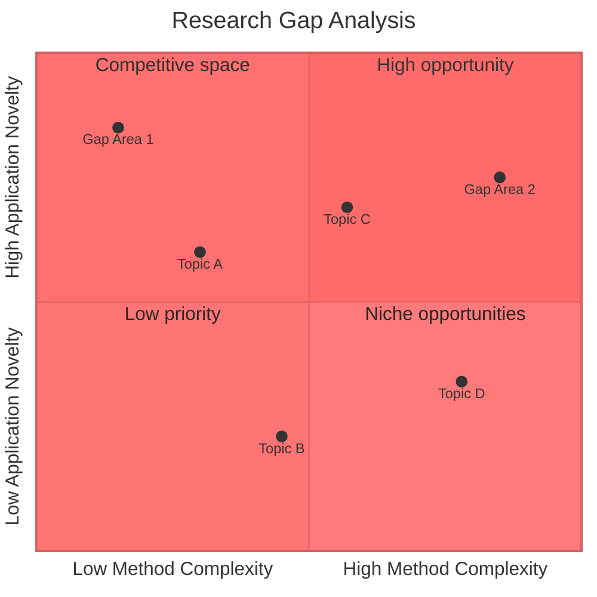
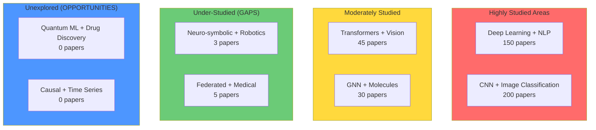
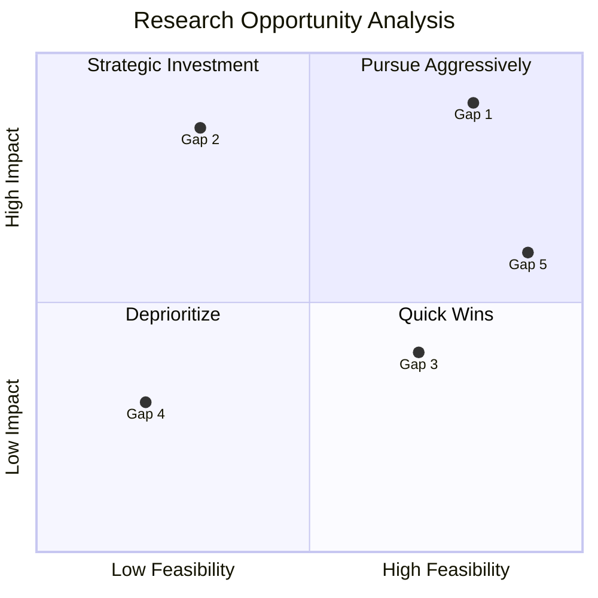

---

## RESEARCH METHODOLOGY GUARDRAILS

**Citation Requirements**:
- NEVER make unsupported claims
- ALWAYS cite sources for facts
- Provide complete bibliographic information
- Use consistent citation format

**Source Quality**:
- Verify credibility before citing
- Prefer peer-reviewed sources
- Cross-reference multiple sources
- Report source tier and confidence

**Transparency Standards**:
- Document methodology explicitly
- Acknowledge limitations
- Disclose assumptions
- Report negative results

**Evidence-Based Practice**:
- Support claims with data
- Use statistical validation
- Apply reproducibility standards
- Follow domain-specific SOPs
name: research-gap-visualizer
description: Create visual maps of research gaps from literature analysis, showing
  what has been studied, what is missing, and where opportunities exist. Generates
  gap matrices, research landscape diagrams, and opportunity maps. Use after literature
  synthesis to visualize the state of research and identify promising directions.
version: 1.0.0
category: research
tags:
- research
- gaps
- visualization
- literature
- analysis
author: ruv
mcp_servers:
  required: [memory-mcp]
  optional: [sequential-thinking]
  auto_enable: true
---

# Research Gap Visualizer

## Kanitsal Cerceve (Evidential Frame Activation)
Kaynak dogrulama modu etkin.


## Purpose

Transform literature analysis into visual gap maps that clearly show what has been studied, what is missing, and where research opportunities exist. Provides visual evidence for research motivation in proposals and manuscripts.

## When to Use This Skill

Activate this skill when:
- Completed literature synthesis and need to identify gaps
- Writing research motivation section (need visual evidence)
- Preparing grant proposals (need to show novelty)
- Planning research direction (need to see landscape)
- Defending thesis topic selection

**DO NOT** use this skill for:
- Initial literature search (use literature-synthesis first)
- Idea generation without literature context (use rapid-idea-generator)
- Detailed methodology planning (use research-driven-planning)

## Visual Output Types

### 1. Gap Matrix
2D matrix showing which combinations of methods/domains have been studied vs unexplored.

### 2. Research Landscape Map
Bubble/scatter diagram showing density of research in different areas.

### 3. Temporal Gap Analysis
Timeline showing when topics were studied and which are stale.

### 4. Method-Application Matrix
Which methods have been applied to which problems.

### 5. Opportunity Quadrant
2x2 matrix of feasibility vs impact for potential research directions.

## Input Contract

```yaml
input:
  literature_data: object (required)
    papers: array[object]
      title: string
      year: number
      methods: array[string]
      domains: array[string]
      key_findings: string

  analysis_type: enum[gap_matrix, landscape, temporal, method_application, opportunity] (required)

  dimensions:
    x_axis: string  # e.g., "methods", "year", "domain"
    y_axis: string  # e.g., "application", "dataset", "metric"

  filters:
    year_range: [start_year, end_year] (optional)
    min_papers: number (default: 1)

  output_format: enum[mermaid, ascii, markdown, graphviz] (default: mermaid)
```

## Output Contract

```yaml
output:
  visualization:
    type: string
    format: string
    code: string  # Mermaid/GraphViz/ASCII code

  gap_analysis:
    total_cells: number
    studied_cells: number
    gap_cells: number
    gap_percentage: number

  identified_gaps:
    high_priority: array[object]
      description: string
      evidence: string  # Why this is a gap
      opportunity_score: number
    medium_priority: array[object]
    low_priority: array[object]

  recommendations:
    top_opportunities: array[string]
    rationale: array[string]

  metadata:
    papers_analyzed: number
    dimensions_used: array[string]
    generation_time: number
```

## SOP Phase 1: Literature Data Parsing

Extract structured data from literature synthesis:

```markdown
## Literature Parsing

**Papers Analyzed**: [N]

**Extracted Dimensions**:
- Methods: [list of unique methods]
- Domains: [list of unique domains/applications]
- Datasets: [list of unique datasets]
- Years: [range]

**Dimension Frequency**:
| Dimension | Count | Percentage |
|-----------|-------|------------|
| [Method 1] | [N] | [%] |
| [Method 2] | [N] | [%] |
```

## SOP Phase 2: Gap Matrix Generation

Create the gap matrix visualization:

### Gap Matrix Template (Markdown)

```markdown
## Research Gap Matrix: [X-Axis] vs [Y-Axis]

|           | [Y1] | [Y2] | [Y3] | [Y4] | [Y5] |
|-----------|------|------|------|------|------|
| **[X1]**  | [N]  | [N]  | GAP  | [N]  | GAP  |
| **[X2]**  | GAP  | [N]  | [N]  | GAP  | GAP  |
| **[X3]**  | [N]  | GAP  | [N]  | [N]  | GAP  |
| **[X4]**  | GAP  | GAP  | GAP  | [N]  | [N]  |

**Legend**:
- [N] = Number of papers
- GAP = No papers found (research opportunity)
- Shading: Darker = more studied

**Gap Statistics**:
- Total cells: [N]
- Studied cells: [N] ([%])
- Gap cells: [N] ([%])
```

### Gap Matrix Template (Mermaid Heatmap)



## SOP Phase 3: Research Landscape Diagram

Visualize research density:



## SOP Phase 4: Temporal Gap Analysis

Show research trends over time:

```markdown
## Temporal Research Landscape

### Publication Trend by Topic

```
Year    | Topic A | Topic B | Topic C | Topic D |
--------|---------|---------|---------|---------|
2019    |  ***    |  **     |  *      |         |
2020    |  ****   |  ***    |  *      |         |
2021    |  *****  |  ****   |  **     |  *      |
2022    |  ****   |  *****  |  ***    |  **     |
2023    |  ***    |  ****   |  ****   |  ***    |
2024    |  **     |  ***    |  *****  |  ****   |
```

**Trend Analysis**:
- **Rising**: Topic C, Topic D (opportunity areas)
- **Stable**: Topic B (competitive but active)
- **Declining**: Topic A (may be saturated)
- **Stale**: [Topics not updated since 2021]
```

## SOP Phase 5: Opportunity Quadrant

Generate prioritized opportunity map:



## SOP Phase 6: Gap Prioritization

Rank identified gaps by research potential:

```markdown
## Prioritized Research Gaps

### High Priority (Pursue)
1. **[Gap Description]**
   - Evidence: [Why this is a gap]
   - Opportunity Score: [0-1]
   - Feasibility: [high/medium/low]
   - Impact: [high/medium/low]
   - Suggested Approach: [Brief methodology]

### Medium Priority (Consider)
2. **[Gap Description]**
   ...

### Low Priority (Monitor)
3. **[Gap Description]**
   ...
```

## Example Execution

**Input** (from literature-synthesis output):
```yaml
literature_data:
  papers:
    - title: "Deep Learning for Drug Discovery"
      year: 2023
      methods: ["CNN", "GNN"]
      domains: ["drug_discovery", "molecular"]
    - title: "Transformers in Medical Imaging"
      year: 2024
      methods: ["Transformer", "Attention"]
      domains: ["medical_imaging", "diagnosis"]
    # ... more papers

analysis_type: gap_matrix
dimensions:
  x_axis: methods
  y_axis: domains
```

**Output**:

```markdown
## Research Gap Matrix: Methods vs Application Domains

|                | Drug Discovery | Medical Imaging | Genomics | Clinical NLP |
|----------------|----------------|-----------------|----------|--------------|
| **CNN**        | 23             | 45              | 12       | 8            |
| **GNN**        | 15             | 3               | 8        | **GAP**      |
| **Transformer**| 5              | 18              | **GAP**  | 22           |
| **Diffusion**  | **GAP**        | 7               | **GAP**  | **GAP**      |

## Identified Gaps (Ranked)

### High Priority
1. **Diffusion Models for Drug Discovery**
   - Evidence: 0 papers found; diffusion excels at generation
   - Opportunity Score: 0.92
   - Rationale: Diffusion models successful in images, untapped in molecules

2. **Graph Neural Networks for Clinical NLP**
   - Evidence: 0 papers; GNNs model document relationships
   - Opportunity Score: 0.78

### Medium Priority
3. **Transformers for Genomics**
   - Evidence: 0 papers in our corpus (may exist elsewhere)
   - Opportunity Score: 0.65
```

## Integration Points

### Receives From
- **literature-synthesis**: Paper data for gap analysis
- **baseline-replication**: Validation of gap existence

### Feeds Into
- **rapid-idea-generator**: Gap-informed ideation
- **rapid-manuscript-drafter**: Visual evidence for motivation
- **research-driven-planning**: Strategic direction

### Memory Storage

```bash
# Store gap analysis for future reference
npx claude-flow@alpha memory store \
  "gap_analysis_[topic]" \
  "[gap_data_json]" \
  --namespace "research/gaps"
```

## Success Criteria

- [ ] All dimensions extracted from literature data
- [ ] Gap matrix accurately reflects paper coverage
- [ ] Gaps prioritized by opportunity score
- [ ] Visual outputs render correctly
- [ ] Recommendations actionable and evidence-based
- [ ] Integration with manuscript writing enabled

## Feature Comparison

| Feature | Basic Tools | This Skill |
|---------|--------|------------|
| Gap identification | Basic | Multi-dimensional |
| Evidence for gaps | None | Paper counts, citations |
| Visualization | Basic diagrams | Matrix, landscape, temporal, quadrant |
| Prioritization | None | Opportunity scoring |
| Integration | Standalone | Feeds into manuscript, planning |
| Transparency | Black box | Full methodology shown |

---

**Version**: 1.0.0
**Category**: Research / Gap Analysis
**Prerequisites**: literature-synthesis output
**Output Formats**: Mermaid, Markdown, ASCII, GraphViz


---
*Promise: `<promise>RESEARCH_GAP_VISUALIZER_SKILL_VERIX_COMPLIANT</promise>`*
