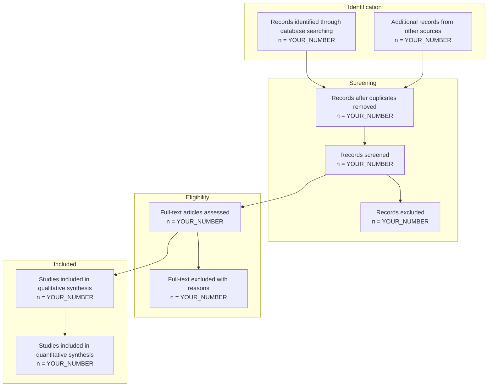
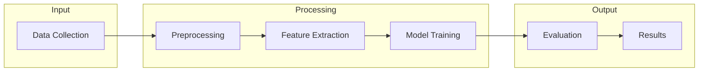
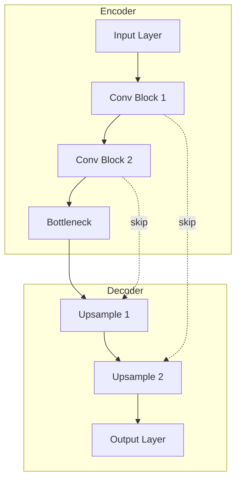
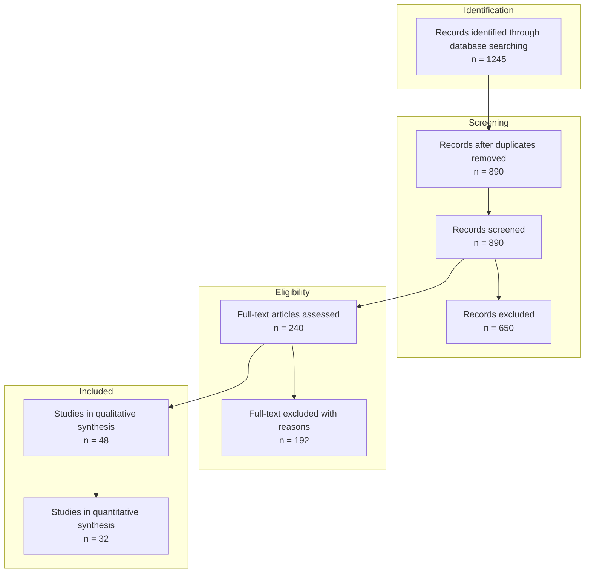

# Visual Asset Generator

## Kanitsal Cerceve (Evidential Frame Activation)
Kaynak dogrulama modu etkin.


## Purpose

Automatically generate publication-ready visual assets (diagrams, charts, tables) from data or descriptions in seconds, filling the gap between text-based research and visual communication.

## When to Use This Skill

Activate this skill when:
- Preparing figures for a research manuscript
- Creating methodology flowcharts
- Generating PRISMA flow diagrams for systematic reviews
- Building comparison tables from research data
- Designing architecture diagrams for systems/methods
- Creating presentation slides with data visualizations
- Documenting experimental pipelines

**DO NOT** use this skill for:
- Fabricating data (this is unethical - we only visualize real data)
- Complex statistical analysis (use appropriate analysis tools first)
- Interactive dashboards (use dedicated BI tools)

## Critical Design Principle

**This skill NEVER fabricates data.**

This skill only visualizes:
1. Data explicitly provided by the user
2. Placeholder templates clearly marked as "[YOUR DATA HERE]"
3. Structural diagrams (flowcharts, architectures) without data

## Supported Visual Asset Types

### 1. Research Diagrams
- PRISMA flow diagrams
- Methodology flowcharts
- Experimental pipeline diagrams
- System architecture diagrams
- Conceptual framework diagrams
- Decision trees

### 2. Data Visualizations
- Bar charts (comparison)
- Line charts (trends)
- Scatter plots (correlations)
- Box plots (distributions)
- Heatmaps (matrices)
- Confusion matrices

### 3. Tables
- Comparison tables (methods, results)
- Summary statistics tables
- Feature matrices
- Literature summary tables
- Hyperparameter tables

### 4. Specialized Research Figures
- Model architecture diagrams
- Ablation study visualizations
- Training curves
- ROC/PR curves (from data)
- Attention visualizations

## Input Contract

```yaml
input:
  asset_type: enum[diagram, chart, table, specialized] (required)

  subtype: string (required)
    # For diagrams: "prisma", "methodology", "pipeline", "architecture", "conceptual"
    # For charts: "bar", "line", "scatter", "box", "heatmap"
    # For tables: "comparison", "summary", "feature_matrix", "literature"
    # For specialized: "model_architecture", "ablation", "training_curves"

  data: object | array | null
    # Actual data to visualize (required for charts)
    # NULL for structural diagrams (will generate template)

  description: string (required for diagrams)
    # Natural language description of what to visualize

  style:
    format: enum[svg, mermaid, graphviz, ascii, markdown] (default: mermaid)
    color_scheme: enum[default, publication, presentation, minimal]
    size: enum[small, medium, large, full_page]

  output_preferences:
    include_caption: boolean (default: true)
    include_source_note: boolean (default: true)
    latex_compatible: boolean (default: false)
```

## Output Contract

```yaml
output:
  visual_asset:
    type: string
    subtype: string
    format: string
    content: string  # The actual diagram/chart/table code

  rendering:
    code: string  # Mermaid/GraphViz/Markdown code
    preview_instructions: string
    export_commands: array[string]

  caption:
    short: string
    long: string

  metadata:
    data_source: string  # "user_provided" | "template_placeholder"
    generation_time: number
    warnings: array[string]
```

## SOP Phase 1: Asset Type Classification

Determine the appropriate visualization for the request:

```markdown
## Asset Classification

**Request Analysis**:
- Type: [diagram | chart | table | specialized]
- Subtype: [specific type]
- Data Available: [yes | no | partial]
- Format: [mermaid | graphviz | markdown | ascii]

**Validation**:
- [ ] Data provided for data-dependent visualizations
- [ ] Description provided for structural diagrams
- [ ] Format supported for asset type
```

## SOP Phase 2: Template Selection

### PRISMA Flow Diagram Template



### Methodology Flowchart Template



### Comparison Table Template

```markdown
| Method | Accuracy | Precision | Recall | F1-Score | Parameters |
|--------|----------|-----------|--------|----------|------------|
| Baseline | [YOUR_DATA] | [YOUR_DATA] | [YOUR_DATA] | [YOUR_DATA] | [YOUR_DATA] |
| Proposed | [YOUR_DATA] | [YOUR_DATA] | [YOUR_DATA] | [YOUR_DATA] | [YOUR_DATA] |
| SOTA | [YOUR_DATA] | [YOUR_DATA] | [YOUR_DATA] | [YOUR_DATA] | [YOUR_DATA] |

*Table X: Performance comparison on [DATASET]. Best results in **bold**.*
```

### Model Architecture Diagram Template



## SOP Phase 3: Data Integration

For data-dependent visualizations:

```markdown
## Data Integration

**Data Validation**:
- [ ] Data format matches visualization requirements
- [ ] No missing critical values
- [ ] Data types appropriate (numeric for charts)

**Data Transformation**:
1. Parse provided data
2. Validate data integrity
3. Transform to visualization format
4. Generate appropriate labels

**If Data Missing**:
- Generate template with [YOUR_DATA] placeholders
- Add warning: "Template generated - replace placeholders with actual data"
```

## SOP Phase 4: Code Generation

Generate the visualization code:

### Mermaid (Default for Diagrams)

```javascript
// Mermaid diagram generation
const generateMermaid = (type, data, description) => {
  // Select template based on type
  // Populate with data or placeholders
  // Return mermaid code
};
```

### GraphViz (Complex Diagrams)

```dot
digraph G {
    rankdir=TB;
    node [shape=box, style=filled, fillcolor=lightblue];

    // Generated nodes and edges
}
```

### Markdown Tables

```markdown
| Column 1 | Column 2 | Column 3 |
|----------|----------|----------|
| Data 1   | Data 2   | Data 3   |
```

### ASCII Art (Terminal-friendly)

```
+----------------+     +----------------+
|    Input       | --> |   Processing   |
+----------------+     +----------------+
                              |
                              v
                       +----------------+
                       |    Output      |
                       +----------------+
```

## SOP Phase 5: Caption Generation

Generate publication-ready captions:

```markdown
## Caption Generation

**Short Caption** (for list of figures):
"Figure X: [Concise description of visualization]"

**Long Caption** (for figure):
"Figure X: [Detailed description including key findings,
methodology notes, and data sources].
[Specific observations].
Source: [Data attribution if applicable]."
```

## Example Executions

### Example 1: PRISMA Diagram

**Input**:
```yaml
asset_type: diagram
subtype: prisma
data:
  identified: 1245
  duplicates_removed: 890
  screened: 890
  excluded_screening: 650
  full_text_assessed: 240
  excluded_full_text: 192
  qualitative: 48
  quantitative: 32
```

**Output**:


### Example 2: Comparison Table

**Input**:
```yaml
asset_type: table
subtype: comparison
data:
  methods:
    - name: "Baseline CNN"
      accuracy: 0.823
      f1: 0.814
      params: "2.3M"
    - name: "Proposed Method"
      accuracy: 0.891
      f1: 0.887
      params: "1.8M"
    - name: "ResNet-50"
      accuracy: 0.876
      f1: 0.869
      params: "25.6M"
```

**Output**:
```markdown
| Method | Accuracy | F1-Score | Parameters |
|--------|----------|----------|------------|
| Baseline CNN | 0.823 | 0.814 | 2.3M |
| **Proposed Method** | **0.891** | **0.887** | **1.8M** |
| ResNet-50 | 0.876 | 0.869 | 25.6M |

*Table 1: Performance comparison on test dataset.
Best results highlighted in **bold**.
Proposed method achieves highest accuracy with fewest parameters.*
```

## Integration Points

### Feeds Into
- **rapid-manuscript-drafter**: Embed figures in drafts
- **research-publication**: Publication-ready figures

### Receives From
- **literature-synthesis**: Data for PRISMA diagrams
- **holistic-evaluation**: Metrics for comparison tables
- **baseline-replication**: Results for visualization

## Rendering Instructions

### Mermaid (Web/Markdown)
```bash
# Preview in VS Code with Mermaid extension
# Or use: https://mermaid.live/

# Export to SVG:
mmdc -i diagram.mmd -o diagram.svg
```

### GraphViz
```bash
# Render to PNG:
dot -Tpng diagram.dot -o diagram.png

# Render to SVG:
dot -Tsvg diagram.dot -o diagram.svg
```

### LaTeX Tables
```latex
\begin{table}[h]
\centering
\caption{Performance Comparison}
\begin{tabular}{lccc}
\toprule
Method & Accuracy & F1 & Params \\
\midrule
Baseline & 0.823 & 0.814 & 2.3M \\
Proposed & \textbf{0.891} & \textbf{0.887} & \textbf{1.8M} \\
\bottomrule
\end{tabular}
\end{table}
```

## Success Criteria

- [ ] Visualization matches requested type
- [ ] Data accurately represented (no fabrication)
- [ ] Template placeholders clearly marked if data missing
- [ ] Caption generated (short + long)
- [ ] Rendering instructions provided
- [ ] Format exportable to publication standards

## Ethical Guidelines

1. **NEVER fabricate data** - Only visualize user-provided data
2. **Mark templates clearly** - Use [YOUR_DATA] placeholders
3. **Attribute sources** - Include data source in captions
4. **Warn about limitations** - Note when data is incomplete

---

**Version**: 1.0.0
**Category**: Research / Visualization
**Formats**: Mermaid, GraphViz, Markdown, ASCII, LaTeX
**Design**: Ethical visualization with placeholder-based data insertion


---
*Promise: `<promise>VISUAL_ASSET_GENERATOR_SKILL_VERIX_COMPLIANT</promise>`*
