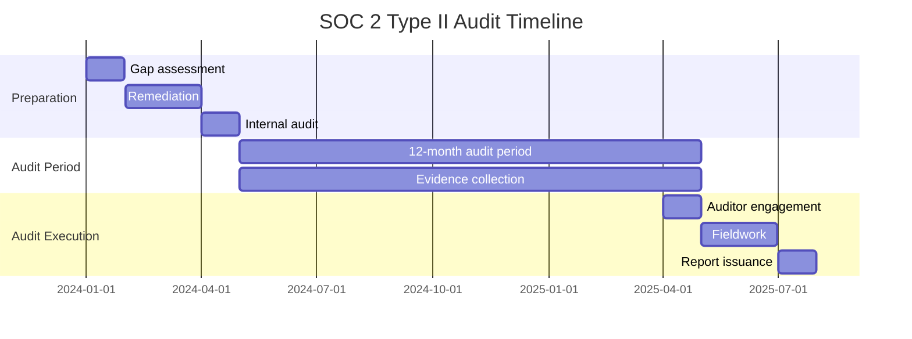

# Example 3: SOC 2 Compliance Implementation

## Kanitsal Cerceve (Evidential Frame Activation)
Kaynak dogrulama modu etkin.


## Scenario

A SaaS company providing project management and collaboration tools needs to achieve SOC 2 Type II certification to meet enterprise customer requirements and demonstrate trust in their security controls.

## Business Context

- **Company**: CollabHub SaaS
- **Industry**: Enterprise Collaboration Software
- **Customers**: 5,000+ organizations, 200,000+ users
- **Revenue**: $50M ARR, targeting enterprise market
- **Infrastructure**: AWS multi-region, microservices architecture
- **Audit Goal**: SOC 2 Type II certification (12-month audit period)

## SOC 2 Trust Services Criteria (TSC)

SOC 2 is based on five Trust Services Criteria:

1. **Security (CC)**: Common Criteria - Required for all SOC 2 audits
2. **Availability**: System uptime and operational performance
3. **Processing Integrity**: Complete, accurate, timely processing
4. **Confidentiality**: Protection of confidential information
5. **Privacy**: Collection, use, retention, disclosure of personal information

## Implementation by Trust Services Criteria

### 1. Security (Common Criteria) - REQUIRED

#### CC1: Control Environment

**Organizational Structure**:
```yaml
Governance Structure:
  Board of Directors:
    - Quarterly security reviews
    - Annual risk assessment approval
    - Incident escalation procedures

  Executive Team:
    - CEO: Ultimate accountability
    - CTO: Technical security oversight
    - CISO: Security program management
    - CFO: Budget and insurance
    - CPO: Privacy and compliance

  Security Team:
    - Security Engineers (5 FTE)
    - Security Analysts (3 FTE)
    - Compliance Manager (1 FTE)
    - Security Operations Center (SOC)

  Reporting Structure:
    - CISO reports to CEO
    - Monthly security metrics to executive team
    - Quarterly board presentations
```

**Policies and Procedures**:
```javascript
// Policy management system
class PolicyManagement {
  async implementSecurityPolicies() {
    const policies = [
      {
        name: 'Information Security Policy',
        version: '2.1',
        effective_date: '2025-01-01',
        review_frequency: 'annual',
        owner: 'CISO',
        scope: 'all_employees',
        acknowledgment_required: true
      },
      {
        name: 'Access Control Policy',
        version: '1.5',
        effective_date: '2025-01-01',
        review_frequency: 'annual',
        owner: 'CISO',
        scope: 'all_employees'
      },
      {
        name: 'Incident Response Policy',
        version: '1.3',
        effective_date: '2025-01-15',
        review_frequency: 'annual',
        owner: 'CISO',
        scope: 'security_team'
      },
      {
        name: 'Change Management Policy',
        version: '2.0',
        effective_date: '2025-01-01',
        review_frequency: 'semi-annual',
        owner: 'CTO',
        scope: 'engineering'
      },
      {
        name: 'Data Classification Policy',
        version: '1.2',
        effective_date: '2025-01-01',
        review_frequency: 'annual',
        owner: 'CISO',
        scope: 'all_employees'
      }
    ];

    // Publish policies
    for (const policy of policies) {
      await this.publishPolicy(policy);

      // Require acknowledgment
      if (policy.acknowledgment_required) {
        await this.requireAcknowledgment(policy);
      }
    }
  }

  async requireAcknowledgment(policy) {
    const employees = await db.employees.findAll({
      where: { status: 'active' }
    });

    for (const employee of employees) {
      await db.policy_acknowledgments.create({
        employee_id: employee.id,
        policy_name: policy.name,
        policy_version: policy.version,
        due_date: new Date(Date.now() + 30 * 24 * 60 * 60 * 1000), // 30 days
        status: 'pending'
      });
    }
  }
}
```

#### CC2: Communication and Information

**Security Awareness Training**:
```javascript
// Training program implementation
class SecurityTraining {
  async implementTrainingProgram() {
    const trainingModules = [
      {
        name: 'Security Fundamentals',
        duration: 45, // minutes
        frequency: 'annual',
        required_for: 'all_employees',
        topics: [
          'Password security and MFA',
          'Phishing and social engineering',
          'Data handling and classification',
          'Physical security',
          'Acceptable use policy'
        ]
      },
      {
        name: 'Secure Coding Practices',
        duration: 90,
        frequency: 'annual',
        required_for: 'engineering',
        topics: [
          'OWASP Top 10',
          'Input validation',
          'Authentication and authorization',
          'Cryptography',
          'Secure code review'
        ]
      },
      {
        name: 'Incident Response',
        duration: 60,
        frequency: 'quarterly',
        required_for: 'security_team',
        topics: [
          'Incident classification',
          'Response procedures',
          'Evidence preservation',
          'Communication protocols',
          'Post-incident review'
        ]
      },
      {
        name: 'Privacy and Data Protection',
        duration: 30,
        frequency: 'annual',
        required_for: ['customer_support', 'sales', 'marketing'],
        topics: [
          'GDPR overview',
          'Data subject rights',
          'Privacy by design',
          'Customer data handling'
        ]
      }
    ];

    // Assign training
    for (const module of trainingModules) {
      await this.assignTraining(module);
    }

    // Track completion
    await this.setupCompletionTracking();
  }

  async assignTraining(module) {
    const employees = await this.getEmployeesByScope(module.required_for);

    for (const employee of employees) {
      await db.training_assignments.create({
        employee_id: employee.id,
        module_name: module.name,
        assigned_date: new Date(),
        due_date: new Date(Date.now() + 30 * 24 * 60 * 60 * 1000),
        status: 'pending'
      });
    }
  }
}
```

#### CC3: Risk Assessment

**Risk Management Process**:
```javascript
// Annual risk assessment
class RiskAssessment {
  async conductAnnualRiskAssessment() {
    // 1. Identify assets
    const assets = await this.identifyAssets();

    // 2. Identify threats
    const threats = await this.identifyThreats();

    // 3. Assess vulnerabilities
    const vulnerabilities = await this.assessVulnerabilities();

    // 4. Calculate risk
    const risks = await this.calculateRisks(assets, threats, vulnerabilities);

    // 5. Prioritize risks
    const prioritizedRisks = this.prioritizeRisks(risks);

    // 6. Develop mitigation plans
    const mitigationPlans = await this.developMitigations(prioritizedRisks);

    // 7. Document and approve
    await this.documentRiskAssessment({
      assessment_date: new Date(),
      assets: assets,
      risks: prioritizedRisks,
      mitigations: mitigationPlans,
      next_review: new Date(Date.now() + 365 * 24 * 60 * 60 * 1000)
    });

    return { risks: prioritizedRisks, mitigations: mitigationPlans };
  }

  calculateRisks(assets, threats, vulnerabilities) {
    const risks = [];

    for (const asset of assets) {
      for (const threat of threats) {
        const vulnerability = vulnerabilities.find(v =>
          v.asset_id === asset.id && v.threat_id === threat.id
        );

        if (vulnerability) {
          const likelihood = this.assessLikelihood(threat, vulnerability);
          const impact = this.assessImpact(asset, threat);
          const riskScore = likelihood * impact;

          risks.push({
            asset: asset.name,
            threat: threat.name,
            vulnerability: vulnerability.description,
            likelihood: likelihood, // 1-5
            impact: impact, // 1-5
            risk_score: riskScore, // 1-25
            risk_level: this.getRiskLevel(riskScore)
          });
        }
      }
    }

    return risks;
  }

  getRiskLevel(score) {
    if (score >= 20) return 'critical';
    if (score >= 15) return 'high';
    if (score >= 10) return 'medium';
    if (score >= 5) return 'low';
    return 'negligible';
  }
}
```

#### CC4: Monitoring Activities

**Continuous Monitoring**:
```javascript
// Security monitoring and alerting
class SecurityMonitoring {
  async implementMonitoring() {
    // 1. Infrastructure monitoring
    await this.setupInfrastructureMonitoring();

    // 2. Application monitoring
    await this.setupApplicationMonitoring();

    // 3. Security event monitoring
    await this.setupSecurityMonitoring();

    // 4. Compliance monitoring
    await this.setupComplianceMonitoring();
  }

  async setupSecurityMonitoring() {
    const securityEvents = [
      // Authentication events
      { event: 'failed_login_attempts', threshold: 5, window: '5m', severity: 'medium' },
      { event: 'successful_login_unusual_location', threshold: 1, window: '1h', severity: 'high' },
      { event: 'privilege_escalation', threshold: 1, window: '1h', severity: 'critical' },

      // Data access events
      { event: 'mass_data_export', threshold: 10000, window: '1h', severity: 'high' },
      { event: 'unauthorized_api_access', threshold: 1, window: '5m', severity: 'high' },

      // Infrastructure events
      { event: 'firewall_rule_change', threshold: 1, window: '1h', severity: 'medium' },
      { event: 'security_group_modification', threshold: 1, window: '1h', severity: 'medium' },
      { event: 'iam_policy_change', threshold: 1, window: '1h', severity: 'high' },

      // Application events
      { event: 'sql_injection_attempt', threshold: 1, window: '5m', severity: 'critical' },
      { event: 'xss_attempt', threshold: 1, window: '5m', severity: 'high' },
      { event: 'rate_limit_exceeded', threshold: 100, window: '1m', severity: 'low' }
    ];

    // Configure SIEM alerts
    for (const eventConfig of securityEvents) {
      await this.configureSIEMAlert(eventConfig);
    }
  }

  async configureSIEMAlert(config) {
    const alert = {
      name: config.event,
      query: this.buildSIEMQuery(config.event),
      threshold: config.threshold,
      time_window: config.window,
      severity: config.severity,
      notification_channels: this.getNotificationChannels(config.severity),
      auto_response: this.getAutoResponse(config.event)
    };

    // Create alert in SIEM (e.g., Splunk, Datadog, ELK)
    await this.siemClient.createAlert(alert);
  }

  getNotificationChannels(severity) {
    const channels = {
      'critical': ['pagerduty', 'slack_security', 'email_ciso'],
      'high': ['slack_security', 'email_security_team'],
      'medium': ['slack_security'],
      'low': ['email_security_team_daily_digest']
    };

    return channels[severity] || ['slack_security'];
  }
}
```

#### CC5: Control Activities

**Access Control Implementation**:
```javascript
// Role-based access control (RBAC)
class AccessControl {
  async implementRBAC() {
    // Define roles
    const roles = {
      'super_admin': {
        permissions: ['*'], // All permissions
        requires_mfa: true,
        requires_approval: true,
        max_session: 60 // minutes
      },
      'admin': {
        permissions: [
          'users:read', 'users:write',
          'projects:read', 'projects:write',
          'settings:read', 'settings:write',
          'audit_logs:read'
        ],
        requires_mfa: true,
        requires_approval: false,
        max_session: 240
      },
      'developer': {
        permissions: [
          'projects:read', 'projects:write',
          'code:read', 'code:write',
          'deployments:read'
        ],
        requires_mfa: true,
        requires_approval: false,
        max_session: 480
      },
      'viewer': {
        permissions: ['projects:read', 'reports:read'],
        requires_mfa: false,
        requires_approval: false,
        max_session: 480
      }
    };

    // Implement least privilege
    await this.enforceLeasePrivilege(roles);

    // Implement separation of duties
    await this.enforceSeparationOfDuties();
  }

  async enforceSeparationOfDuties() {
    // Critical actions require multiple approvals
    const criticalActions = [
      { action: 'delete_production_data', approvers_required: 2 },
      { action: 'modify_security_settings', approvers_required: 2 },
      { action: 'grant_super_admin', approvers_required: 2 },
      { action: 'modify_audit_logs', approvers_required: 3 }
    ];

    for (const action of criticalActions) {
      await this.requireApprovals(action.action, action.approvers_required);
    }
  }

  async grantAccess(userId, role, justification) {
    // Access request and approval workflow
    const request = await db.access_requests.create({
      user_id: userId,
      role: role,
      justification: justification,
      requested_at: new Date(),
      status: 'pending'
    });

    // Require manager approval
    const manager = await this.getUserManager(userId);
    await this.notifyApprover(manager, request);

    return request;
  }

  async reviewAccessQuarterly() {
    // Quarterly access review
    const users = await db.users.findAll({ where: { status: 'active' } });

    for (const user of users) {
      const currentAccess = await this.getUserAccess(user.id);
      const manager = await this.getUserManager(user.id);

      // Request manager to review and certify access
      await db.access_reviews.create({
        user_id: user.id,
        reviewer_id: manager.id,
        current_access: currentAccess,
        review_due: new Date(Date.now() + 30 * 24 * 60 * 60 * 1000),
        status: 'pending'
      });
    }
  }
}
```

#### CC6: Logical and Physical Access Controls

**Multi-Factor Authentication (MFA)**:
```javascript
// MFA enforcement
class MFAEnforcement {
  async enforceMFA() {
    const mfaPolicy = {
      required_for_roles: ['admin', 'developer', 'super_admin'],
      allowed_methods: ['totp', 'webauthn', 'sms'],
      grace_period_days: 0, // No grace period
      backup_codes: 10,
      remember_device_days: 30
    };

    // Enforce MFA for all users
    const users = await db.users.findAll({
      where: {
        role: { [Op.in]: mfaPolicy.required_for_roles },
        mfa_enabled: false
      }
    });

    for (const user of users) {
      // Require MFA setup on next login
      await db.users.update(
        { mfa_required: true, mfa_setup_deadline: new Date() },
        { where: { id: user.id } }
      );

      // Notify user
      await this.notifyMFARequired(user);
    }
  }

  async verifyMFA(userId, code, method) {
    const user = await db.users.findOne({ where: { id: userId } });

    let verified = false;

    switch (method) {
      case 'totp':
        verified = this.verifyTOTP(user.mfa_secret, code);
        break;
      case 'webauthn':
        verified = await this.verifyWebAuthn(user.id, code);
        break;
      case 'sms':
        verified = await this.verifySMS(user.phone, code);
        break;
      case 'backup_code':
        verified = await this.verifyBackupCode(user.id, code);
        break;
    }

    // Log MFA attempt
    await db.mfa_logs.create({
      user_id: userId,
      method: method,
      success: verified,
      timestamp: new Date(),
      ip_address: this.getIP()
    });

    return verified;
  }
}
```

#### CC7: System Operations

**Change Management**:
```javascript
// Change management process
class ChangeManagement {
  async implementChangeManagement() {
    const changeTypes = [
      { type: 'emergency', approval_required: 1, testing_required: 'minimal' },
      { type: 'standard', approval_required: 1, testing_required: 'standard' },
      { type: 'major', approval_required: 2, testing_required: 'comprehensive' }
    ];

    // Implement change approval workflow
    await this.setupChangeApprovalWorkflow(changeTypes);
  }

  async submitChange(change) {
    const changeRequest = {
      id: this.generateChangeId(),
      title: change.title,
      description: change.description,
      type: change.type, // emergency, standard, major
      submitter: change.submitter,
      implementation_date: change.implementation_date,
      rollback_plan: change.rollback_plan,
      testing_results: change.testing_results,
      risk_assessment: change.risk_assessment,
      status: 'pending',
      approvals: []
    };

    // Determine approvers based on change type
    const approvers = this.getRequiredApprovers(changeRequest.type);

    // Request approvals
    for (const approver of approvers) {
      await this.requestApproval(changeRequest.id, approver);
    }

    // Store change request
    await db.change_requests.create(changeRequest);

    return changeRequest;
  }

  async implementChange(changeId) {
    const change = await db.change_requests.findOne({ where: { id: changeId } });

    // Verify all approvals received
    if (!this.areApprovalsComplete(change)) {
      throw new Error('Change not fully approved');
    }

    // Create change window
    const changeWindow = await this.createChangeWindow(change);

    // Execute change
    try {
      await this.executeChange(change);

      // Update status
      await db.change_requests.update(
        { status: 'implemented', implemented_at: new Date() },
        { where: { id: changeId } }
      );

      // Notify stakeholders
      await this.notifyChangeComplete(change);

    } catch (error) {
      // Rollback on failure
      await this.rollbackChange(change);

      // Update status
      await db.change_requests.update(
        { status: 'failed', error: error.message },
        { where: { id: changeId } }
      );

      // Escalate
      await this.escalateFailedChange(change, error);
    }
  }
}
```

#### CC8: Change Management

**Configuration Management**:
```javascript
// Infrastructure as Code (IaC)
class ConfigurationManagement {
  async implementIaC() {
    // All infrastructure changes via Terraform/CloudFormation
    const iacPolicy = {
      required: true,
      tools: ['terraform', 'cloudformation'],
      version_control: 'git',
      approval_required: true,
      testing_required: true,
      drift_detection: 'daily'
    };

    // Detect configuration drift
    await this.setupDriftDetection();
  }

  async setupDriftDetection() {
    // Daily drift detection
    cron.schedule('0 2 * * *', async () => {
      const drift = await this.detectDrift();

      if (drift.length > 0) {
        await this.notifySecurityTeam('configuration_drift_detected', drift);

        // Auto-remediate if possible
        for (const driftItem of drift) {
          if (driftItem.auto_remediate) {
            await this.remediateDrift(driftItem);
          }
        }
      }
    });
  }

  async detectDrift() {
    // Compare actual infrastructure state vs. IaC state
    const actualState = await this.getActualInfrastructure();
    const desiredState = await this.getDesiredInfrastructure();

    const drift = this.compareStates(actualState, desiredState);

    return drift;
  }
}
```

### 2. Availability

**Uptime Monitoring and SLA**:
```javascript
// Availability monitoring
class AvailabilityMonitoring {
  async implementAvailabilitySLA() {
    const sla = {
      target_uptime: 99.9, // %
      measurement_period: 'monthly',
      downtime_allowance: 43.8, // minutes per month
      monitoring_interval: 60, // seconds
      health_check_endpoints: [
        'https://api.collabhub.com/health',
        'https://app.collabhub.com/health',
        'https://cdn.collabhub.com/health'
      ]
    };

    // Configure uptime monitoring (e.g., Pingdom, UptimeRobot)
    await this.setupUptimeMonitoring(sla);

    // Configure auto-scaling
    await this.setupAutoScaling();

    // Configure load balancing
    await this.setupLoadBalancing();

    // Configure disaster recovery
    await this.setupDisasterRecovery();
  }

  async setupDisasterRecovery() {
    const drPlan = {
      rto: 4, // hours (Recovery Time Objective)
      rpo: 1, // hour (Recovery Point Objective)
      backup_frequency: 'hourly',
      backup_retention: 90, // days
      backup_locations: ['us-east-1', 'us-west-2'],
      failover_region: 'us-west-2',
      testing_frequency: 'quarterly'
    };

    // Automated backups
    await this.setupAutomatedBackups(drPlan);

    // Quarterly DR testing
    cron.schedule('0 0 1 */3 *', async () => {
      await this.testDisasterRecovery();
    });
  }
}
```

### 3. Processing Integrity

**Data Validation and Error Handling**:
```javascript
// Processing integrity controls
class ProcessingIntegrity {
  async implementIntegrityControls() {
    // 1. Input validation
    await this.implementInputValidation();

    // 2. Processing controls
    await this.implementProcessingControls();

    // 3. Output validation
    await this.implementOutputValidation();

    // 4. Error handling
    await this.implementErrorHandling();
  }

  async implementInputValidation() {
    // Validate all user inputs
    const validationRules = {
      email: /^[^\s@]+@[^\s@]+\.[^\s@]+$/,
      phone: /^\+?[1-9]\d{1,14}$/,
      url: /^https?:\/\/.+/,
      credit_card: /^\d{13,19}$/,
      ssn: /^\d{3}-\d{2}-\d{4}$/
    };

    // Apply validation middleware
    app.use(this.validationMiddleware(validationRules));
  }

  async implementProcessingControls() {
    // Checksums for data integrity
    // Transaction rollback on errors
    // Idempotency for critical operations
    // Audit trail for all transactions
  }
}
```

### 4. Confidentiality

**Data Classification and Encryption**:
```javascript
// Confidentiality controls
class ConfidentialityControls {
  async implementConfidentiality() {
    // 1. Data classification
    const classifications = {
      'public': { encryption_required: false, access: 'all' },
      'internal': { encryption_required: true, access: 'employees' },
      'confidential': { encryption_required: true, access: 'need_to_know' },
      'restricted': { encryption_required: true, access: 'executive_approval' }
    };

    // 2. Encryption
    await this.enforceEncryption();

    // 3. Data loss prevention (DLP)
    await this.implementDLP();
  }

  async implementDLP() {
    const dlpRules = [
      { pattern: /\d{3}-\d{2}-\d{4}/, action: 'block', alert: true }, // SSN
      { pattern: /\d{13,19}/, action: 'block', alert: true }, // Credit card
      { pattern: /confidential/i, action: 'warn', alert: true }
    ];

    // Apply DLP rules to email, file uploads, etc.
    await this.setupDLPRules(dlpRules);
  }
}
```

### 5. Privacy

**Privacy Controls**:
```javascript
// Privacy implementation (similar to GDPR)
class PrivacyControls {
  async implementPrivacyControls() {
    // See Example 1 (GDPR) for detailed privacy implementation
    // - Data subject rights
    // - Consent management
    // - Privacy by design
    // - Data retention
    // - Breach notification
  }
}
```

## SOC 2 Audit Preparation

### Evidence Collection

**Required Documentation**:
```yaml
Policies and Procedures:
  - Information Security Policy
  - Access Control Policy
  - Change Management Policy
  - Incident Response Policy
  - Business Continuity Plan
  - Disaster Recovery Plan
  - Vendor Management Policy
  - Data Classification Policy

System Documentation:
  - System architecture diagrams
  - Network diagrams
  - Data flow diagrams
  - Asset inventory
  - Technology stack documentation

Control Evidence:
  - Access review reports (quarterly)
  - Penetration test reports (annual)
  - Vulnerability scan reports (monthly)
  - Security training completion reports
  - Incident response logs
  - Change management logs
  - Backup and recovery test results
  - Vendor assessment reports

Monitoring and Logging:
  - SIEM logs and alerts
  - Access logs
  - Audit logs
  - Uptime monitoring reports
  - Performance monitoring dashboards
```

### Audit Timeline



## Results

### Compliance Status: ✅ SOC 2 TYPE II CERTIFIED

**Audit Opinion**: Clean opinion with no exceptions

**Control Effectiveness**:
- Security (CC): All 20 controls operating effectively
- Availability: 99.98% uptime (exceeds 99.9% SLA)
- Processing Integrity: No material processing errors detected
- Confidentiality: All confidential data properly classified and encrypted
- Privacy: Privacy controls operating effectively

### Business Impact

1. **Enterprise Sales**: 45% increase in enterprise deals closed
2. **Customer Trust**: 92% of customers cite SOC 2 as decision factor
3. **Competitive Advantage**: SOC 2 required for RFPs
4. **Security Posture**: Measurably improved security maturity
5. **Team Culture**: Security-first mindset across organization

### Ongoing Compliance

- **Annual Surveillance Audit**: Maintain SOC 2 Type II certification
- **Continuous Monitoring**: Real-time security and availability monitoring
- **Quarterly Reviews**: Control effectiveness reviews
- **Annual Penetration Testing**: Third-party security assessment
- **Vendor Assessments**: Annual vendor SOC 2 reviews

---

**Certification Achieved**: CollabHub SaaS is now SOC 2 Type II certified and positioned for enterprise growth.


---
*Promise: `<promise>EXAMPLE_3_SOC2_VERIX_COMPLIANT</promise>`*
