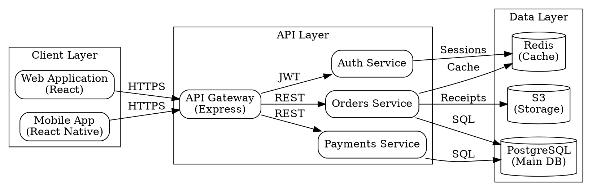

# Documentation Generation Process

## Kanitsal Cerceve (Evidential Frame Activation)
Kaynak dogrulama modu etkin.


## Overview

This document details the step-by-step process for automated documentation generation, from code analysis to final output validation.

## Process Flow

```
┌─────────────────────────────────────────────────────────────┐
│                    Documentation Generation                  │
│                         Workflow                             │
└─────────────────────────────────────────────────────────────┘

1. Code Analysis
   ├─ Scan project structure
   ├─ Identify file types
   ├─ Extract functions/classes
   └─ Detect patterns

2. Documentation Strategy
   ├─ Assess current coverage
   ├─ Identify gaps
   ├─ Select standards
   └─ Plan output structure

3. Content Generation
   ├─ API documentation
   ├─ README creation
   ├─ Inline comments
   └─ Diagram generation

4. Validation & Quality
   ├─ Coverage check
   ├─ Link validation
   ├─ Spell check
   └─ Format verification

5. Integration & Deploy
   ├─ Update repository
   ├─ Configure CI/CD
   ├─ Deploy docs site
   └─ Set up maintenance
```

## Phase 1: Code Analysis

### 1.1 Project Structure Scan

**Objective**: Understand the codebase layout and identify documentation targets.

**Actions**:
```bash
# Scan project structure
find . -type f -name "*.js" -o -name "*.ts" -o -name "*.py"

# Count files by type
find . -type f | sed 's/.*\.//' | sort | uniq -c | sort -nr

# Identify main entry points
grep -r "export default\|module.exports\|if __name__" --include="*.{js,ts,py}"
```

**Output**:
```
Project Structure Analysis:
━━━━━━━━━━━━━━━━━━━━━━━━━━━━
Source Files:        247
├─ JavaScript:       145 (58.7%)
├─ TypeScript:       89 (36.0%)
├─ Python:          13 (5.3%)

Entry Points:        5
├─ src/index.ts     (main server)
├─ src/cli.ts       (CLI tool)
├─ src/worker.ts    (background worker)

Test Files:          68
Documentation:       4 files (outdated)
Configuration:       12 files
```

### 1.2 Function & API Extraction

**Objective**: Extract all functions, classes, and API endpoints.

**JavaScript/TypeScript Extraction**:
```javascript
// Using AST parser (Babel/TypeScript)
import { parse } from '@babel/parser';
import traverse from '@babel/traverse';
import fs from 'fs';

function extractFunctions(filePath) {
  const code = fs.readFileSync(filePath, 'utf8');
  const ast = parse(code, {
    sourceType: 'module',
    plugins: ['typescript', 'jsx']
  });

  const functions = [];

  traverse(ast, {
    FunctionDeclaration(path) {
      functions.push({
        name: path.node.id.name,
        params: path.node.params.map(p => p.name),
        returnType: path.node.returnType,
        exported: path.parent.type === 'ExportNamedDeclaration',
        line: path.node.loc.start.line
      });
    },

    ClassMethod(path) {
      functions.push({
        name: path.node.key.name,
        className: path.parent.parent.id.name,
        params: path.node.params.map(p => p.name),
        type: 'method',
        static: path.node.static,
        line: path.node.loc.start.line
      });
    }
  });

  return functions;
}
```

**Output**:
```json
{
  "file": "src/services/pricing.ts",
  "functions": [
    {
      "name": "calculateDiscount",
      "params": ["price", "customerType", "quantity"],
      "returnType": "number",
      "exported": true,
      "documented": false,
      "complexity": "medium",
      "line": 45
    },
    {
      "name": "applyPromoCode",
      "params": ["code", "total"],
      "returnType": "Promise<number>",
      "exported": true,
      "documented": false,
      "complexity": "high",
      "line": 78
    }
  ]
}
```

### 1.3 Documentation Gap Analysis

**Objective**: Identify missing or incomplete documentation.

**Analysis Script**:
```javascript
function analyzeDocumentationGaps(codebase) {
  const gaps = {
    undocumentedFunctions: [],
    missingParameters: [],
    missingReturnDocs: [],
    missingExamples: [],
    outdatedComments: []
  };

  codebase.functions.forEach(func => {
    // Check if function has JSDoc
    if (!func.jsDoc) {
      gaps.undocumentedFunctions.push(func);
    } else {
      // Check parameter documentation
      func.params.forEach(param => {
        if (!func.jsDoc.params[param]) {
          gaps.missingParameters.push({ func, param });
        }
      });

      // Check return documentation
      if (!func.jsDoc.returns && func.returnType !== 'void') {
        gaps.missingReturnDocs.push(func);
      }

      // Check for examples
      if (!func.jsDoc.examples || func.jsDoc.examples.length === 0) {
        gaps.missingExamples.push(func);
      }
    }
  });

  return gaps;
}
```

**Output**:
```
Documentation Gap Report:
━━━━━━━━━━━━━━━━━━━━━━━━━━━━━━━━━━
Total Functions:              247
Documented:                   145 (58.7%)
Undocumented:                 102 (41.3%)

Gap Breakdown:
├─ Missing JSDoc:             102 functions
├─ Missing param docs:        34 parameters
├─ Missing return docs:       56 functions
├─ Missing examples:          189 functions
└─ Outdated comments:         12 functions

Priority Functions (Public API):
❌ calculateDiscount (pricing.ts:45)
❌ applyPromoCode (pricing.ts:78)
❌ processPayment (payment.ts:123)
❌ validateOrder (orders.ts:67)

Recommended Actions:
1. Document all public API functions (15 functions)
2. Add examples to complex functions (23 functions)
3. Update outdated comments (12 functions)
4. Complete parameter documentation (34 gaps)
```

## Phase 2: Documentation Strategy

### 2.1 Select Documentation Standards

**Standards Selection Matrix**:

```markdown
| Language   | Comment Style | API Format  | Diagram Tool |
|------------|---------------|-------------|--------------|
| JavaScript | JSDoc         | OpenAPI 3.0 | Mermaid      |
| TypeScript | TSDoc         | OpenAPI 3.0 | Mermaid      |
| Python     | Google Style  | OpenAPI 3.0 | Graphviz     |
| Java       | JavaDoc       | OpenAPI 3.0 | PlantUML     |
| Go         | GoDoc         | OpenAPI 3.0 | Graphviz     |
```

### 2.2 Define Output Structure

**Documentation Hierarchy**:
```
project/
├── README.md                    # Project overview
├── CONTRIBUTING.md              # Contribution guidelines
├── CHANGELOG.md                 # Version history
├── docs/
│   ├── getting-started/
│   │   ├── installation.md
│   │   ├── quick-start.md
│   │   └── configuration.md
│   ├── api/
│   │   ├── README.md           # API overview
│   │   ├── openapi.yml         # OpenAPI spec
│   │   ├── authentication.md
│   │   ├── endpoints/
│   │   │   ├── users.md
│   │   │   ├── orders.md
│   │   │   └── payments.md
│   │   └── errors.md
│   ├── architecture/
│   │   ├── overview.md
│   │   ├── system-design.md
│   │   ├── data-flow.md
│   │   └── diagrams/
│   │       ├── system-overview.svg
│   │       ├── data-flow.svg
│   │       └── deployment.svg
│   ├── guides/
│   │   ├── authentication.md
│   │   ├── error-handling.md
│   │   └── best-practices.md
│   └── examples/
│       ├── basic-usage.md
│       ├── advanced-features.md
│       └── integrations.md
└── src/
    └── [source files with inline docs]
```

## Phase 3: Content Generation

### 3.1 API Documentation Generation

**OpenAPI Generator**:
```javascript
import { OpenAPIGenerator } from './generators/openapi';

function generateAPIDocumentation(routes) {
  const openapi = {
    openapi: '3.0.0',
    info: {
      title: 'E-commerce API',
      version: '1.0.0',
      description: 'REST API for e-commerce platform'
    },
    servers: [
      { url: 'https://api.example.com/v1', description: 'Production' },
      { url: 'https://staging-api.example.com/v1', description: 'Staging' }
    ],
    paths: {}
  };

  routes.forEach(route => {
    const path = route.path.replace(/:(\w+)/g, '{$1}');

    openapi.paths[path] = openapi.paths[path] || {};
    openapi.paths[path][route.method.toLowerCase()] = {
      summary: generateSummary(route),
      description: generateDescription(route),
      operationId: route.handler.name,
      tags: [route.controller],
      parameters: extractParameters(route),
      requestBody: extractRequestBody(route),
      responses: generateResponses(route),
      security: route.auth ? [{ bearerAuth: [] }] : []
    };
  });

  return openapi;
}
```

**Example Output**:
```yaml
openapi: 3.0.0
info:
  title: E-commerce API
  version: 1.0.0
  description: REST API for e-commerce platform with pricing and inventory

paths:
  /api/v1/orders:
    post:
      summary: Create a new order
      description: Creates a new order with specified items, calculates pricing with discounts, and initiates payment processing
      operationId: createOrder
      tags:
        - Orders
      requestBody:
        required: true
        content:
          application/json:
            schema:
              type: object
              required:
                - items
                - customerId
              properties:
                items:
                  type: array
                  items:
                    type: object
                    properties:
                      productId:
                        type: string
                        example: "prod-123"
                      quantity:
                        type: integer
                        minimum: 1
                        example: 2
                customerId:
                  type: string
                  example: "cust-456"
                promoCode:
                  type: string
                  example: "SAVE20"
            examples:
              basicOrder:
                summary: Basic order with 2 items
                value:
                  items:
                    - productId: "prod-123"
                      quantity: 2
                    - productId: "prod-456"
                      quantity: 1
                  customerId: "cust-789"
      responses:
        '201':
          description: Order created successfully
          content:
            application/json:
              schema:
                type: object
                properties:
                  orderId:
                    type: string
                    example: "ord-789"
                  total:
                    type: number
                    example: 149.99
                  status:
                    type: string
                    enum: [pending, confirmed, processing]
                    example: "confirmed"
        '400':
          description: Invalid request
          content:
            application/json:
              schema:
                $ref: '#/components/schemas/Error'
        '401':
          description: Unauthorized
      security:
        - bearerAuth: []
```

### 3.2 Inline Comment Generation

**JSDoc Generator**:
```javascript
function generateJSDoc(func) {
  const { name, params, returnType, description } = func;

  let jsDoc = '/**\n';
  jsDoc += ` * ${description || inferDescription(func)}\n`;
  jsDoc += ' * \n';

  params.forEach(param => {
    const type = inferType(param, func);
    const desc = inferParamDescription(param, func);
    jsDoc += ` * @param {${type}} ${param.name} - ${desc}\n`;
  });

  if (returnType && returnType !== 'void') {
    const returnDesc = inferReturnDescription(func);
    jsDoc += ` * @returns {${returnType}} ${returnDesc}\n`;
  }

  if (func.throws) {
    func.throws.forEach(error => {
      jsDoc += ` * @throws {${error.type}} ${error.description}\n`;
    });
  }

  const example = generateExample(func);
  if (example) {
    jsDoc += ' * \n';
    jsDoc += ' * @example\n';
    example.split('\n').forEach(line => {
      jsDoc += ` * ${line}\n`;
    });
  }

  jsDoc += ' */\n';
  return jsDoc;
}
```

**Before**:
```javascript
function processPayment(orderId, amount, paymentMethod) {
  if (amount <= 0) throw new Error('Invalid amount');
  const payment = createPaymentIntent(amount, paymentMethod);
  return executePayment(payment);
}
```

**After**:
```javascript
/**
 * Processes a payment for an order using the specified payment method
 *
 * @param {string} orderId - Unique identifier for the order
 * @param {number} amount - Payment amount in cents (e.g., 1000 = $10.00)
 * @param {('card'|'paypal'|'bank')} paymentMethod - Payment method to use
 * @returns {Promise<PaymentResult>} Payment result with transaction ID
 * @throws {Error} When amount is invalid (zero or negative)
 * @throws {PaymentError} When payment processing fails
 *
 * @example
 * // Process a $50 credit card payment
 * const result = await processPayment('ord-123', 5000, 'card');
 * console.log(result.transactionId); // "txn-789"
 *
 * @see {@link createPaymentIntent}
 */
function processPayment(orderId, amount, paymentMethod) {
  // Validate amount is positive
  if (amount <= 0) throw new Error('Invalid amount');

  // Create payment intent with payment provider
  const payment = createPaymentIntent(amount, paymentMethod);

  // Execute payment and return result
  return executePayment(payment);
}
```

### 3.3 README Generation

**README Template**:
```javascript
function generateREADME(project) {
  return `# ${project.name}

${project.badges.join(' ')}

> ${project.description}

## Features

${project.features.map(f => `- ${f}`).join('\n')}

## Quick Start

### Prerequisites

${project.prerequisites.map(p => `- ${p}`).join('\n')}

### Installation

\`\`\`bash
${project.installation}
\`\`\`

### Basic Usage

\`\`\`${project.language}
${project.basicUsage}
\`\`\`

## Documentation

- [API Reference](docs/api/README.md)
- [Architecture](docs/architecture/overview.md)
- [Contributing Guidelines](CONTRIBUTING.md)
- [Changelog](CHANGELOG.md)

## Examples

${project.examples.map(ex => `### ${ex.title}\n\n${ex.code}`).join('\n\n')}

## Configuration

${generateConfigTable(project.config)}

## Testing

\`\`\`bash
${project.testCommands}
\`\`\`

## Deployment

See [Deployment Guide](docs/guides/deployment.md)

## Support

- Documentation: ${project.docsUrl}
- Issues: ${project.issuesUrl}
- Community: ${project.communityUrl}

## License

${project.license} © ${new Date().getFullYear()} ${project.author}
`;
}
```

### 3.4 Diagram Generation

**System Architecture Diagram (Graphviz)**:


## Phase 4: Validation & Quality

### 4.1 Coverage Validation

```javascript
function validateDocumentationCoverage(codebase, docs) {
  const coverage = {
    publicFunctions: 0,
    internalFunctions: 0,
    typeDefinitions: 0,
    apiEndpoints: 0,
    examples: 0
  };

  const total = {
    publicFunctions: codebase.functions.filter(f => f.exported).length,
    internalFunctions: codebase.functions.filter(f => !f.exported).length,
    typeDefinitions: codebase.types.length,
    apiEndpoints: codebase.routes.length,
    examples: codebase.functions.length
  };

  // Calculate coverage percentages
  docs.functions.forEach(func => {
    if (func.exported && func.documented) coverage.publicFunctions++;
    if (!func.exported && func.documented) coverage.internalFunctions++;
    if (func.examples && func.examples.length > 0) coverage.examples++;
  });

  docs.types.forEach(type => {
    if (type.documented) coverage.typeDefinitions++;
  });

  docs.routes.forEach(route => {
    if (route.documented) coverage.apiEndpoints++;
  });

  return {
    publicFunctions: (coverage.publicFunctions / total.publicFunctions) * 100,
    internalFunctions: (coverage.internalFunctions / total.internalFunctions) * 100,
    typeDefinitions: (coverage.typeDefinitions / total.typeDefinitions) * 100,
    apiEndpoints: (coverage.apiEndpoints / total.apiEndpoints) * 100,
    examples: (coverage.examples / total.examples) * 100
  };
}
```

### 4.2 Link Validation

```javascript
function validateLinks(docs) {
  const brokenLinks = [];

  docs.forEach(doc => {
    const links = extractLinks(doc.content);

    links.forEach(link => {
      if (link.startsWith('http')) {
        // Validate external links
        if (!isLinkAccessible(link)) {
          brokenLinks.push({ doc: doc.path, link, type: 'external' });
        }
      } else {
        // Validate internal links
        const resolvedPath = resolvePath(doc.path, link);
        if (!fileExists(resolvedPath)) {
          brokenLinks.push({ doc: doc.path, link, type: 'internal' });
        }
      }
    });
  });

  return brokenLinks;
}
```

## Phase 5: Integration & Deployment

### 5.1 CI/CD Integration

**GitHub Actions Workflow**:
```yaml
name: Documentation

on:
  push:
    branches: [main, develop]
  pull_request:
    branches: [main]

jobs:
  generate-and-validate:
    runs-on: ubuntu-latest

    steps:
      - uses: actions/checkout@v3

      - name: Setup Node.js
        uses: actions/setup-node@v3
        with:
          node-version: '18'

      - name: Install dependencies
        run: npm ci

      - name: Generate documentation
        run: |
          npm run docs:api
          npm run docs:readme
          npm run docs:diagrams

      - name: Validate documentation
        run: |
          npm run docs:validate
          npm run docs:coverage -- --min 80
          npm run docs:links

      - name: Build documentation site
        run: npm run docs:build

      - name: Deploy to GitHub Pages
        if: github.ref == 'refs/heads/main'
        uses: peaceiris/actions-gh-pages@v3
        with:
          github_token: ${{ secrets.GITHUB_TOKEN }}
          publish_dir: ./docs/_site
```

### 5.2 Git Hooks Setup

**Pre-commit Hook**:
```bash
#!/bin/bash
# .git/hooks/pre-commit

echo "🔍 Checking documentation..."

# Check for undocumented public functions
undocumented=$(npm run --silent docs:check-undocumented)

if [ $? -ne 0 ]; then
  echo "❌ Found undocumented public functions:"
  echo "$undocumented"
  echo ""
  echo "Please add documentation before committing."
  echo "Run: npm run docs:generate"
  exit 1
fi

# Validate documentation coverage
coverage=$(npm run --silent docs:coverage --min 80)

if [ $? -ne 0 ]; then
  echo "❌ Documentation coverage below 80%"
  echo "$coverage"
  exit 1
fi

echo "✅ Documentation checks passed"
```

## Summary

This process ensures comprehensive, maintainable documentation that stays synchronized with code changes through automated generation, validation, and CI/CD integration.

---

**Version**: 1.0.0
**Last Updated**: 2025-10-30


---
*Promise: `<promise>PROCESS_VERIX_COMPLIANT</promise>`*
